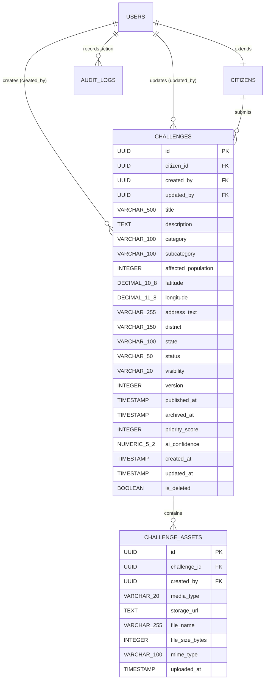

# Technical Design Document (DESIGN) — Module 2: Citizen Challenge Management [LOCKED 🔒]

**Document Version:** 2.1 (Final)  
**Module ID:** M2  
**Module Name:** Citizen Challenge Management  
**Status:** 🔒 **LOCKED & APPROVED**  
**Author:** SICP Architecture & Engineering Core Team  
**Parent Architecture:** `Docs/backend-architecture.md`, `Docs/frontend-architecture.md`, `Docs/Database.md`, `Docs/api-spec.md`  
**Dependencies:** M1: Identity & Access Management (IAM) [LOCKED 🔒]  

---

## 1. Architectural Overview & Design Principles

### 1.1 Architectural Pattern: Clean Layered Architecture
Module 2 adheres strictly to the Clean Layered Architecture mandated in `Docs/agent-rules.md`:

```
┌─────────────────────────────────────────────────────────────────────────┐
│                           Client Layer                                  │
│  (Next.js 15 App Router / React Hook Form / Leaflet Maps / Zod Schemas) │
└────────────────────────────────────┬────────────────────────────────────┘
                                     │ HTTPS / JSON & Multipart
                                     ▼
┌─────────────────────────────────────────────────────────────────────────┐
│                      API Gateway / Routing Layer                        │
│          (FastAPI Endpoints / Dependency Injection / RBAC Guards)       │
└────────────────────────────────────┬────────────────────────────────────┘
                                     │ DTOs / Schemas (Pydantic v2)
                                     ▼
┌─────────────────────────────────────────────────────────────────────────┐
│                         Service Layer                                   │
│ (State Machine / Concurrency Locks / Business Rules / Storage Services) │
└────────────────────────────────────┬────────────────────────────────────┘
                                     │ Domain Entities
                                     ▼
┌─────────────────────────────────────────────────────────────────────────┐
│                       Repository Layer                                  │
│          (SQLAlchemy 2.0 Async Queries / Spatial Indexing)              │
└────────────────────────────────────┬────────────────────────────────────┘
                                     │ Async SQL (asyncpg / aiosqlite)
                                     ▼
┌─────────────────────────────────────────────────────────────────────────┐
│                        Database Layer                                   │
│       (PostgreSQL 16 + PostGIS / SQLite Async Test In-Memory Engine)    │
└─────────────────────────────────────────────────────────────────────────┘
```

### 1.2 Cross-Module Contracts & M1 Integration
* **M1 Consumption**:
  - `User` and `CitizenProfile` models are consumed as foreign key targets (`challenges.created_by -> users.id`, `challenges.citizen_id -> citizens.user_id`).
  - `require_roles(["citizen", "admin"])` and `require_roles(["faculty", "admin"])` dependencies enforce strict role boundaries.
  - `AuditRepository.log` records all challenge lifecycle events (`CHALLENGE_CREATED`, `CHALLENGE_UPDATED`, `STATUS_CHANGED`, `ASSET_UPLOADED`, `CHALLENGE_ARCHIVED`, `VISIBILITY_CHANGED`).
  - Standard response envelopes (`StandardResponse[T]` and `ErrorResponse`) are strictly preserved.
* **M3 Downstream Readiness**:
  - Internal event hooks (`publish_event("ChallengeCreated", payload)`, `publish_event("ChallengePublished", payload)`) allow Module 3's AI engine to attach seamlessly later.

---

## 2. Database Schema & Data Models



### 2.1 Table: `challenges`

```sql
CREATE TABLE challenges (
    id UUID PRIMARY KEY,
    citizen_id UUID NOT NULL REFERENCES citizens(user_id) ON DELETE RESTRICT,
    created_by UUID NOT NULL REFERENCES users(id) ON DELETE RESTRICT,
    updated_by UUID REFERENCES users(id) ON DELETE SET NULL,
    title VARCHAR(500) NOT NULL,
    description TEXT NOT NULL,
    category VARCHAR(100) NOT NULL,
    subcategory VARCHAR(100),
    affected_population INTEGER NOT NULL CHECK (affected_population > 0),
    latitude DECIMAL(10, 8) NOT NULL CHECK (latitude >= -90.0 AND latitude <= 90.0),
    longitude DECIMAL(11, 8) NOT NULL CHECK (longitude >= -180.0 AND longitude <= 180.0),
    address_text VARCHAR(255),
    district VARCHAR(150),
    state VARCHAR(100),
    status VARCHAR(50) NOT NULL DEFAULT 'draft',
    visibility VARCHAR(20) NOT NULL DEFAULT 'PUBLIC',
    version INTEGER NOT NULL DEFAULT 1,
    published_at TIMESTAMP WITH TIME ZONE DEFAULT NULL,
    archived_at TIMESTAMP WITH TIME ZONE DEFAULT NULL,
    priority_score INTEGER DEFAULT NULL,
    ai_confidence NUMERIC(5, 2) DEFAULT NULL,
    created_at TIMESTAMP WITH TIME ZONE DEFAULT CURRENT_TIMESTAMP NOT NULL,
    updated_at TIMESTAMP WITH TIME ZONE DEFAULT CURRENT_TIMESTAMP NOT NULL,
    is_deleted BOOLEAN DEFAULT FALSE NOT NULL
);

-- PostgreSQL BTree & Spatial Indexes
CREATE INDEX idx_challenges_citizen_id ON challenges(citizen_id);
CREATE INDEX idx_challenges_created_by ON challenges(created_by);
CREATE INDEX idx_challenges_category ON challenges(category);
CREATE INDEX idx_challenges_status ON challenges(status);
CREATE INDEX idx_challenges_visibility ON challenges(visibility);
CREATE INDEX idx_challenges_district ON challenges(district);
CREATE INDEX idx_challenges_created_at ON challenges(created_at DESC);
CREATE INDEX idx_challenges_is_deleted ON challenges(is_deleted);
```

### 2.2 Table: `challenge_assets`

```sql
CREATE TABLE challenge_assets (
    id UUID PRIMARY KEY,
    challenge_id UUID NOT NULL REFERENCES challenges(id) ON DELETE CASCADE,
    created_by UUID NOT NULL REFERENCES users(id) ON DELETE RESTRICT,
    media_type VARCHAR(20) NOT NULL CHECK (media_type IN ('image', 'video', 'document')),
    storage_url TEXT NOT NULL,
    file_name VARCHAR(255) NOT NULL,
    file_size_bytes INTEGER NOT NULL CHECK (file_size_bytes > 0),
    mime_type VARCHAR(100) NOT NULL,
    uploaded_at TIMESTAMP WITH TIME ZONE DEFAULT CURRENT_TIMESTAMP NOT NULL
);

CREATE INDEX idx_challenge_assets_challenge_id ON challenge_assets(challenge_id);
CREATE INDEX idx_challenge_assets_media_type ON challenge_assets(media_type);
```

---

## 3. Explicit State Machine Architecture & Transitions

```python
VALID_TRANSITIONS = {
    "draft": {"submitted", "archived"},
    "submitted": {"under_review", "rejected", "archived"},
    "under_review": {"approved", "rejected", "submitted"},
    "approved": {"published", "archived"},
    "published": {"closed", "archived"},
    "closed": {"archived"},
    "rejected": set(),  # Terminal
    "archived": set(),  # Terminal
}
```

### 3.1 Transition Ownership Enforcement Rules
1. **`draft -> submitted`**: Allowed for challenge author (`created_by == current_user.id`) or `admin`.
2. **`draft -> archived`**: Allowed for challenge author (`created_by == current_user.id`) or `admin`.
3. **`submitted -> under_review`**: Allowed for `faculty` (evaluator) or `admin`.
4. **`submitted -> rejected`**: Allowed for `faculty` (evaluator) or `admin`.
5. **`submitted -> archived`**: Allowed for challenge author (`created_by == current_user.id`) or `admin`.
6. **`under_review -> approved`**: Allowed for `faculty` (evaluator) or `admin`.
7. **`under_review -> rejected`**: Allowed for `faculty` (evaluator) or `admin`.
8. **`under_review -> submitted`**: Allowed for `faculty` (evaluator) or `admin` (Revision requested).
9. **`approved -> published`**: Allowed for `admin` or `faculty` (evaluator).
10. **`approved -> archived`**: Allowed for `admin`.
11. **`published -> closed`**: Allowed for `admin`.
12. **`published -> archived`**: Allowed for `admin`.
13. **`closed -> archived`**: Allowed for `admin`.

---

## 4. Storage Architecture Abstraction

```python
from abc import ABC, abstractmethod
from typing import BinaryIO, Tuple

class BaseStorageService(ABC):
    """Storage provider interface ready for Local, S3, and MinIO backends."""
    @abstractmethod
    async def upload_file(
        self, file_obj: BinaryIO, filename: str, content_type: str, destination_folder: str
    ) -> Tuple[str, str]:
        """Uploads file and returns (storage_url, file_key)."""
        pass

    @abstractmethod
    async def delete_file(self, file_key: str) -> bool:
        """Deletes file by key."""
        pass
```
* **M2 Implementation (`LocalStorageService`)**: Implements `BaseStorageService` storing validated assets in `backend/uploads/challenges/{challenge_id}/` and serving static URLs (`/static/uploads/...`).
* **Cloud Storage Readiness**: The interface contracts (`upload_file`, `delete_file`) allow drop-in replacement with `S3StorageService` or `MinIOStorageService` via configuration settings.

---

## 5. Concurrency Control & Optimistic Locking

### 5.1 Version-Based Optimistic Locking
1. The `challenges` table contains an integer column `version` initialized to `1`.
2. Any mutation endpoint (`PATCH /challenges/{id}` or `PATCH /challenges/{id}/status`) requires the client to supply `version: int`.
3. The repository executes an atomic update condition:
   ```sql
   UPDATE challenges 
   SET title = :title, description = :description, version = version + 1, updated_at = NOW(), updated_by = :user_id
   WHERE id = :challenge_id AND version = :expected_version AND is_deleted = FALSE;
   ```
4. If 0 rows are affected (indicating a concurrent transaction updated the record first), the repository throws a `ConcurrencyConflictError` which maps to HTTP `409 Conflict`.

### 5.2 Idempotency Key Caching
* Double submissions on `POST /challenges` are prevented using the `Idempotency-Key` header with in-memory caching for 5 minutes.

### 5.3 Atomic Asset Count Guard
* Asset uploads lock the challenge record or verify asset counts atomically to guarantee that the 5-asset ceiling cannot be breached under concurrency.

---

## 6. Alembic Migration Specification

File: `backend/alembic/versions/002_challenge_management_schema.py`
* **Upgrade**: Creates `challenges` and `challenge_assets` tables, adds foreign keys to `citizens` and `users`, and creates BTree/spatial indexes.
* **Downgrade**: Safely drops `challenge_assets` and `challenges` tables in reverse order.
