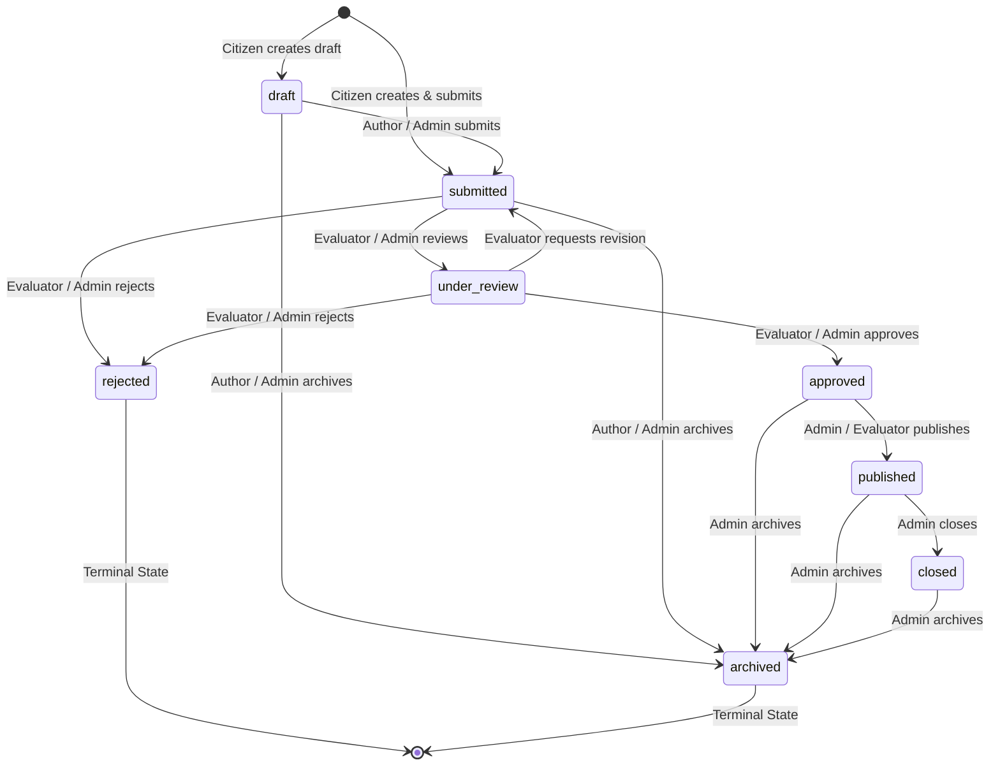

# Product Requirements Document (PRD) — Module 2: Citizen Challenge Management [LOCKED 🔒]

**Document Version:** 2.1 (Final)  
**Module ID:** M2  
**Module Name:** Citizen Challenge Management  
**Status:** 🔒 **LOCKED & APPROVED**  
**Author:** SICP Architecture & Engineering Core Team  
**Parent Project:** Societal Innovation Collaboration Platform (SICP)  
**Target Delivery:** Milestone 2  
**Dependencies:** M1: Identity & Access Management (IAM) [LOCKED 🔒]  

---

## 1. Executive Summary & Problem Definition

### 1.1 Context & Background
In the SICP ecosystem, societal progress begins when real-world challenges faced by grassroots communities, urban neighborhoods, and rural villages are surfaced, captured with rich contextual evidence, and structured into actionable innovation challenges.

Module 1 (IAM) established a secure, role-based identity baseline. **Module 2 (Citizen Challenge Management)** is the foundational ingestion, lifecycle management, and asset coordination entry point of the platform. It provides citizens, community advocates, evaluators, and administrators with an intuitive, mobile-first interface and robust APIs to submit, geo-locate, document, review, publish, and track societal challenges across essential domains (Water, Healthcare, Agriculture, Infrastructure, Sanitation, Education, Environment, Energy, etc.).

### 1.2 Module Objectives
1. **Empower Citizens**: Provide a simple, accessible (<3 minutes to submit) mechanism for citizens to create challenges with geospatial coordinates (GPS/Map picker) and multimedia evidence.
2. **Deterministic State Machine**: Govern challenge lifecycles through a strictly validated state machine (`draft` $\rightarrow$ `submitted` $\rightarrow$ `under_review` $\rightarrow$ `approved` $\rightarrow$ `published` $\rightarrow$ `closed`, with terminal states `rejected` and `archived`).
3. **Multi-Role Authorization**: Enforce a granular role-action matrix governing citizens, students, evaluators (faculty), and administrators across all lifecycle actions, with `created_by` as the core ownership anchor.
4. **Comprehensive Auditability**: Emit immutable audit trail events (`CHALLENGE_CREATED`, `CHALLENGE_UPDATED`, `STATUS_CHANGED`, `ASSET_UPLOADED`, `CHALLENGE_ARCHIVED`, `VISIBILITY_CHANGED`) on all mutations.
5. **Concurrency & Data Integrity**: Provide optimistic locking (`version`), idempotency keys against double submission, and race-free asset limits (maximum 5 assets).
6. **Decoupled Downstream Handoff**: Maintain a clean database model and event baseline (`ChallengeCreated`, `ChallengePublished`) that safely feeds Module 3 (AI Intelligence Engine) and Module 4 (Academic Collaboration Hub).

---

## 2. Scope & Strict Boundaries

### 2.1 In-Scope (Module 2 Deliverables)
* **Challenge Entity Lifecycle**: Full CRUD, state machine transitions, and persistence for societal challenges (`challenges` table) with UUID keys, `created_by` ownership, future-proofing metadata (`updated_by`, `published_at`, `archived_at`, `visibility`, `version`), geospatial coordinates, and lifecycle statuses.
* **Challenge Asset Management**: Ingestion, validation, metadata persistence (`challenge_assets` table), and storage URL resolution for supporting images, videos, and PDFs.
* **Challenge Management APIs**:
  - `POST /api/v1/challenges`: Create challenge (as `draft` or `submitted`).
  - `GET /api/v1/challenges/{id}`: Detailed challenge retrieval with asset attachments and visibility checks.
  - `GET /api/v1/challenges`: Paginated, filterable challenge catalog (filters: category, status, district, state, search, visibility).
  - `GET /api/v1/challenges/my-challenges`: Author-specific challenge tracking endpoint.
  - `PATCH /api/v1/challenges/{id}`: Update editable challenge fields with optimistic locking (`version`).
  - `PATCH /api/v1/challenges/{id}/status`: Explicit state machine transitions with authorization guards.
  - `POST /api/v1/challenges/{id}/assets`: Multipart file upload for challenge evidence.
  - `DELETE /api/v1/challenges/{id}`: Soft-delete / withdrawal of draft challenges.
* **Storage Abstraction**: Extensible `BaseStorageService` architecture supporting Local, S3, and MinIO storage (with `LocalStorageService` implemented for M2).
* **Database Migrations**: Alembic migration script for M2 schema creation (`002_challenge_management_schema.py`).
* **Frontend Citizen Portal (`features/challenge`)**:
  - Interactive Challenge Creation Form (`/citizen/create-challenge`) with Leaflet GPS Map Picker and asset dropzone.
  - Citizen "My Challenges" Tracking Dashboard (`/citizen/my-challenges`) with real-time status badges.
  - Public / Authenticated Challenge Detail View (`/challenges/[id]`) with asset viewer and geospatial map pin.
* **Automated Test Suite**: Complete unit, state machine, authorization matrix, audit event, concurrency, performance benchmarks, and E2E test coverage (≥90% on critical path).

### 2.2 Out-of-Scope (Strictly Prohibited in M2)
* ❌ **M3 AI Intelligence**: Automated NLP categorization, AI priority scoring (0–100), SentenceTransformers embeddings, duplicate cluster detection, text summarization.
* ❌ **M4 Academic Hub**: University department matching, faculty mentor recommendations, student team formation.
* ❌ **M5 Project Lifecycle**: Innovation project proposals, prototype blueprints, milestone management.
* ❌ **M6 Industry Partnership**: CSR sponsorships, corporate funding requests, industrial mentor matching.
* ❌ **M7 Governance Analytics**: District-level aggregate heatmaps, automated social impact calculation engines.
* ❌ **Gamification & Rewards**: Citizen karma points, leaderboards, reward tokens.

---

## 3. Challenge Lifecycle & State Machine

### 3.1 State Definitions

| State | Type | Description |
|---|---|---|
| `draft` | Active | Initial private draft created by the citizen. Editable by author. Not visible in public catalog. |
| `submitted` | Active | Officially submitted by citizen for formal evaluation. Editable only with revision request. |
| `under_review` | Active | Under active assessment by an Evaluator or Moderator. |
| `approved` | Active | Formally approved as a valid, high-quality challenge ready for publication. |
| `published` | Active | Live in the open innovation catalog; visible to universities, students, and industry. |
| `closed` | Active | Challenge resolved or assigned to an active innovation project in M5. |
| `rejected` | Terminal | Evaluated and rejected due to policy violation, spam, or invalidity. Immutable. |
| `archived` | Terminal | Withdrawn or archived. Preserved for audit compliance; excluded from active feeds. |

### 3.2 Role Ownership for State Transitions

| From State | Allowed Target States | Permitted Roles & Ownership Rule | Required Audit Action |
|---|---|---|---|
| `draft` | `submitted`, `archived` | `citizen` (Author: `created_by == current_user.id`), `admin` | `STATUS_CHANGED`, `CHALLENGE_ARCHIVED` |
| `submitted` | `under_review`, `rejected` | `faculty` (Evaluator), `admin` | `STATUS_CHANGED` |
| `submitted` | `archived` | `citizen` (Author: `created_by == current_user.id`), `admin` | `CHALLENGE_ARCHIVED` |
| `under_review` | `approved`, `rejected` | `faculty` (Evaluator), `admin` | `STATUS_CHANGED` |
| `under_review` | `submitted` | `faculty` (Evaluator: Revision Request), `admin` | `STATUS_CHANGED` |
| `approved` | `published` | `admin`, `faculty` (Evaluator) | `STATUS_CHANGED`, `VISIBILITY_CHANGED` |
| `approved` | `archived` | `admin` | `CHALLENGE_ARCHIVED` |
| `published` | `closed`, `archived` | `admin` | `STATUS_CHANGED`, `CHALLENGE_ARCHIVED` |
| `closed` | `archived` | `admin` | `CHALLENGE_ARCHIVED` |
| `rejected` | None (Terminal) | None | N/A |
| `archived` | None (Terminal) | None | N/A |

---

## 4. Formal Role-Action Authorization Matrix

| Action | Citizen (Author) | Citizen (Non-Author) | Student | Evaluator (Faculty) | Admin |
|---|---|---|---|---|---|
| **Create Challenge (`draft`/`submitted`)** | ✅ Allowed | ✅ Allowed | ❌ Denied | ❌ Denied | ✅ Allowed |
| **Edit Challenge Details** | ✅ Allowed (`draft`, `submitted`) | ❌ Denied | ❌ Denied | ❌ Denied | ✅ Allowed (All active) |
| **Upload Assets** | ✅ Allowed (`draft`, `submitted`) | ❌ Denied | ❌ Denied | ❌ Denied | ✅ Allowed |
| **View (Published)** | ✅ Allowed | ✅ Allowed | ✅ Allowed | ✅ Allowed | ✅ Allowed |
| **View (Draft/Submitted/Under Review)**| ✅ Allowed (Own only) | ❌ Denied | ❌ Denied | ✅ Allowed (Review queue) | ✅ Allowed (All) |
| **Review / Change Status** | ❌ Denied | ❌ Denied | ❌ Denied | ✅ Allowed (`under_review`, `approved`, `rejected`) | ✅ Allowed (All transitions) |
| **Publish Challenge** | ❌ Denied | ❌ Denied | ❌ Denied | ✅ Allowed (If approved) | ✅ Allowed |
| **Close Challenge** | ❌ Denied | ❌ Denied | ❌ Denied | ❌ Denied | ✅ Allowed |
| **Archive Challenge** | ✅ Allowed (`draft`, `submitted` own) | ❌ Denied | ❌ Denied | ❌ Denied | ✅ Allowed (All states) |
| **Delete Challenge (Soft)** | ✅ Allowed (`draft` own only) | ❌ Denied | ❌ Denied | ❌ Denied | ✅ Allowed |

---

## 5. Visibility Taxonomy & Future-Proofing Fields

### 5.1 Visibility Enum (`app.core.constants.ChallengeVisibility`)
* `PRIVATE`: Accessible only to the creator (`created_by`) and platform administrators.
* `INSTITUTION`: Accessible to creator, academic evaluators, and assigned partner institutions.
* `PUBLIC`: Accessible to all authenticated platform users and public exploration feeds.
* `ARCHIVED`: Archived and hidden from active discovery feeds.

### 5.2 Future-Proofing Fields Specification

| Field Name | Data Type | Nullable | Default | Business Purpose |
|---|---|---|---|---|
| `created_by` | `UUID` (FK $\rightarrow$ `users.id`) | No | N/A | Core ownership anchor identifying the user who authored the challenge. |
| `updated_by` | `UUID` (FK $\rightarrow$ `users.id`) | Yes | `NULL` | Foreign key referencing the user identity of the last editor/reviewer. |
| `published_at` | `TIMESTAMPTZ` | Yes | `NULL` | Timestamp recorded when status first transitions to `published`. |
| `archived_at` | `TIMESTAMPTZ` | Yes | `NULL` | Timestamp recorded when status transitions to `archived`. |
| `visibility` | `VARCHAR(20)` | No | `'PUBLIC'` | Granular visibility setting (`PRIVATE`, `INSTITUTION`, `PUBLIC`, `ARCHIVED`). |
| `version` | `INTEGER` | No | `1` | Optimistic locking counter. Increments on every update to prevent lost updates. |

---

## 6. Audit Logging Specifications

Module 2 emits standard immutable audit events to the `audit_logs` table for all mutations:

| Audit Action | Trigger Condition | Emitted Metadata Payload |
|---|---|---|
| `CHALLENGE_CREATED` | New challenge saved as `draft` or `submitted` | `{"challenge_id": "...", "status": "...", "title": "...", "category": "..."}` |
| `CHALLENGE_UPDATED` | Title, description, category, or location modified | `{"challenge_id": "...", "updated_fields": [...], "version": 2}` |
| `STATUS_CHANGED` | Challenge transitions to a new lifecycle state | `{"challenge_id": "...", "previous_status": "...", "new_status": "...", "reason": "..."}` |
| `ASSET_UPLOADED` | File successfully attached to challenge | `{"challenge_id": "...", "asset_id": "...", "media_type": "...", "file_size_bytes": 1048576}` |
| `CHALLENGE_ARCHIVED`| Challenge transitioned to `archived` status | `{"challenge_id": "...", "archived_at": "...", "previous_status": "..."}` |
| `VISIBILITY_CHANGED`| Visibility changed (`PUBLIC` $\leftrightarrow$ `INSTITUTION` $\leftrightarrow$ `PRIVATE`) | `{"challenge_id": "...", "previous_visibility": "...", "new_visibility": "..."}` |

---

## 7. Performance Acceptance Criteria & Benchmarking

| Metric | Target Threshold | Acceptance & Benchmark Condition |
|---|---|---|
| **Challenge List Latency** | **$< 500\text{ ms}$** | `GET /api/v1/challenges` with 20 items, default sorting, and active filters under 100 concurrent requests. |
| **Challenge Creation Latency** | **$< 300\text{ ms}$** | `POST /api/v1/challenges` executing schema validation, database write, citizen counter increment, and audit log. |
| **Pagination Query Execution** | **$< 200\text{ ms}$** | Indexed SQL offset/limit query execution time on a table populated with 100,000 challenge records. |
| **Asset Ingestion & Upload** | **$< 3.0\text{ s}$** | `POST /api/v1/challenges/{id}/assets` for a 10MB JPEG image / 20MB PDF document including MIME check, file write, and DB commit. |

---

## 8. Concurrency & Optimistic Locking Rules

1. **Optimistic Locking**:
   - Every mutation payload (`PATCH /challenges/{id}` or `PATCH /challenges/{id}/status`) must supply the current `version` integer.
   - The repository executes: `UPDATE challenges SET ..., version = version + 1 WHERE id = :id AND version = :expected_version`.
   - If 0 rows are affected, a `409 Conflict` (`CONCURRENCY_CONFLICT`) exception is raised.
2. **Double Submission Prevention**:
   - `POST /challenges` supports an optional `Idempotency-Key` HTTP header.
   - Repeated requests with the identical idempotency key within 5 minutes return the existing challenge record without duplicate insertion.
3. **Atomic Asset Limits**:
   - Maximum 5 assets per challenge enforced atomically via row-level locking (`FOR UPDATE`) or transaction counting.
