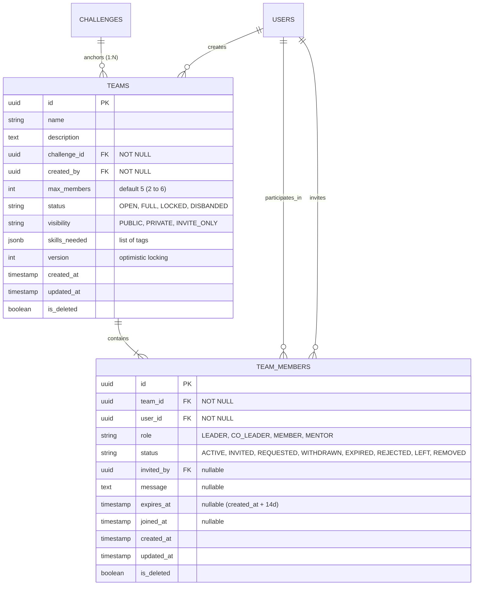

# System Architecture & Design Document (DESIGN) — Module 3: Team Formation & Collaboration

**Document Version:** 1.1 (Final)  
**Module ID:** M3  
**Module Name:** Team Formation & Collaboration  
**Status:** 🔒 **LOCKED**  
**Author:** SICP Architecture & Engineering Core Team  
**Parent Project:** Societal Innovation Collaboration Platform (SICP)  
**Target Delivery:** Milestone 3  
**Dependencies:** 
- M1: Identity & Access Management (IAM) [LOCKED 🔒]
- M2: Citizen Challenge Management [LOCKED 🔒]

---

## 1. Architectural Overview & Context

Module 3 delivers the foundational **Team Formation & Collaboration** subsystem within the SICP Layered Architecture. It enables multidisciplinary student teams, faculty mentors, and industry advisors to form, discover, recruit, and manage project teams focused on resolving verified societal challenges.

### 1.1 Layered Architecture Pattern

```
┌────────────────────────────────────────────────────────┐
│               FastAPI API Routing Layer                │
│       /api/v1/teams (CRUD, Discovery, Recruitment)     │
└───────────────────────────┬────────────────────────────┘
                            │ (Dependency Injection)
┌───────────────────────────▼────────────────────────────┐
│                     Service Layer                      │
│   TeamService, TeamMemberService, RecruitmentService   │
│  (State Machines, Capacity Limits, Auth Guards, Audit) │
└───────────────────────────┬────────────────────────────┘
                            │ (Async Session)
┌───────────────────────────▼────────────────────────────┐
│                   Repository Layer                     │
│        TeamRepository, TeamMemberRepository            │
│  (Atomic Locks, Concurrency Protection, Spatial Index) │
└───────────────────────────┬────────────────────────────┘
                            │ (SQLAlchemy ORM / Async)
┌───────────────────────────▼────────────────────────────┐
│            PostgreSQL 16 Relational Engine             │
│      teams, team_members, challenges (M2), users (M1)  │
└────────────────────────────────────────────────────────┘
```

---

## 2. Domain Models & Database Schema

### 2.1 Enumerations (`app.core.constants`)

```python
class TeamStatus(str, Enum):
    OPEN = "OPEN"             # Actively seeking members (active_contributors < max_members)
    FULL = "FULL"             # Reached maximum student contributor capacity
    LOCKED = "LOCKED"         # Recruitment closed by Leader
    DISBANDED = "DISBANDED"   # Terminated by Leader or Admin (Terminal)

class TeamVisibility(str, Enum):
    PUBLIC = "PUBLIC"         # Discoverable in catalog, accepts join requests
    PRIVATE = "PRIVATE"       # Hidden from search, discoverable via direct link
    INVITE_ONLY = "INVITE_ONLY" # Visible in search, inbound join requests disabled

class TeamMemberRole(str, Enum):
    LEADER = "LEADER"         # Team creator / owner (Primary Admin, Contributor)
    CO_LEADER = "CO_LEADER"   # Delegated team manager (Max 2, Contributor)
    MEMBER = "MEMBER"         # Active student contributor (Contributor)
    MENTOR = "MENTOR"         # Faculty or Industry technical advisor (Max 2, Non-contributor)

class TeamMemberStatus(str, Enum):
    ACTIVE = "ACTIVE"         # Full active participating member
    INVITED = "INVITED"       # Outbound invite sent by Leader; pending recipient action
    REQUESTED = "REQUESTED"   # Inbound request sent by Student; pending Leader action
    WITHDRAWN = "WITHDRAWN"   # Join request withdrawn by applicant (Terminal)
    EXPIRED = "EXPIRED"       # Outbound invitation expired after 14 days (Terminal)
    REJECTED = "REJECTED"     # Join request rejected by Leader (Terminal)
    LEFT = "LEFT"             # Member voluntarily exited (Terminal)
    REMOVED = "REMOVED"       # Member evicted by Leader (Terminal)
```

---

## 3. Database Schema & Hardened Indexes

### 3.1 Entity Relationship Diagram (ERD)



---

### 3.2 Detailed Table Schemas

#### 1. `teams` Table
| Column | Type | Constraints / Description |
| :--- | :--- | :--- |
| `id` | UUID | Primary Key, default `uuid4()` |
| `name` | VARCHAR(100) | Not Null, Min 3 chars |
| `description` | TEXT | Not Null, Min 20 chars |
| `challenge_id` | UUID | Foreign Key $\rightarrow$ `challenges.id` (**NOT NULL**, ON DELETE RESTRICT, Indexed) |
| `created_by` | UUID | Foreign Key $\rightarrow$ `users.id` (Not Null, Indexed, Ownership Anchor) |
| `max_members` | INTEGER | Not Null, Default `5`, Checked ($2 \le \text{max\_members} \le 6$) |
| `status` | VARCHAR(20) | Not Null, Default `'OPEN'` (`TeamStatus`) |
| `visibility` | VARCHAR(20) | Not Null, Default `'PUBLIC'` (`TeamVisibility`) |
| `skills_needed` | JSONB / TEXT | List of required skills (e.g. `["Python", "IoT", "React"]`) |
| `version` | INTEGER | Not Null, Default `1` (Optimistic Locking) |
| `created_at` | TIMESTAMP WITH TZ | Not Null, Default `now()` |
| `updated_at` | TIMESTAMP WITH TZ | Not Null, Default `now()` |
| `is_deleted` | BOOLEAN | Not Null, Default `false` (Soft Delete) |

#### 2. `team_members` Table
| Column | Type | Constraints / Description |
| :--- | :--- | :--- |
| `id` | UUID | Primary Key, default `uuid4()` |
| `team_id` | UUID | Foreign Key $\rightarrow$ `teams.id` (Not Null, ON DELETE CASCADE, Indexed) |
| `user_id` | UUID | Foreign Key $\rightarrow$ `users.id` (Not Null, ON DELETE RESTRICT, Indexed) |
| `role` | VARCHAR(20) | Not Null, Default `'MEMBER'` (`TeamMemberRole`) |
| `status` | VARCHAR(20) | Not Null, Default `'REQUESTED'` (`TeamMemberStatus`) |
| `invited_by` | UUID | Foreign Key $\rightarrow$ `users.id` (Nullable) |
| `message` | VARCHAR(500) | Optional statement of intent or recruitment pitch |
| `expires_at` | TIMESTAMP WITH TZ | Nullable (Set to `created_at + INTERVAL '14 days'` for `INVITED` status) |
| `joined_at` | TIMESTAMP WITH TZ | Nullable (Populated upon status transitioning to `ACTIVE`) |
| `created_at` | TIMESTAMP WITH TZ | Not Null, Default `now()` |
| `updated_at` | TIMESTAMP WITH TZ | Not Null, Default `now()` |
| `is_deleted` | BOOLEAN | Not Null, Default `false` (Soft Delete) |

---

### 3.3 Hardened Database Indexes & Rationale

| Index Name | Table & Columns | Partial Predicate | Rationale & Architectural Objective |
| :--- | :--- | :--- | :--- |
| `idx_teams_created_by` | `teams(created_by)` | `None` | Accelerates "My Created Teams" queries and owner lookups. |
| `idx_teams_status` | `teams(status)` | `None` | Optimizes public catalog filtering on `OPEN` and `FULL` teams. |
| `idx_teams_challenge_status` | `teams(challenge_id, status)` | `None` | Crucial for challenge detail views displaying active problem-solving teams. |
| `idx_teams_unique_active_owner` | `teams(challenge_id, created_by)` | `WHERE is_deleted = false AND status != 'DISBANDED'` | **Enforces FR-M3-15 at the database level**: Guarantees a user cannot own $>1$ active team per challenge. |
| `idx_team_members_status` | `team_members(status)` | `None` | Speeds up system-wide invitation expiration sweeps and status counts. |
| `idx_team_members_team_status` | `team_members(team_id, status)` | `None` | Critical for sub-millisecond atomic capacity counting ($N_{\text{active}} \le \text{max\_members}$). |
| `idx_unique_active_user_team` | `team_members(team_id, user_id)` | `WHERE is_deleted = false AND status IN ('ACTIVE', 'INVITED', 'REQUESTED')` | **Enforces membership integrity**: Prevents duplicate active/pending membership records for the same user in a team. |

---

## 4. State Machines & Lifecycle Transitions

### 4.1 Team Lifecycle State Machine

```
      [Create Team]
            │
            ▼
       ┌─────────┐   (active_contributors == max_members)   ┌────────┐
       │  OPEN   ├─────────────────────────────────────────►│  FULL  │
       └────┬────┘                                          └───┬────┘
            │   ▲                                            ▲  │
 (Lock Team)│   │(Unlock Team)            (Contributor Left) │  │(Contributor Left)
            ▼   │                                            │  ▼
       ┌────────┴┐                                          ┌───┴────┐
       │ LOCKED  │                                          │  OPEN  │
       └────┬────┘                                          └────────┘
            │
            │ (Disband by Leader/Admin)
            ▼
      ┌───────────┐
      │ DISBANDED │ [Terminal: All mutations return HTTP 400 Invalid Team State]
      └───────────┘
```

### 4.2 Team Member Lifecycle State Machine

```
   Inbound Flow (Candidate Request)                  Outbound Flow (Leader Invite)
   ────────────────────────────────                  ─────────────────────────────
           [Student Applies]                              [Leader Sends Invite]
                   │                                                │
                   ▼                                                ▼
             ┌───────────┐                                    ┌───────────┐
             │ REQUESTED │                                    │  INVITED  │
             └─────┬─────┘                                    └─────┬─────┘
                   │                                                │
     ┌─────────────┼─────────────┐                    ┌─────────────┼─────────────┐
     │ (Applicant) │ (Leader)    │ (Leader)           │ (Invitee)   │ (Invitee)   │ (14 Days)
     ▼             ▼             ▼                    ▼             ▼             ▼
┌───────────┐┌───────────┐ ┌───────────┐        ┌───────────┐ ┌───────────┐ ┌───────────┐
│ WITHDRAWN ││ REJECTED  │ │  ACTIVE   │        │  ACTIVE   │ │   LEFT    │ │  EXPIRED  │
│[Terminal] ││[Terminal] │ └─────┬─────┘        └─────┬─────┘ │[Terminal] │ │[Terminal] │
└───────────┘└───────────┘       │                    │       └───────────┘ └───────────┘
                                 │ (Leave/Kick)       │ (Leave/Kick)
                                 ▼                    ▼
                           ┌───────────┐        ┌───────────┐
                           │   LEFT    │        │  REMOVED  │ [Terminal]
                           └───────────┘        └───────────┘
```

---

## 5. Capacity, Integrity & Concurrency Control

### 5.1 Student Contributor vs. Mentor Capacity Rules
1. **Student Contributor Capacity**:
   - Roles counted: `LEADER`, `CO_LEADER`, `MEMBER`.
   - Total active contributors must satisfy: $2 \le N_{\text{contributors}} \le \text{max\_members} \le 6$.
   - When $N_{\text{contributors}} == \text{max\_members}$, team status transitions to `FULL`.
2. **Mentor Capacity Governance**:
   - Role counted: `MENTOR`.
   - Mentors do NOT consume student contributor capacity.
   - Total active mentors must satisfy: $N_{\text{mentors}} \le 2$.
   - Inviting or accepting a 3rd mentor is rejected with `HTTP 409 Conflict` (`MENTOR_CAPACITY_EXCEEDED`).

### 5.2 Membership Integrity & Cross-Channel Protection
Before creating an invitation or join request, the service enforces:
1. **Target User Check**:
   - If user is already `ACTIVE` in this team $\rightarrow$ `HTTP 409 Conflict` (`ALREADY_ACTIVE_MEMBER`).
   - If user has a pending `INVITED` record in this team $\rightarrow$ `HTTP 409 Conflict` (`INVITATION_ALREADY_PENDING`).
   - If user has a pending `REQUESTED` record in this team $\rightarrow$ `HTTP 409 Conflict` (`JOIN_REQUEST_ALREADY_PENDING`).
2. **Single Active Team Per Challenge Check**:
   - Active participation query across teams anchored to the same `challenge_id`:
     ```sql
     SELECT tm.id FROM team_members tm
     JOIN teams t ON t.id = tm.team_id
     WHERE tm.user_id = :user_id 
       AND tm.status = 'ACTIVE' 
       AND t.challenge_id = :challenge_id 
       AND tm.is_deleted = false;
     ```
   - If found, raises `HTTP 409 Conflict` (`USER_ALREADY_IN_ACTIVE_TEAM_FOR_CHALLENGE`).

### 5.3 14-Day Invitation Expiration Logic
- Invitations are written with `expires_at = now() + INTERVAL '14 days'`.
- On invitation response (`accept`/`decline`):
  ```python
  if invitation.expires_at and datetime.now(timezone.utc) > invitation.expires_at:
      invitation.status = TeamMemberStatus.EXPIRED
      await self.audit_service.log_event(action="INVITATION_EXPIRED", ...)
      raise ConflictError("This invitation has expired", code="INVITATION_EXPIRED")
  ```

### 5.4 Join Request Withdrawal
- An applicant may withdraw a pending join request:
  ```python
  if join_request.user_id != current_user.id and current_user.role != UserRole.ADMIN:
      raise ForbiddenError("Only the applicant can withdraw this request")
  if join_request.status != TeamMemberStatus.REQUESTED:
      raise ConflictError(f"Cannot withdraw request in status {join_request.status}")
  join_request.status = TeamMemberStatus.WITHDRAWN
  await self.audit_service.log_event(action="JOIN_REQUEST_WITHDRAWN", ...)
  ```

### 5.5 Disbanded Team Lockdown Guard
All endpoints and services modifying teams or team members check the parent team state:
```python
if team.status == TeamStatus.DISBANDED:
    raise BadRequestError("Cannot perform operations on a disbanded team", code="INVALID_TEAM_STATE")
```

### 5.6 Concurrency Protection via Pessimistic Row Locking
```sql
-- Executed inside transaction before accepting join request or invitation
SELECT * FROM teams WHERE id = :team_id FOR UPDATE;

-- Atomic count of active student contributors
SELECT COUNT(*) FROM team_members 
WHERE team_id = :team_id 
  AND status = 'ACTIVE' 
  AND role IN ('LEADER', 'CO_LEADER', 'MEMBER')
  AND is_deleted = false;

-- Atomic count of active mentors
SELECT COUNT(*) FROM team_members 
WHERE team_id = :team_id 
  AND status = 'ACTIVE' 
  AND role = 'MENTOR'
  AND is_deleted = false;
```

---

## 6. Authorization Matrix

| Action | Leader | Co-Leader | Member | Mentor | Applicant | Invitee | Student (Non-Member) | Faculty | Admin |
| :--- | :---: | :---: | :---: | :---: | :---: | :---: | :---: | :---: | :---: |
| **Create Team** | ✅ | ✅ | ✅ | ❌ | ❌ | ❌ | ✅ | ❌ | ✅ |
| **View Public Teams** | ✅ | ✅ | ✅ | ✅ | ✅ | ✅ | ✅ | ✅ | ✅ |
| **View Team Workspace** | ✅ | ✅ | ✅ | ✅ | ❌ | ❌ | ❌ | ❌ | ✅ |
| **Edit Team Details** | ✅ | ✅ | ❌ | ❌ | ❌ | ❌ | ❌ | ❌ | ✅ |
| **Lock / Unlock Team** | ✅ | ❌ | ❌ | ❌ | ❌ | ❌ | ❌ | ❌ | ✅ |
| **Send Invitation (Member)** | ✅ | ✅ | ❌ | ❌ | ❌ | ❌ | ❌ | ❌ | ✅ |
| **Send Invitation (Mentor)** | ✅ | ✅ | ❌ | ❌ | ❌ | ❌ | ❌ | ❌ | ✅ |
| **Apply (Join Request)** | ❌ | ❌ | ❌ | ❌ | ❌ | ❌ | ✅ | ❌ | ❌ |
| **Withdraw Join Request** | ❌ | ❌ | ❌ | ❌ | ✅ (Applicant) | ❌ | ❌ | ❌ | ✅ |
| **Accept/Reject Join Request**| ✅ | ✅ | ❌ | ❌ | ❌ | ❌ | ❌ | ❌ | ✅ |
| **Accept/Decline Invitation** | ❌ | ❌ | ❌ | ❌ | ❌ | ✅ (Recipient) | ❌ | ❌ | ❌ |
| **Promote to Co-Leader** | ✅ | ❌ | ❌ | ❌ | ❌ | ❌ | ❌ | ❌ | ✅ |
| **Demote Co-Leader** | ✅ | ❌ | ❌ | ❌ | ❌ | ❌ | ❌ | ❌ | ✅ |
| **Remove Member** | ✅ | ✅ (Members) | ❌ | ❌ | ❌ | ❌ | ❌ | ❌ | ✅ |
| **Leave Team** | ❌* | ✅ | ✅ | ✅ | ❌ | ❌ | ❌ | ❌ | ❌ |
| **Transfer Leadership** | ✅ | ❌ | ❌ | ❌ | ❌ | ❌ | ❌ | ❌ | ✅ |
| **Disband Team** | ✅ | ❌ | ❌ | ❌ | ❌ | ❌ | ❌ | ❌ | ✅ |

*\*Note: Leader must transfer leadership before voluntarily leaving.*

---

## 7. Audit Trail Events (16 Mandatory Events)

All actions emit structured records to `audit_logs`:
1. `TEAM_CREATED`: Logged when a team is successfully registered.
2. `TEAM_UPDATED`: Logged when team details/settings are modified.
3. `TEAM_STATUS_CHANGED`: Logged when team transitions (`OPEN`, `FULL`, `LOCKED`).
4. `TEAM_DISBANDED`: Logged when a team is disbanded.
5. `INVITATION_SENT`: Logged when an outbound invite is issued.
6. `INVITATION_ACCEPTED`: Logged when an invitee accepts an invite.
7. `INVITATION_DECLINED`: Logged when an invitee declines an invite.
8. `INVITATION_EXPIRED`: Logged when an expired invitation is accessed or swept.
9. `JOIN_REQUEST_SENT`: Logged when a candidate submits an inbound application.
10. `JOIN_REQUEST_ACCEPTED`: Logged when a leader accepts a join request.
11. `JOIN_REQUEST_REJECTED`: Logged when a leader rejects a join request.
12. `JOIN_REQUEST_WITHDRAWN`: Logged when an applicant retracts a pending request.
13. `MEMBER_LEFT`: Logged when an active member voluntarily departs.
14. `MEMBER_REMOVED`: Logged when a leader/co-leader evicts a member.
15. `MEMBER_ROLE_CHANGED`: Logged when promotion or demotion occurs.
16. `LEADERSHIP_TRANSFERRED`: Logged when primary leadership is reassigned.

---

## 8. API Specifications & Endpoints

### 8.1 Team Management Endpoints
- `POST /api/v1/teams`: Create team anchored to challenge (Returns `TeamResponseData`).
- `GET /api/v1/teams`: List & filter discoverable teams (Returns `PaginatedResponse[TeamSummaryData]`).
- `GET /api/v1/teams/my-teams`: List teams where user is active or has pending requests/invites.
- `GET /api/v1/teams/{id}`: Team profile with active contributor & mentor roster.
- `PATCH /api/v1/teams/{id}`: Update team settings (`version` guarded).
- `PATCH /api/v1/teams/{id}/status`: Change status (`OPEN`, `LOCKED`).
- `DELETE /api/v1/teams/{id}`: Disband team (Transitions to `DISBANDED`).

### 8.2 Recruitment & Membership Endpoints
- `POST /api/v1/teams/{id}/join-requests`: Submit join request.
- `GET /api/v1/teams/{id}/join-requests`: List pending join requests.
- `POST /api/v1/teams/{id}/join-requests/{member_id}/action`: Accept or Reject join request.
- `POST /api/v1/teams/join-requests/{request_id}/withdraw`: Withdraw pending join request.
- `POST /api/v1/teams/{id}/invitations`: Invite user (with 14-day validity).
- `GET /api/v1/teams/invitations/me`: List active unexpired received invitations.
- `POST /api/v1/teams/invitations/{member_id}/action`: Accept or Decline invitation.
- `POST /api/v1/teams/{id}/leave`: Voluntarily leave team.
- `DELETE /api/v1/teams/{id}/members/{user_id}`: Remove member from team.
- `PATCH /api/v1/teams/{id}/members/{user_id}/role`: Promote or Demote member role.
- `POST /api/v1/teams/{id}/transfer-leadership`: Transfer primary leader role.

---

## 9. Frontend Architecture (`features/team`)

### 9.1 Directory Structure
```
frontend/src/
├── features/
│   └── team/
│       ├── types/
│       │   └── team.types.ts
│       ├── schemas/
│       │   └── team.schema.ts
│       ├── components/
│       │   ├── TeamCard.tsx
│       │   ├── TeamFilters.tsx
│       │   ├── TeamRoster.tsx
│       │   ├── TeamStatusBadge.tsx
│       │   ├── JoinRequestModal.tsx
│       │   ├── InviteMemberModal.tsx
│       │   ├── ManageMembersModal.tsx
│       │   └── WithdrawRequestButton.tsx
│       └── hooks/
│           ├── useTeam.ts
│           ├── useTeams.ts
│           └── useTeamRecruitment.ts
├── services/
│   └── team.service.ts
└── app/
    └── teams/
        ├── page.tsx                  # Public Discovery & Search Catalog
        ├── create/
        │   └── page.tsx              # Team Creation Wizard (Challenge Selected)
        ├── my-teams/
        │   └── page.tsx              # User Personal Teams Dashboard
        └── [id]/
            └── page.tsx              # Team Workspace & Roster View
```
