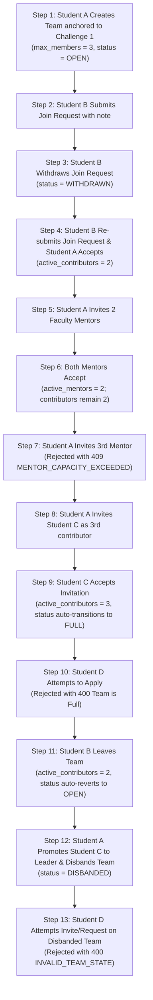

# Test-Driven Development (TDD) Specification — Module 3: Team Formation & Collaboration

**Document Version:** 1.1 (Final)  
**Module ID:** M3  
**Module Name:** Team Formation & Collaboration  
**Status:** 🔒 **LOCKED**  
**Author:** SICP Architecture & Engineering Core Team  
**Parent Project:** Societal Innovation Collaboration Platform (SICP)  
**Target Delivery:** Milestone 3  
**Dependencies:** 
- M1: Identity & Access Management (IAM) [LOCKED 🔒]
- M2: Citizen Challenge Management [LOCKED 🔒]

---

## 1. TDD Strategy & Core Principles

Module 3 strictly adheres to the **Test-Driven Development (TDD) Red-Green-Refactor Lifecycle**:

```
 ┌─────────────┐       ┌─────────────┐       ┌─────────────┐
 │  1. RED     ├──────►│  2. GREEN   ├──────►│ 3. REFACTOR │
 │ Write Tests │       │ Implement   │       │ Optimize &  │
 │ (Must Fail) │       │ Minimal Code│       │ Clean Code  │
 └─────────────┘       └─────────────┘       └──────┬──────┘
        ▲                                           │
        └───────────────────────────────────────────┘
```

### Strict TDD Mandates:
1. **Zero Code Before Tests**: All unit, validation, state machine, auth matrix, concurrency, and API integration tests must be written and validated as failing before any domain service or repository code is authored.
2. **Deterministic Isolation**: Tests execute against an isolated in-memory async SQLite/PostgreSQL test session with transaction rollback per test case.
3. **No Regressions on M1 & M2**: M1 (IAM) and M2 (Challenges) test suites must maintain a 100% pass rate at every phase.
4. **Coverage Threshold**: Minimum **90% test coverage** across all Module 3 service, repository, and router code (95% on core capacity and state machine branches).

---

## 2. Test Suite Organization (`backend/tests/teams/`)

```
backend/tests/teams/
├── conftest.py                       # Fixtures: Auth tokens for Leader, Collaborators, Mentors, Admins, Sample Challenge
├── test_team_schemas.py              # Pydantic schema constraints, validation rules & boundaries
├── test_team_state_machine.py        # Team lifecycle transitions (OPEN, FULL, LOCKED, DISBANDED) & Disbanded Protection
├── test_team_membership_lifecycle.py # Member transitions (REQUESTED, WITHDRAWN, INVITED, EXPIRED, ACTIVE, LEFT, REMOVED)
├── test_team_auth_matrix.py          # Role-action authorization matrix tests & permissions
├── test_team_capacity_concurrency.py # Contributor/Mentor capacity race tests, single ownership & participation constraints
├── test_team_audit.py                # Audit log verification across all 16 mandatory team actions
├── test_team_benchmarks.py           # API latency acceptance verification
├── test_team_repository.py           # CRUD, spatial/skill filters, pagination, partial unique indexes, and row locks
├── test_teams_api.py                 # REST API endpoints & standardized JSON response envelopes
└── test_team_e2e.py                  # Full collaborative team lifecycle integration journey
```

---

## 3. Detailed Test Specifications

### 3.1 Pydantic Validation & Schema Tests (`test_team_schemas.py`)

| Test ID | Test Scenario | Input Data / Condition | Expected Output / Code |
| :--- | :--- | :--- | :--- |
| `TEST-TEAM-SCH-001` | Valid Team Creation Payload | Name (20 chars), description (100 chars), `challenge_id` (valid UUID), `max_members=5`, `skills=["Python", "IoT"]` | Pydantic Schema Validated |
| `TEST-TEAM-SCH-002` | Missing Mandatory Challenge ID | `challenge_id = None` or omitted | `ValidationError` (`challenge_id` is required) |
| `TEST-TEAM-SCH-003` | Team Name Too Short | Name = `"AI"` (< 3 chars) | `ValidationError` |
| `TEST-TEAM-SCH-004` | Description Too Short | Description = `"Short desc"` (< 20 chars) | `ValidationError` |
| `TEST-TEAM-SCH-005` | Max Members Below Minimum | `max_members = 1` (< 2) | `ValidationError` |
| `TEST-TEAM-SCH-006` | Max Members Above Maximum | `max_members = 10` (> 6) | `ValidationError` |
| `TEST-TEAM-SCH-007` | Skills List Exceeds Limit | `skills_needed` with 15 items (> 10 items) | `ValidationError` |
| `TEST-TEAM-SCH-008` | Invalid Visibility Enum | `visibility = "INVALID_VIS"` | `ValidationError` |
| `TEST-TEAM-SCH-009` | Invalid Role Enum | `role = "SUPER_LEADER"` | `ValidationError` |
| `TEST-TEAM-SCH-010` | Join Request Message Exceeds Limit | `message` > 500 characters | `ValidationError` |

---

### 3.2 Team State Machine & Disbanded Protection Tests (`test_team_state_machine.py`)

| Test ID | Current State | Trigger Action | Target State | Expected Status Code / Error |
| :--- | :--- | :--- | :--- | :--- |
| `TEST-TEAM-SM-001` | `[None]` | Creator creates team with valid challenge | `OPEN` | 201 Created |
| `TEST-TEAM-SM-002` | `OPEN` | Active student contributors reach `max_members` | `FULL` | 200 OK (Status auto-updates to `FULL`) |
| `TEST-TEAM-SM-003` | `FULL` | Active contributor leaves or is removed | `OPEN` | 200 OK (Status auto-reverts to `OPEN`) |
| `TEST-TEAM-SM-004` | `OPEN` | Leader toggles lock | `LOCKED` | 200 OK |
| `TEST-TEAM-SM-005` | `LOCKED` | Leader toggles unlock | `OPEN` | 200 OK |
| `TEST-TEAM-SM-006` | `OPEN` / `FULL` | Leader disbands team | `DISBANDED` | 200 OK (Terminal) |
| `TEST-TEAM-SM-007` | `DISBANDED` | Attempt to edit team metadata | N/A | `400 Bad Request` (`INVALID_TEAM_STATE`) |
| `TEST-TEAM-SM-008` | `DISBANDED` | Attempt to send invitation | N/A | `400 Bad Request` (`INVALID_TEAM_STATE`) |
| `TEST-TEAM-SM-009` | `DISBANDED` | Attempt to submit join request | N/A | `400 Bad Request` (`INVALID_TEAM_STATE`) |
| `TEST-TEAM-SM-010` | `DISBANDED` | Attempt to accept pending invitation | N/A | `400 Bad Request` (`INVALID_TEAM_STATE`) |
| `TEST-TEAM-SM-011` | `DISBANDED` | Attempt to accept pending join request | N/A | `400 Bad Request` (`INVALID_TEAM_STATE`) |
| `TEST-TEAM-SM-012` | `DISBANDED` | Attempt to promote member or transfer leadership | N/A | `400 Bad Request` (`INVALID_TEAM_STATE`) |
| `TEST-TEAM-SM-013` | `LOCKED` | Candidate attempts join request | N/A | `400 Bad Request` ("Team is locked") |

---

### 3.3 Membership Lifecycle, Expiry & Integrity Tests (`test_team_membership_lifecycle.py`)

| Test ID | Trigger Action | Initial Status | Target Status | Validation Rule & Expected Result |
| :--- | :--- | :--- | :--- | :--- |
| `TEST-MEM-LC-001` | Candidate submits join request | `[None]` | `REQUESTED` | Creates pending request (201 Created) |
| `TEST-MEM-LC-002` | Applicant withdraws join request | `REQUESTED` | `WITHDRAWN` | Requester marks terminal (200 OK) |
| `TEST-MEM-LC-003` | Non-applicant attempts to withdraw request | `REQUESTED` | N/A | `403 Forbidden` ("Only applicant can withdraw") |
| `TEST-MEM-LC-004` | Attempt to withdraw approved/rejected request | `ACTIVE` / `REJECTED` | N/A | `409 Conflict` ("Request cannot be withdrawn") |
| `TEST-MEM-LC-005` | Leader accepts join request | `REQUESTED` | `ACTIVE` | `joined_at` timestamp recorded (200 OK) |
| `TEST-MEM-LC-006` | Leader rejects join request | `REQUESTED` | `REJECTED` | Terminal status (200 OK) |
| `TEST-MEM-LC-007` | Leader sends invitation | `[None]` | `INVITED` | `expires_at = now() + 14d` set (201 Created) |
| `TEST-MEM-LC-008` | Invitee accepts unexpired invitation | `INVITED` | `ACTIVE` | `joined_at` recorded (200 OK) |
| `TEST-MEM-LC-009` | Invitee attempts to accept expired invite | `INVITED` (>14 days) | `EXPIRED` | `409 Conflict` (`INVITATION_EXPIRED`) |
| `TEST-MEM-LC-010` | Invitee declines invitation | `INVITED` | `LEFT` | Record marked inactive (200 OK) |
| `TEST-MEM-LC-011` | Invite existing ACTIVE member | `ACTIVE` | N/A | `409 Conflict` (`ALREADY_ACTIVE_MEMBER`) |
| `TEST-MEM-LC-012` | Invite user who already has pending INVITE | `INVITED` | N/A | `409 Conflict` (`INVITATION_ALREADY_PENDING`) |
| `TEST-MEM-LC-013` | Invite user who already has pending REQUEST | `REQUESTED` | N/A | `409 Conflict` (`JOIN_REQUEST_ALREADY_PENDING`) |
| `TEST-MEM-LC-014` | Join request from user with pending INVITE | `INVITED` | N/A | `409 Conflict` (`INVITATION_ALREADY_PENDING`) |
| `TEST-MEM-LC-015` | Join request from user with pending REQUEST | `REQUESTED` | N/A | `409 Conflict` (`JOIN_REQUEST_ALREADY_PENDING`) |
| `TEST-MEM-LC-016` | Active member leaves voluntarily | `ACTIVE` | `LEFT` | Member vacated (200 OK) |
| `TEST-MEM-LC-017` | Leader removes active member | `ACTIVE` | `REMOVED` | Member evicted (200 OK) |
| `TEST-MEM-LC-018` | Sole Leader attempts to leave | `ACTIVE` (Leader) | N/A | `400 Bad Request` ("Leader must transfer first") |

---

### 3.4 Role-Action Authorization Matrix Tests (`test_team_auth_matrix.py`)

| Test ID | Role | Action Attempted | Expected Status Code |
| :--- | :--- | :--- | :--- |
| `TEST-AUTH-MAT-001` | `student` | Create new team anchored to challenge | 201 Created |
| `TEST-AUTH-MAT-002` | `citizen` | Create new team | `403 Forbidden` |
| `TEST-AUTH-MAT-003` | `faculty` | Attempt to create team | `403 Forbidden` |
| `TEST-AUTH-MAT-004` | `LEADER` | Update team settings | 200 OK |
| `TEST-AUTH-MAT-005` | `CO_LEADER` | Update team settings | 200 OK |
| `TEST-AUTH-MAT-006` | `MEMBER` | Attempt to update team settings | `403 Forbidden` |
| `TEST-AUTH-MAT-007` | `LEADER` | Accept join request | 200 OK |
| `TEST-AUTH-MAT-008` | `CO_LEADER` | Accept join request | 200 OK |
| `TEST-AUTH-MAT-009` | `MEMBER` | Attempt to accept join request | `403 Forbidden` |
| `TEST-AUTH-MAT-010` | `LEADER` | Promote member to Co-Leader | 200 OK |
| `TEST-AUTH-MAT-011` | `CO_LEADER` | Attempt to promote member | `403 Forbidden` |
| `TEST-AUTH-MAT-012` | `LEADER` | Transfer primary leadership | 200 OK |
| `TEST-AUTH-MAT-013` | `admin` | Disband any team | 200 OK (Admin Bypass) |
| `TEST-AUTH-MAT-014` | `LEADER` | Invite faculty user as `MENTOR` | 201 Created |
| `TEST-AUTH-MAT-015` | `LEADER` | Attempt to invite student as `MENTOR` | `422 Unprocessable Entity` ("Mentors must be faculty/industry") |

---

### 3.5 Capacity, Governance & Concurrency Tests (`test_team_capacity_concurrency.py`)

| Test ID | Test Description | Concurrent / Boundary Action | Expected Outcome |
| :--- | :--- | :--- | :--- |
| `TEST-CONC-001` | Race to fill last student contributor slot | 2 candidates accepted concurrently on team with 1 open slot | Exactly 1 succeeds (200 OK); 2nd fails with `409 Conflict` (`TeamCapacityExceededError`). Total active contributors == `max_members`. |
| `TEST-CONC-002` | Concurrent invitation acceptance after final slot filled | 2 invitees accept simultaneously when 1 slot remains | Exactly 1 succeeds; 2nd fails with `409 Conflict`. |
| `TEST-CONC-003` | Mentor capacity limit (Max 2 Mentors) | Team already has 2 active mentors; leader attempts to activate 3rd mentor | Rejected with `409 Conflict` (`MENTOR_CAPACITY_EXCEEDED`). |
| `TEST-CONC-004` | Multiple concurrent mentor invitations | 3 mentor invitations sent; all 3 accept simultaneously | Exactly 2 succeed; 3rd fails with `409 Conflict`. Total active mentors == 2. |
| `TEST-CONC-005` | Mentors do not consume contributor capacity | Team has `max_members=2`, 2 active student members, 2 active mentors | Team status is `FULL` for contributors, but allows mentor advisory participation (Total members = 4). |
| `TEST-CONC-006` | Single team ownership per challenge | User already owns an active team (`OPEN`) on Challenge A; attempts to create a second team on Challenge A | Rejected with `409 Conflict` (`DUPLICATE_ACTIVE_TEAM_OWNERSHIP`). |
| `TEST-CONC-007` | Ownership allowed after previous team disbanded | User's previous team on Challenge A was `DISBANDED`; user creates new team on Challenge A | 201 Created (Allowed). |
| `TEST-CONC-008` | Single active team participation per challenge | Student attempts to join Team B on Challenge X while already active in Team A on Challenge X | Rejected with `409 Conflict` (`USER_ALREADY_IN_ACTIVE_TEAM_FOR_CHALLENGE`). |
| `TEST-CONC-009` | Optimistic locking collision on team settings | 2 leaders concurrently edit team metadata with version 1 | 1st update increments version to 2; 2nd update fails with `409 Conflict` (`ConcurrencyConflictError`). |

---

### 3.6 Audit Trail Verification Tests (`test_team_audit.py`)

| Test ID | Action Performed | Expected Audit Action in `audit_logs` | Metadata Verified |
| :--- | :--- | :--- | :--- |
| `TEST-AUD-001` | Create Team | `TEAM_CREATED` | `team_id`, `challenge_id`, `created_by` |
| `TEST-AUD-002` | Update Team | `TEAM_UPDATED` | `team_id`, changed fields |
| `TEST-AUD-003` | Change Status (Lock/Unlock) | `TEAM_STATUS_CHANGED` | `team_id`, `old_status`, `new_status` |
| `TEST-AUD-004` | Disband Team | `TEAM_DISBANDED` | `team_id`, `disbanded_by` |
| `TEST-AUD-005` | Send Invite | `INVITATION_SENT` | `team_id`, `invitee_id`, `role`, `expires_at` |
| `TEST-AUD-006` | Accept Invite | `INVITATION_ACCEPTED` | `team_id`, `user_id` |
| `TEST-AUD-007` | Decline Invite | `INVITATION_DECLINED` | `team_id`, `user_id` |
| `TEST-AUD-008` | Invite Expired | `INVITATION_EXPIRED` | `team_id`, `invitee_id`, `expired_at` |
| `TEST-AUD-009` | Send Join Request | `JOIN_REQUEST_SENT` | `team_id`, `applicant_id` |
| `TEST-AUD-010` | Accept Join Request | `JOIN_REQUEST_ACCEPTED` | `team_id`, `applicant_id` |
| `TEST-AUD-011` | Reject Join Request | `JOIN_REQUEST_REJECTED` | `team_id`, `applicant_id` |
| `TEST-AUD-012` | Withdraw Join Request | `JOIN_REQUEST_WITHDRAWN` | `team_id`, `applicant_id` |
| `TEST-AUD-013` | Member Leaves | `MEMBER_LEFT` | `team_id`, `user_id` |
| `TEST-AUD-014` | Member Removed | `MEMBER_REMOVED` | `team_id`, `user_id`, `removed_by` |
| `TEST-AUD-015` | Role Changed | `MEMBER_ROLE_CHANGED` | `team_id`, `user_id`, `new_role` |
| `TEST-AUD-016` | Transfer Leadership | `LEADERSHIP_TRANSFERRED` | `team_id`, `old_leader`, `new_leader` |

---

### 3.7 End-to-End Collaborative Lifecycle Journey (`test_team_e2e.py`)



---

## 4. Acceptance Criteria & Quality Gates

1. **Test Execution**: 100% pass across all 70+ unit, state machine, auth matrix, concurrency, audit, repository, and E2E test cases.
2. **Deterministic Concurrency**: 0 race condition anomalies during parallel recruitment and mentor onboarding stress tests.
3. **M1 & M2 Integrity**: 0 regressions on IAM (`backend/tests/auth/`) and Challenge Management (`backend/tests/challenges/`).
4. **Coverage & Quality**: $\ge 90\%$ code coverage across services and routers; strict Python 3.12+ `mypy` compliance.
