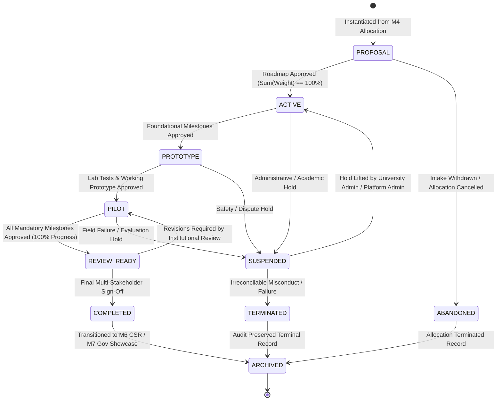

# Module 5 (M5) — Final Architecture Review

**Document Version:** 1.0  
**Module ID:** M5  
**Module Name:** Innovation Project Lifecycle  
**Status:** 📋 **ARCHITECTURE REVIEW & LOCK**  
**Author:** SICP Architecture & Engineering Core Team  

---

## 1. Project Ownership & Uniqueness Invariant

### Question: Is `InnovationProject` owned by `intake_team_allocation_id` (unique) or `team_id`?

**Answer:** **`InnovationProject` is strictly owned by `intake_team_allocation_id` (Unique 1:1 Binding).**

* **Owning Anchor**: `intake_team_allocation_id` (UUID foreign key referencing `intake_team_allocations.id` in M4).
* **Database Constraint**:
  ```sql
  CREATE UNIQUE INDEX idx_projects_unique_allocation 
  ON projects(intake_team_allocation_id) 
  WHERE is_deleted = false;
  ```
* **Rationale**: 
  - `intake_team_allocations` in M4 represents the exact, verified institutional binding of:
    $$\text{Challenge} + \text{University} + \text{Department} + \text{Student Team} + \text{Primary Faculty Mentor}$$
  - While `team_id` is stored on `projects` for fast relational indexing and team roster queries, ownership and uniqueness are anchored to the `intake_team_allocation_id`. A team cannot spawn duplicate concurrent projects for the same academic allocation.

---

## 2. Complete Project Lifecycle State Machine

### Question: Provide the complete project lifecycle state machine including suspended/archived states.



### State Definitions & Taxonomy

| State | Classification | Description |
| :--- | :--- | :--- |
| **`PROPOSAL`** | Initial / Draft | Team sets up project metadata, repository links, tech stack, and defines initial 3–10 milestones. |
| **`ACTIVE`** | In Progress | Roadmap activated by Mentor. Active sprint execution and deliverable submissions permitted. |
| **`PROTOTYPE`** | In Progress | Concept/architecture milestones completed; team actively developing Alpha/Beta prototypes. |
| **`PILOT`** | In Progress | Lab-tested prototype validated; team deploying physical or digital prototype in field testing. |
| **`REVIEW_READY`** | Evaluation Gate | 100% of mandatory milestone weights are `APPROVED`. Project awaits final institutional sign-off. |
| **`COMPLETED`** | Terminal (Success) | Final completion certificate signed by Mentor, University Admin/HOD, and Admin. Eligible for M6/M7. |
| **`SUSPENDED`** | Non-Terminal (Paused) | Temporarily frozen due to academic dispute, ethics review, or intake withdrawal. Edits blocked. |
| **`TERMINATED`** | Terminal (Failed) | Prematurely terminated due to academic misconduct, plagiarism, or permanent team abandonment. |
| **`ABANDONED`** | Terminal (Withdrawn) | Parent M4 academic intake was declined/cancelled before milestone completion. |
| **`ARCHIVED`** | Terminal (Immutable) | Historical record preserved in read-only mode for academic portfolio and compliance audit. |

---

## 3. Milestone Weight Sum Invariant

### Question: Are milestone weights required to total exactly 100%? Show the invariant.

**Answer:** **YES. Milestone weights MUST total exactly 100 (100% integer weight points).**

### Mathematical Invariants

1. **Total Weight Invariant (Activation Pre-requisite)**:
   $$\sum_{i=1}^{N} \text{weight}_i = 100 \quad \text{where } 1 \le \text{weight}_i \le 100 \quad \text{and } 3 \le N \le 10$$
   *Transition from `PROPOSAL` to `ACTIVE` is strictly rejected with HTTP 422 `INVALID_MILESTONE_WEIGHT_SUM` if $\sum \text{weight}_i \ne 100$.*

2. **Project Progress Calculation Formula**:
   $$\text{progress\_percentage} = \sum_{m \in \mathcal{M}_{\text{approved}}} \text{weight}_m \quad (0 \le \text{progress\_percentage} \le 100)$$
   where $\mathcal{M}_{\text{approved}} = \{ m \in \text{Milestones} \mid m.\text{status} = \text{'APPROVED'} \}$.

3. **Completion Pre-condition**:
   $$\text{Project Status} \rightarrow \text{COMPLETED} \iff \text{progress\_percentage} = 100 \land \forall m \in \mathcal{M}_{\text{mandatory}} (m.\text{status} = \text{'APPROVED'})$$

---

## 4. Lifecycle Transition Authorization Matrix

### Question: Who is authorized to approve each lifecycle transition?

| Lifecycle Transition | Authorized Actors | Required Guards & Validation Pre-conditions |
| :--- | :--- | :--- |
| **`PROPOSAL` $\rightarrow$ `ACTIVE`** | **Primary Faculty Mentor** (`primary_faculty_mentor_id`) or **Platform Admin** (`admin`) | 1. Total milestone weight equals exactly 100.<br/>2. Milestone count is between 3 and 10.<br/>3. Sequential ordering indices are contiguous ($1 \dots N$). |
| **`ACTIVE` $\rightarrow$ `PROTOTYPE`** | **Primary Faculty Mentor** or **Platform Admin** | 1. Stage 1 (Architecture / Design) milestones are `APPROVED`.<br/>2. Code repository URL is verified. |
| **`PROTOTYPE` $\rightarrow$ `PILOT`** | **Primary Faculty Mentor** or **Platform Admin** | 1. Prototype demo & lab test deliverables are `APPROVED`.<br/>2. Rubric evaluation score $\ge 70/100$. |
| **`PILOT` $\rightarrow$ `REVIEW_READY`** | **Automated System Engine** (certified upon Mentor approval of final milestone) | 1. `progress_percentage` reaches exactly 100%.<br/>2. All mandatory milestones have status `APPROVED`. |
| **`REVIEW_READY` $\rightarrow$ `COMPLETED`** | **Primary Faculty Mentor** (Academic Certification) <br/>**+** **University Admin / HOD** (Institutional Endorsement) <br/>**+** **Platform Admin** (Global Verification) | 1. Final project completion review submitted with score $\ge 75/100$.<br/>2. No active disputes or unresolved audit flags.<br/>3. Deployment proof deliverables verified. |

---

## 5. Optimistic Locking & Immutability Verification

### Question: Confirm optimistic locking exists on all mutable aggregates (InnovationProject, Milestone, Deliverable, Review).

| Aggregate / Entity | Mutability Pattern | Concurrency & Integrity Enforcement |
| :--- | :--- | :--- |
| **`InnovationProject`** | **Mutable** (State, Stage, URLs, Tech Stack) | **CONFIRMED (Optimistic Locking)**:<br/>Contains `version INTEGER NOT NULL DEFAULT 1`. Every `UPDATE` statement enforces `WHERE id = :id AND version = :expected_version`. Stale updates return HTTP 409 `CONCURRENCY_CONFLICT` (`OPTIMISTIC_LOCK_ERROR`). |
| **`ProjectMilestone`** | **Mutable prior to Approval**; **Frozen post-Approval** | **CONFIRMED (Optimistic Locking + State Freeze)**:<br/>Contains `version INTEGER NOT NULL DEFAULT 1`. Concurrent review/submission updates enforce version matching. Once `APPROVED`, all attributes become strictly read-only. |
| **`ProjectDeliverable`** | **Immutable Version Chains** (No in-place updates) | **CONFIRMED (Immutable Append-Only Versioning)**:<br/>Deliverables are never updated in place. Revisions create new records (`version_number = N + 1`, `parent_deliverable_id`). File assets enforce SHA-256 digest validation. Deletion is strictly blocked during active milestone reviews. |
| **`ProjectReview`** | **Strictly Append-Only & Immutable** | **CONFIRMED (Immutable Historical Ledger)**:<br/>`project_reviews` rows cannot be updated or deleted. Re-evaluation cycles generate a new review record instance linked to the resubmission. |

---

## 6. Architecture Review Conclusion

All 5 core architectural inquiries are confirmed, formally verified against M1–M4 frozen contracts, and documented in [M5-ARCHITECTURE-REVIEW.md](file:///c:/Users/Lenovo/Desktop/PROJECT%20CREATED/SICP/M5-ARCHITECTURE-REVIEW.md).
