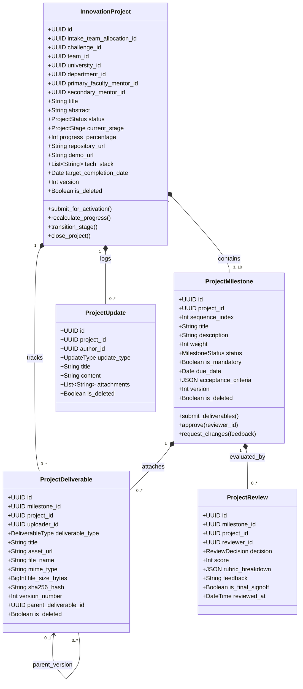
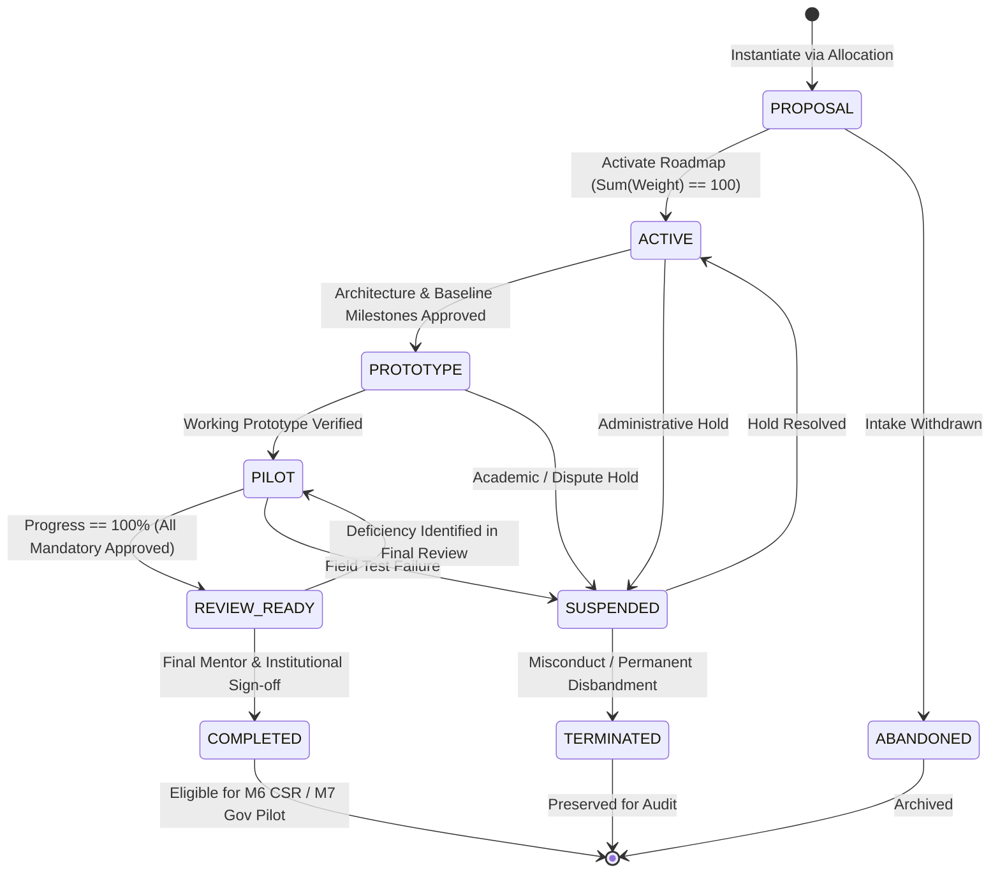
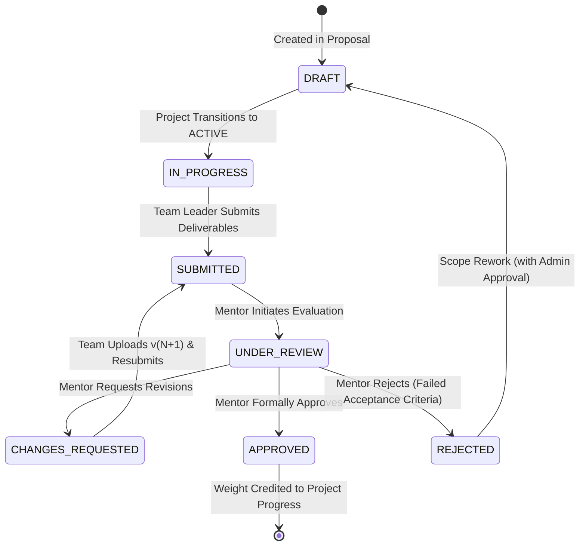

# System Architecture & Design Document (DESIGN) — Module 5: Innovation Project Lifecycle

**Document Version:** 1.0 (Specification Only)  
**Module ID:** M5  
**Module Name:** Innovation Project Lifecycle  
**Status:** 📋 **PROPOSED SPECIFICATION (PENDING APPROVAL)**  
**Author:** SICP Architecture & Engineering Core Team  
**Parent Project:** Societal Innovation Collaboration Platform (SICP)  
**Target Delivery:** Milestone 5  
**Dependencies:** 
- M1: Identity & Access Management (IAM) [LOCKED 🔒 `v1.0.0-m1-lock`]
- M2: Citizen Challenge Management [LOCKED 🔒 `v2.0.0-m2-lock`]
- M3: Team Formation & Collaboration [LOCKED 🔒 `v3.0.0-m3-lock`]
- M4: Academic Collaboration Hub [LOCKED 🔒 `v4.0.0-m4-lock`]

---

## 1. Mandatory Architectural Answers & Invariants

Prior to establishing schemas and endpoints, the 10 critical architectural questions are formally resolved and locked:

### Q1: Can one Academic Intake create multiple projects?
**Answer:** **Yes, indirectly via allocations (1 Intake $\rightarrow$ N Allocations $\rightarrow$ N Projects).**  
An `AcademicIntake` represents a university's institutional claim on a Challenge. A university may allocate multiple student teams via `intake_team_allocations`. Each `IntakeTeamAllocation` instantiates exactly **one** `InnovationProject`. Thus, an Intake with 3 team allocations yields 3 distinct projects. An intake cannot create multiple projects for the *same* team allocation.

### Q2: Can a project have multiple faculty mentors?
**Answer:** **Primary Faculty Mentor (Mandatory) + One Co-Mentor/Advisor (Optional) — Maximum 2.**  
In strict compliance with M3 (maximum 2 mentors per team) and M4 faculty workload rules (max 3 active platform mentorships, max 1 per challenge):
- `primary_faculty_mentor_id`: Mandatory; inherited from `intake_team_allocations`. Authoritative reviewer for milestone sign-offs.
- `secondary_mentor_id`: Optional; accredited co-mentor (faculty or technical advisor) with advisory review privileges.

### Q3: Can milestones be edited after completion?
**Answer:** **No (Strict Immutability).**  
Once a milestone transitions to `APPROVED` / `COMPLETED`, its attributes (`title`, `description`, `weight`, `acceptance_criteria`, `due_date`) are permanently frozen. Any scope changes require adding a new milestone or a structured milestone revision/addendum before final project sign-off.

### Q4: Can deliverables be replaced after review?
**Answer:** **No in-place replacement; Yes via Immutable Version Chains.**  
Deliverables evaluated in a completed review cannot be overwritten, modified, or deleted. If revision is required (`CHANGES_REQUESTED`), the team uploads a new deliverable record pointing to `parent_deliverable_id` with incremented `version_number = N + 1`.

### Q5: Can rejected reviews be reopened?
**Answer:** **No direct mutation of historical reviews.**  
`ProjectReview` records are append-only historical audit events. A reviewer cannot mutate an existing review record. When a team addresses feedback and re-submits the milestone, a **new Review instance** is created for the new evaluation cycle.

### Q6: Who can close a project?
**Answer:** **Authorized Multi-Role Governance:**
1. **Student Team Leader**: May submit a completion request or initiate voluntary project termination.
2. **Primary Faculty Mentor**: Signs the authoritative completion evaluation upon 100% milestone progress.
3. **University Administrator / HOD**: Signs the institutional completion endorsement.
4. **Platform Administrator (`admin`)**: Possesses global administrative authority to close, terminate, or suspend any project.
*(Note: Closing a project marks the institutional intake as completed; global M2 Challenge closure remains reserved for Platform Admin / Government in M7).*

### Q7: Can industry partners participate before M6?
**Answer:** **Read-Only / Advisory Mentorship only (No Financial/CSR Escrow).**  
Industry users (`role = 'industry'`) can view public project showcases and act as non-authoritative secondary advisors (`secondary_mentor_id`). Financial sponsorship, CSR escrow, resource grants, and contractual partnerships are strictly deferred to **M6**.

### Q8: What happens when an Academic Intake is withdrawn?
**Answer:** **Automatic Cascading Freeze / Suspension.**  
If an `AcademicIntake` is transitioned to `DECLINED` or withdrawn:
- All linked `InnovationProjects` automatically transition to `SUSPENDED` (or `ABANDONED`) with reason `INTAKE_WITHDRAWN`.
- Active milestones and review queues are frozen.
- Immutable audit event `PROJECT_SUSPENDED_INTAKE_WITHDRAWN` is emitted.

### Q9: How is concurrent milestone completion handled?
**Answer:** **Optimistic Locking (`version` column) + Atomic State Machine Validation.**  
All project and milestone entities contain an integer `version` field. Milestone submissions and review sign-offs execute conditional updates (`WHERE id = :id AND version = :expected_version`). Concurrent conflicting updates fail with HTTP 409 `CONCURRENCY_CONFLICT` (`OPTIMISTIC_LOCK_ERROR`).

### Q10: Which audit events are immutable?
**Answer:** **ALL 100% of M5 Audit Events are Strictly Append-Only & Immutable.**  
`audit_logs` records cannot be updated, soft-deleted, or truncated. Database-level trigger protections and application-level repository encapsulation enforce this constraint platform-wide.

---

## 2. Architecture Overview & Context

Module 5 sits atop M1 (IAM), M2 (Challenges), M3 (Teams), and M4 (Academic Hub). It executes in accordance with the SICP 4-layer architecture:

```
┌────────────────────────────────────────────────────────────────────────┐
│                        FastAPI Routing Layer                           │
│   /api/v1/projects (Projects, Milestones, Deliverables, Reviews, Logs) │
└───────────────────────────────────┬────────────────────────────────────┘
                                    │ (Dependency Injection & Guards)
┌───────────────────────────────────▼────────────────────────────────────┘
│                            Service Layer                               │
│   ProjectService, MilestoneService, DeliverableService, ReviewService  │
│   ProgressCalculatorService, S3AssetService                            │
└───────────────────────────────────┬────────────────────────────────────┘
                                    │ (Async SQLAlchemy Sessions)
┌───────────────────────────────────▼────────────────────────────────────┘
│                          Repository Layer                              │
│   ProjectRepository, MilestoneRepository, DeliverableRepository,       │
│   ReviewRepository, ProjectUpdateRepository, AuditRepository           │
└───────────────────────────────────┬────────────────────────────────────┘
                                    │ (PostgreSQL 16 Engine)
┌───────────────────────────────────▼────────────────────────────────────┘
│                  Relational & Storage Infrastructure                   │
│   projects, project_milestones, project_deliverables, project_reviews, │
│   project_updates ──▶ MinIO / AWS S3 (Encrypted Storage)               │
└────────────────────────────────────────────────────────────────────────┘
```

---

## 3. Domain Model & Aggregate Boundaries



---

## 4. Aggregate Root Specifications

### 4.1 InnovationProject Aggregate Root
* **Root Entity**: `InnovationProject`
* **Invariants**:
  1. Exactly **one** project per active `intake_team_allocation_id`.
  2. Cannot transition to `ACTIVE` unless total milestone weights equal **100**.
  3. `progress_percentage` is strictly derived as $\sum \text{weight}$ of all `APPROVED` milestones ($0 \le \text{progress} \le 100$).
  4. Only Team Leader can submit initial proposal and request closure; only Primary Mentor and University Admin/Admin can approve completion.
  5. Cannot transition to `COMPLETED` unless $\text{progress\_percentage} = 100\%$ and all mandatory milestones are `APPROVED`.

### 4.2 Milestone Aggregate
* **Entity**: `ProjectMilestone`
* **Invariants**:
  1. `sequence_index` must be contiguous starting from 1 ($1, 2, \dots, N$).
  2. Milestone $K$ cannot transition to `SUBMITTED` until Milestone $K-1$ is `APPROVED`.
  3. Once `APPROVED`, attributes become completely read-only.
  4. Sum of weights of all milestones in a project cannot exceed 100.

### 4.3 Deliverable Aggregate
* **Entity**: `ProjectDeliverable`
* **Invariants**:
  1. Once attached to a `SUBMITTED` milestone, deliverable cannot be deleted or mutated.
  2. Replacements must link to `parent_deliverable_id` with incremented `version_number`.
  3. Valid `sha256_hash` (64 hex characters) required for all non-URL assets.

### 4.4 Review Aggregate
* **Entity**: `ProjectReview`
* **Invariants**:
  1. Review records are strictly append-only and immutable.
  2. `score` must be between $0$ and $100$.
  3. Only designated `primary_faculty_mentor_id`, authorized HOD, or Platform Admin can submit authoritative `APPROVED` reviews.

---

## 5. State Machines & Lifecycle Transitions

### 5.1 Project State Machine



### 5.2 Milestone State Machine



---

## 6. Database Schema (PostgreSQL 16 DDL)

### 6.1 Enumerations (`app.core.constants`)

```python
class ProjectStatus(str, Enum):
    PROPOSAL = "PROPOSAL"
    ACTIVE = "ACTIVE"
    PROTOTYPE = "PROTOTYPE"
    PILOT = "PILOT"
    REVIEW_READY = "REVIEW_READY"
    COMPLETED = "COMPLETED"
    SUSPENDED = "SUSPENDED"
    TERMINATED = "TERMINATED"
    ABANDONED = "ABANDONED"

class ProjectStage(str, Enum):
    CONCEPT_RESEARCH = "CONCEPT_RESEARCH"
    DESIGN_ARCHITECTURE = "DESIGN_ARCHITECTURE"
    PROTOTYPE_DEVELOPMENT = "PROTOTYPE_DEVELOPMENT"
    LAB_VALIDATION = "LAB_VALIDATION"
    FIELD_PILOT = "FIELD_PILOT"
    FINAL_EVALUATION = "FINAL_EVALUATION"

class MilestoneStatus(str, Enum):
    DRAFT = "DRAFT"
    IN_PROGRESS = "IN_PROGRESS"
    SUBMITTED = "SUBMITTED"
    UNDER_REVIEW = "UNDER_REVIEW"
    CHANGES_REQUESTED = "CHANGES_REQUESTED"
    APPROVED = "APPROVED"
    REJECTED = "REJECTED"

class DeliverableType(str, Enum):
    CODE_REPOSITORY = "CODE_REPOSITORY"
    DOCUMENTATION = "DOCUMENTATION"
    PROTOTYPE_DEMO = "PROTOTYPE_DEMO"
    TEST_REPORT = "TEST_REPORT"
    DATASET = "DATASET"
    DEPLOYMENT_PROOF = "DEPLOYMENT_PROOF"

class ReviewDecision(str, Enum):
    APPROVED = "APPROVED"
    CHANGES_REQUESTED = "CHANGES_REQUESTED"
    REJECTED = "REJECTED"

class UpdateType(str, Enum):
    SPRINT_LOG = "SPRINT_LOG"
    BLOCKER = "BLOCKER"
    LAB_NOTE = "LAB_NOTE"
    GENERAL_ANNOUNCEMENT = "GENERAL_ANNOUNCEMENT"
```

### 6.2 Relational Entity Tables

#### 1. `projects` Table
```sql
CREATE TABLE projects (
    id UUID PRIMARY KEY DEFAULT gen_random_uuid(),
    intake_team_allocation_id UUID NOT NULL REFERENCES intake_team_allocations(id) ON DELETE RESTRICT,
    challenge_id UUID NOT NULL REFERENCES challenges(id) ON DELETE RESTRICT,
    team_id UUID NOT NULL REFERENCES teams(id) ON DELETE RESTRICT,
    university_id UUID NOT NULL REFERENCES universities(id) ON DELETE RESTRICT,
    department_id UUID NOT NULL REFERENCES departments(id) ON DELETE RESTRICT,
    primary_faculty_mentor_id UUID NOT NULL REFERENCES users(id) ON DELETE RESTRICT,
    secondary_mentor_id UUID REFERENCES users(id) ON DELETE SET NULL,
    title VARCHAR(255) NOT NULL,
    abstract TEXT NOT NULL,
    status VARCHAR(30) NOT NULL DEFAULT 'PROPOSAL',
    current_stage VARCHAR(30) NOT NULL DEFAULT 'CONCEPT_RESEARCH',
    progress_percentage INTEGER NOT NULL DEFAULT 0 CHECK (progress_percentage BETWEEN 0 AND 100),
    repository_url VARCHAR(500),
    demo_url VARCHAR(500),
    tech_stack JSONB DEFAULT '[]'::jsonb,
    target_completion_date DATE,
    actual_completion_date TIMESTAMPTZ,
    closure_reason TEXT,
    created_by UUID NOT NULL REFERENCES users(id) ON DELETE RESTRICT,
    version INTEGER NOT NULL DEFAULT 1,
    is_deleted BOOLEAN NOT NULL DEFAULT FALSE,
    created_at TIMESTAMPTZ NOT NULL DEFAULT CURRENT_TIMESTAMP,
    updated_at TIMESTAMPTZ NOT NULL DEFAULT CURRENT_TIMESTAMP
);

CREATE UNIQUE INDEX idx_projects_unique_allocation ON projects(intake_team_allocation_id) WHERE is_deleted = false;
CREATE INDEX idx_projects_challenge ON projects(challenge_id) WHERE is_deleted = false;
CREATE INDEX idx_projects_team ON projects(team_id) WHERE is_deleted = false;
CREATE INDEX idx_projects_university ON projects(university_id) WHERE is_deleted = false;
CREATE INDEX idx_projects_mentor ON projects(primary_faculty_mentor_id) WHERE is_deleted = false;
CREATE INDEX idx_projects_status ON projects(status) WHERE is_deleted = false;
CREATE INDEX idx_projects_stage ON projects(current_stage) WHERE is_deleted = false;
```

#### 2. `project_milestones` Table
```sql
CREATE TABLE project_milestones (
    id UUID PRIMARY KEY DEFAULT gen_random_uuid(),
    project_id UUID NOT NULL REFERENCES projects(id) ON DELETE CASCADE,
    sequence_index INTEGER NOT NULL CHECK (sequence_index >= 1),
    title VARCHAR(255) NOT NULL,
    description TEXT NOT NULL,
    weight INTEGER NOT NULL CHECK (weight BETWEEN 1 AND 100),
    status VARCHAR(30) NOT NULL DEFAULT 'DRAFT',
    is_mandatory BOOLEAN NOT NULL DEFAULT TRUE,
    due_date DATE NOT NULL,
    completed_at TIMESTAMPTZ,
    acceptance_criteria JSONB DEFAULT '[]'::jsonb,
    created_by UUID NOT NULL REFERENCES users(id) ON DELETE RESTRICT,
    version INTEGER NOT NULL DEFAULT 1,
    is_deleted BOOLEAN NOT NULL DEFAULT FALSE,
    created_at TIMESTAMPTZ NOT NULL DEFAULT CURRENT_TIMESTAMP,
    updated_at TIMESTAMPTZ NOT NULL DEFAULT CURRENT_TIMESTAMP
);

CREATE UNIQUE INDEX idx_milestones_unique_sequence ON project_milestones(project_id, sequence_index) WHERE is_deleted = false;
CREATE INDEX idx_milestones_project ON project_milestones(project_id) WHERE is_deleted = false;
CREATE INDEX idx_milestones_status ON project_milestones(status) WHERE is_deleted = false;
```

#### 3. `project_deliverables` Table
```sql
CREATE TABLE project_deliverables (
    id UUID PRIMARY KEY DEFAULT gen_random_uuid(),
    milestone_id UUID NOT NULL REFERENCES project_milestones(id) ON DELETE RESTRICT,
    project_id UUID NOT NULL REFERENCES projects(id) ON DELETE CASCADE,
    uploader_id UUID NOT NULL REFERENCES users(id) ON DELETE RESTRICT,
    deliverable_type VARCHAR(30) NOT NULL,
    title VARCHAR(255) NOT NULL,
    asset_url VARCHAR(1000) NOT NULL,
    file_name VARCHAR(255),
    mime_type VARCHAR(100),
    file_size_bytes BIGINT,
    sha256_hash VARCHAR(64),
    version_number INTEGER NOT NULL DEFAULT 1,
    parent_deliverable_id UUID REFERENCES project_deliverables(id) ON DELETE SET NULL,
    metadata_info JSONB DEFAULT '{}'::jsonb,
    is_deleted BOOLEAN NOT NULL DEFAULT FALSE,
    created_at TIMESTAMPTZ NOT NULL DEFAULT CURRENT_TIMESTAMP,
    updated_at TIMESTAMPTZ NOT NULL DEFAULT CURRENT_TIMESTAMP
);

CREATE INDEX idx_deliverables_milestone ON project_deliverables(milestone_id) WHERE is_deleted = false;
CREATE INDEX idx_deliverables_project ON project_deliverables(project_id) WHERE is_deleted = false;
CREATE INDEX idx_deliverables_parent ON project_deliverables(parent_deliverable_id) WHERE is_deleted = false;
```

#### 4. `project_reviews` Table
```sql
CREATE TABLE project_reviews (
    id UUID PRIMARY KEY DEFAULT gen_random_uuid(),
    milestone_id UUID NOT NULL REFERENCES project_milestones(id) ON DELETE RESTRICT,
    project_id UUID NOT NULL REFERENCES projects(id) ON DELETE CASCADE,
    reviewer_id UUID NOT NULL REFERENCES users(id) ON DELETE RESTRICT,
    decision VARCHAR(30) NOT NULL,
    score INTEGER NOT NULL CHECK (score BETWEEN 0 AND 100),
    rubric_breakdown JSONB DEFAULT '{}'::jsonb,
    feedback TEXT NOT NULL,
    is_final_signoff BOOLEAN NOT NULL DEFAULT FALSE,
    created_at TIMESTAMPTZ NOT NULL DEFAULT CURRENT_TIMESTAMP
);

CREATE INDEX idx_reviews_milestone ON project_reviews(milestone_id);
CREATE INDEX idx_reviews_project ON project_reviews(project_id);
CREATE INDEX idx_reviews_reviewer ON project_reviews(reviewer_id);
```

#### 5. `project_updates` Table
```sql
CREATE TABLE project_updates (
    id UUID PRIMARY KEY DEFAULT gen_random_uuid(),
    project_id UUID NOT NULL REFERENCES projects(id) ON DELETE CASCADE,
    author_id UUID NOT NULL REFERENCES users(id) ON DELETE RESTRICT,
    update_type VARCHAR(30) NOT NULL DEFAULT 'SPRINT_LOG',
    title VARCHAR(255) NOT NULL,
    content TEXT NOT NULL,
    attachments JSONB DEFAULT '[]'::jsonb,
    is_deleted BOOLEAN NOT NULL DEFAULT FALSE,
    created_at TIMESTAMPTZ NOT NULL DEFAULT CURRENT_TIMESTAMP,
    updated_at TIMESTAMPTZ NOT NULL DEFAULT CURRENT_TIMESTAMP
);

CREATE INDEX idx_project_updates_project ON project_updates(project_id) WHERE is_deleted = false;
```

---

## 7. API Contracts (FastAPI Specification)

### 7.1 Response Envelope Structure
In accordance with `AGENTS.md` Rule 5:
- **Success**: `{"success": true, "data": { ... }}`
- **Error**: `{"success": false, "error": {"code": "...", "message": "...", "details": { ... }}}`

### 7.2 Endpoint Catalog

| HTTP Method | Route Path | Description | Required Roles / Guards |
| :--- | :--- | :--- | :--- |
| `POST` | `/api/v1/projects` | Instantiate innovation project from allocation | `student` (Team Leader), `admin` |
| `GET` | `/api/v1/projects` | List projects (with filters by challenge, uni, team) | Authenticated Users |
| `GET` | `/api/v1/projects/{id}` | Get detailed project aggregate & progress | Authenticated Users |
| `PATCH` | `/api/v1/projects/{id}` | Update project metadata (tech stack, repo, demo) | Team Leader, Primary Mentor, Admin |
| `POST` | `/api/v1/projects/{id}/activate` | Activate roadmap (`PROPOSAL` $\rightarrow$ `ACTIVE`) | Primary Faculty Mentor, Admin |
| `POST` | `/api/v1/projects/{id}/milestones` | Define milestone for project | Team Leader, Primary Mentor, Admin |
| `GET` | `/api/v1/projects/{id}/milestones` | List all milestones with deliverable summaries | Authenticated Users |
| `PATCH` | `/api/v1/projects/{id}/milestones/{milestone_id}` | Edit milestone (only when not approved) | Team Leader, Primary Mentor, Admin |
| `POST` | `/api/v1/projects/{id}/milestones/{milestone_id}/submit` | Submit milestone deliverables for review | `student` (Team Leader) |
| `POST` | `/api/v1/projects/{id}/milestones/{milestone_id}/reviews` | Submit evaluation & rubric decision | Primary Mentor, HOD, Admin |
| `POST` | `/api/v1/projects/{id}/deliverables` | Upload new deliverable (or increment version) | Team Members, Team Leader |
| `GET` | `/api/v1/projects/{id}/deliverables/{deliv_id}/download` | Get time-limited signed S3 download URL | Authenticated Users |
| `POST` | `/api/v1/projects/{id}/updates` | Post sprint log or blocker update | Team Members, Mentor |
| `GET` | `/api/v1/projects/{id}/updates` | List project updates feed | Authenticated Users |
| `POST` | `/api/v1/projects/{id}/complete` | Request / execute final project completion | Team Leader + Mentor + Admin |
| `POST` | `/api/v1/projects/{id}/suspend` | Put project on administrative hold | University Admin, Platform Admin |

---

## 8. RBAC & Authorization Matrix

| Endpoint Action | `admin` | `univ_admin` / HOD | `primary_faculty_mentor` | `student` (Leader) | `student` (Member) | `industry` | `citizen` / Public |
| :--- | :---: | :---: | :---: | :---: | :---: | :---: | :---: |
| **Create Project** | ✅ | ❌ | ❌ | ✅ (Own Alloc) | ❌ | ❌ | ❌ |
| **Activate Roadmap** | ✅ | ❌ | ✅ (Assigned) | ❌ | ❌ | ❌ | ❌ |
| **Edit Project Meta** | ✅ | ✅ (Own Dept) | ✅ (Assigned) | ✅ (Own Team) | ❌ | ❌ | ❌ |
| **Create Milestone** | ✅ | ❌ | ✅ (Assigned) | ✅ (Proposal) | ❌ | ❌ | ❌ |
| **Submit Milestone** | ✅ | ❌ | ❌ | ✅ (Own Team) | ❌ | ❌ | ❌ |
| **Upload Deliverable** | ✅ | ❌ | ❌ | ✅ (Own Team) | ✅ (Own Team) | ❌ | ❌ |
| **Submit Review** | ✅ | ✅ (Escalation) | ✅ (Assigned) | ❌ | ❌ | ❌ (Advisory Only) | ❌ |
| **Post Sprint Update** | ✅ | ✅ (Own Dept) | ✅ (Assigned) | ✅ (Own Team) | ✅ (Own Team) | ❌ | ❌ |
| **Final Sign-off** | ✅ | ✅ (Endorsement)| ✅ (Authoritative) | ❌ (Submit Req) | ❌ | ❌ | ❌ |
| **Suspend Project** | ✅ | ✅ (Own Dept) | ❌ | ❌ | ❌ | ❌ | ❌ |
| **View Catalog** | ✅ | ✅ | ✅ | ✅ | ✅ | ✅ | ✅ (Public) |

---

## 9. Standardized Audit Events (M5 Additions to `AuditAction`)

Module 5 extends `app.core.constants.AuditAction` with 15 project lifecycle audit events:

1. `PROJECT_CREATED`: Instantiation from M4 intake team allocation.
2. `PROJECT_ROADMAP_ACTIVATED`: Transition from `PROPOSAL` to `ACTIVE`.
3. `PROJECT_METADATA_UPDATED`: Modification of repo URL, demo URL, tech stack.
4. `PROJECT_STAGE_CHANGED`: Transition between project stages.
5. `PROJECT_SUSPENDED`: Administrative hold applied.
6. `PROJECT_RESUMED`: Administrative hold lifted.
7. `PROJECT_TERMINATED`: Premature termination for cause.
8. `PROJECT_COMPLETED`: Successful final completion sign-off.
9. `MILESTONE_CREATED`: New milestone defined.
10. `MILESTONE_UPDATED`: Milestone details amended prior to approval.
11. `MILESTONE_SUBMITTED`: Team leader submits milestone deliverables.
12. `MILESTONE_REVIEW_COMPLETED`: Mentor evaluates milestone (`APPROVED`, `CHANGES_REQUESTED`, `REJECTED`).
13. `MILESTONE_APPROVED`: Formally certified; weight credited to project.
14. `DELIVERABLE_UPLOADED`: New deliverable or version uploaded.
15. `PROJECT_UPDATE_POSTED`: Sprint log or blocker note published.

---

## 10. Integration Points

### 10.1 Integration with Module 4 (Academic Collaboration Hub)
* **Intake Team Allocation Ingestion**: `InnovationProject` consumes verified bindings from `intake_team_allocations`. It extracts `challenge_id`, `team_id`, `university_id`, `department_id`, and `faculty_mentor_id`.
* **Mentorship Capacity Sync**: Milestone reviews and completion events update faculty mentorship statistics in M4.
* **Intake Completion Trigger**: When a project reaches `COMPLETED`, it notifies M4 `AcademicIntakeService` to evaluate whether all allocated teams under that university have finished, allowing the institutional intake to transition to `COMPLETED`.

### 10.2 Future Integration with Module 6 (Industry Partnership Network)
* **Prototype Showcase Discovery**: Completed and pilot-stage innovation projects expose verified deliverables and test reports to the M6 Industry CSR Marketplace.
* **Milestone-Gated CSR Tranche Releases**: In M6, corporate sponsors release grant tranches conditionally upon M5 `MILESTONE_APPROVED` audit events.
* **Industrial Mentorship Advisory**: M6 corporate mentors can be bound as `secondary_mentor_id` to provide industry-standard code reviews and testing guidance.
