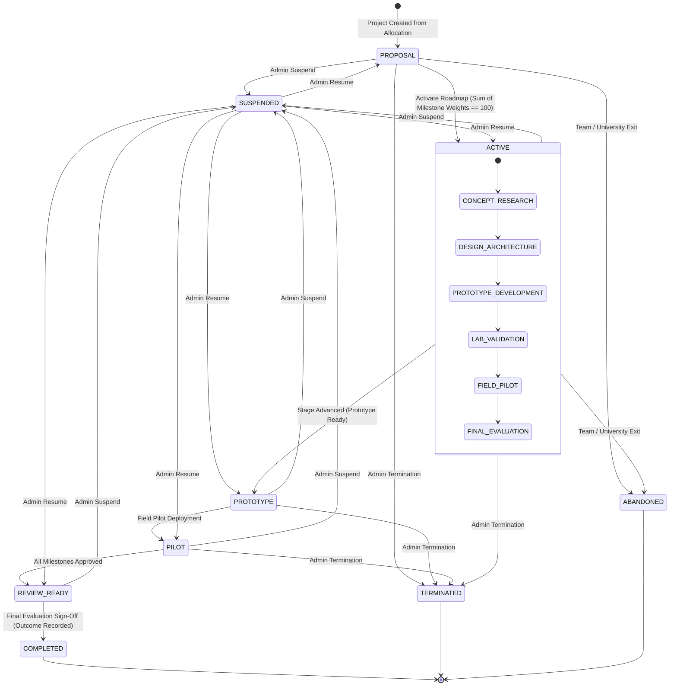
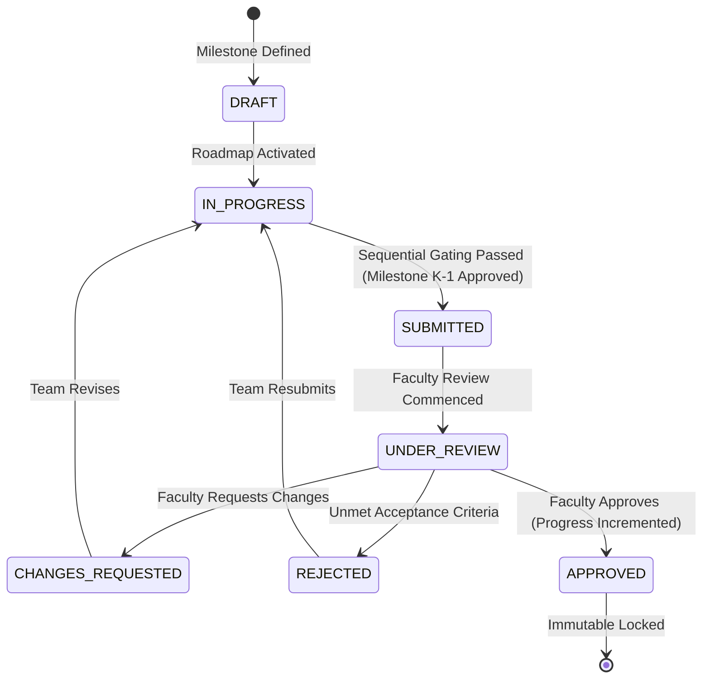

# Module 5 (M5) — Architecture & Contract Lock

**Document Version:** 5.0.0 (Locked Specification & Implementation)  
**Module ID:** M5  
**Module Name:** Innovation Project Lifecycle  
**STATUS:** 🔒 **LOCKED**  
**VERSION:** `v5.0.0-m5-lock`  
**Author:** SICP Architecture & Engineering Core Team  
**Parent Project:** Societal Innovation Collaboration Platform (SICP)  
**Target Delivery:** Milestone 5  

---

## 1. Locked Architecture Decisions

1. **Intake Team Allocation Ownership ($1:1$)**:
   - Every `InnovationProject` is uniquely owned by and bound to an `intake_team_allocation_id` from M4.
   - An allocation represents the approved binding of a Challenge (M2), Student Team (M3), University Department (M4), and Primary Faculty Mentor (M4).
   - One Challenge can produce multiple Innovation Projects across different university teams/allocations, but exactly one Innovation Project exists per `intake_team_allocation_id`.

2. **Sequential Milestone Gating**:
   - Milestones are strictly ordered by `sequence_index`. Milestone $K$ cannot transition to `SUBMITTED` until Milestone $K-1$ is `APPROVED`.
   - Milestone weights must sum to exactly $100\%$ before a project roadmap can transition from `PROPOSAL` to `ACTIVE`.

3. **Multi-Stakeholder Stage & Lifecycle Authority**:
   - Lifecycle activation, stage progression, and completion require explicit authorization:
     - `PROPOSAL` $\rightarrow$ `ACTIVE`: Student Team Leader (upon roadmap validation $\sum \text{weight} == 100$).
     - `ACTIVE` $\rightarrow$ `PROTOTYPE`: Primary Faculty Mentor or Platform Admin.
     - `PROTOTYPE` $\rightarrow$ `PILOT`: Primary Faculty Mentor, University Admin, or Platform Admin.
     - `PILOT` $\rightarrow$ `REVIEW_READY`: Student Team Leader or Faculty Mentor.
     - `REVIEW_READY` $\rightarrow$ `COMPLETED`: Primary Faculty Mentor, Challenge Evaluator, or Platform Admin.
     - `SUSPEND` / `RESUME`: Super Admin only.

4. **Immutable Evidence & Review Ledger**:
   - Deliverables require a 64-character SHA-256 cryptographic digest. New versions create new chained rows linking to `parent_deliverable_id`.
   - Milestone reviews are append-only rows in `project_reviews` with numerical scoring ($0-100$) and structured rubric breakdowns.
   - Approved milestones become permanently immutable.

---

## 2. Frozen Database Schema Contracts

The following entities and tables are **frozen and locked**. No modifications are permitted in subsequent modules (M6, M7):

### 2.1 `projects` Table (`InnovationProject`)
- `id`: UUID (PK)
- `title`: String(255), Not Null
- `abstract`: Text, Not Null
- `intake_team_allocation_id`: UUID, Unique, Indexed, FK $\rightarrow$ `intake_team_allocations.id` (1:1 Ownership)
- `challenge_id`: UUID, Indexed, FK $\rightarrow$ `challenges.id`
- `team_id`: UUID, Indexed, FK $\rightarrow$ `teams.id`
- `university_id`: UUID, Indexed, FK $\rightarrow$ `universities.id`
- `department_id`: UUID, Indexed, FK $\rightarrow$ `departments.id`
- `primary_faculty_mentor_id`: UUID, Indexed, FK $\rightarrow$ `users.id`
- `status`: String(50), Not Null (`ProjectStatus`: `PROPOSAL`, `ACTIVE`, `PROTOTYPE`, `PILOT`, `REVIEW_READY`, `COMPLETED`, `SUSPENDED`, `TERMINATED`, `ABANDONED`)
- `stage`: String(50), Not Null (`ProjectStage`: `CONCEPT_RESEARCH`, `DESIGN_ARCHITECTURE`, `PROTOTYPE_DEVELOPMENT`, `LAB_VALIDATION`, `FIELD_PILOT`, `FINAL_EVALUATION`)
- `project_outcome`: String(50), Nullable (`ProjectOutcome`: `SUCCESS`, `PARTIAL_SUCCESS`, `FAILED`, `ABANDONED`)
- `progress_percentage`: Integer, Default 0 ($0 \le \text{progress} \le 100$)
- `repository_url`: String(500), Nullable
- `documentation_url`: String(500), Nullable
- `version`: Integer, Default 1 (Optimistic Locking)
- `started_at`: Timestamp With Time Zone, Nullable
- `completed_at`: Timestamp With Time Zone, Nullable
- `suspended_at`: Timestamp With Time Zone, Nullable
- `created_at`: Timestamp With Time Zone, Default UTC Now
- `updated_at`: Timestamp With Time Zone, Default UTC Now

### 2.2 `project_milestones` Table (`ProjectMilestone`)
- `id`: UUID (PK)
- `project_id`: UUID, Indexed, FK $\rightarrow$ `projects.id`
- `sequence_index`: Integer, Not Null ($\ge 1$)
- `title`: String(255), Not Null
- `description`: Text, Not Null
- `acceptance_criteria`: Text, Not Null
- `weight_percentage`: Integer, Not Null ($1 \le \text{weight} \le 100$)
- `due_date`: Date, Not Null
- `status`: String(50), Not Null (`MilestoneStatus`: `DRAFT`, `IN_PROGRESS`, `SUBMITTED`, `UNDER_REVIEW`, `CHANGES_REQUESTED`, `APPROVED`, `REJECTED`)
- `faculty_signoff_by`: UUID, Nullable, FK $\rightarrow$ `users.id`
- `faculty_signoff_at`: Timestamp With Time Zone, Nullable
- `version`: Integer, Default 1 (Optimistic Locking)
- `created_at`: Timestamp With Time Zone, Default UTC Now
- `updated_at`: Timestamp With Time Zone, Default UTC Now
- **Unique Constraint**: `(project_id, sequence_index)`

### 2.3 `project_deliverables` Table (`ProjectDeliverable`)
- `id`: UUID (PK)
- `milestone_id`: UUID, Indexed, FK $\rightarrow$ `project_milestones.id`
- `deliverable_type`: String(50), Not Null (`DeliverableType`: `CODE_REPOSITORY`, `DOCUMENTATION`, `PROTOTYPE_DEMO`, `TEST_REPORT`, `DATASET`, `DEPLOYMENT_PROOF`)
- `title`: String(255), Not Null
- `asset_url`: String(1000), Not Null
- `asset_checksum`: String(64), Not Null (SHA-256 digest)
- `version_number`: Integer, Default 1
- `parent_deliverable_id`: UUID, Nullable, FK $\rightarrow$ `project_deliverables.id`
- `uploaded_by`: UUID, Not Null, FK $\rightarrow$ `users.id`
- `created_at`: Timestamp With Time Zone, Default UTC Now

### 2.4 `project_reviews` Table (`ProjectReview`)
- `id`: UUID (PK)
- `milestone_id`: UUID, Indexed, FK $\rightarrow$ `project_milestones.id`
- `reviewer_id`: UUID, Indexed, FK $\rightarrow$ `users.id`
- `decision`: String(50), Not Null (`ReviewDecision`: `APPROVED`, `CHANGES_REQUESTED`, `REJECTED`)
- `score`: Integer, Not Null ($0 \le \text{score} \le 100$)
- `feedback`: Text, Not Null
- `rubric_breakdown`: JSONB, Default `{}`
- `created_at`: Timestamp With Time Zone, Default UTC Now (Immutable append-only ledger)

### 2.5 `project_updates` Table (`ProjectUpdate`)
- `id`: UUID (PK)
- `project_id`: UUID, Indexed, FK $\rightarrow$ `projects.id`
- `author_id`: UUID, Not Null, FK $\rightarrow$ `users.id`
- `update_type`: String(50), Not Null (`UpdateType`: `SPRINT_LOG`, `BLOCKER`, `LAB_NOTE`, `GENERAL_ANNOUNCEMENT`)
- `title`: String(255), Not Null
- `content`: Text, Not Null
- `created_at`: Timestamp With Time Zone, Default UTC Now

---

## 3. Frozen API Contracts

All endpoints return standard envelopes: `{ success: true, data: {} }` or `{ success: false, error: { code, message, details } }`.

| Method | Endpoint | Authorized Roles | Description |
| :--- | :--- | :--- | :--- |
| `POST` | `/api/v1/projects` | `student`, `admin` | Create project from active allocation (Team Leader only). |
| `GET` | `/api/v1/projects` | All Authenticated | List innovation projects with filters and pagination. |
| `GET` | `/api/v1/projects/{id}` | All Authenticated | Get detailed project by UUID including milestones. |
| `PATCH` | `/api/v1/projects/{id}` | Team Members, Admin | Update project metadata with optimistic concurrency check. |
| `POST` | `/api/v1/projects/{id}/activate` | `student`, `admin` | Transition `PROPOSAL` $\rightarrow$ `ACTIVE` (checks $\sum \text{weight} == 100$). |
| `POST` | `/api/v1/projects/{id}/stage` | `faculty`, `admin` | Advance engineering stage (`ProjectStage`). |
| `POST` | `/api/v1/projects/{id}/complete` | `faculty`, `admin` | Transition to `COMPLETED` and record `project_outcome`. |
| `POST` | `/api/v1/projects/{id}/suspend` | `admin` | Emergency admin suspension. |
| `POST` | `/api/v1/projects/{id}/resume` | `admin` | Resume suspended project. |
| `POST` | `/api/v1/projects/{id}/milestones` | Team Members, Admin | Create milestone during proposal phase. |
| `GET` | `/api/v1/projects/{id}/milestones` | All Authenticated | List all milestones ordered by `sequence_index`. |
| `PATCH` | `/api/v1/projects/{id}/milestones/{milestone_id}` | Team Members, Admin | Update milestone details (immutable if `APPROVED`). |
| `POST` | `/api/v1/projects/{id}/milestones/{milestone_id}/submit` | Team Members, Admin | Submit milestone for faculty review. |
| `POST` | `/api/v1/projects/{id}/milestones/{milestone_id}/reviews` | `faculty`, `admin` | Submit review decision (`APPROVED`, `CHANGES_REQUESTED`, `REJECTED`). |
| `POST` | `/api/v1/projects/{id}/deliverables` | Team Members, Admin | Upload deliverable artifact with SHA-256 validation. |
| `POST` | `/api/v1/projects/{id}/updates` | Team Members, Faculty, Admin | Post sprint log, blocker, or lab note. |
| `GET` | `/api/v1/projects/{id}/updates` | All Authenticated | List project updates feed. |

---

## 4. Frozen State Machine

### Milestone State Machine

---

## 5. Frozen RBAC Matrix

| Action / Operation | Citizen | Student Member | Team Leader | Faculty Mentor | University Admin | Super Admin |
| :--- | :---: | :---: | :---: | :---: | :---: | :---: |
| Create Project from Allocation | ❌ | ❌ | ✅ | ❌ | ❌ | ✅ |
| Update Project Metadata | ❌ | ✅ | ✅ | ❌ | ❌ | ✅ |
| Activate Project Roadmap | ❌ | ❌ | ✅ | ❌ | ❌ | ✅ |
| Advance Engineering Stage | ❌ | ❌ | ❌ | ✅ (Assigned) | ❌ | ✅ |
| Add / Edit Draft Milestone | ❌ | ✅ | ✅ | ❌ | ❌ | ✅ |
| Submit Milestone for Review | ❌ | ✅ | ✅ | ❌ | ❌ | ✅ |
| Upload Milestone Deliverable | ❌ | ✅ | ✅ | ❌ | ❌ | ✅ |
| Review & Approve Milestone | ❌ | ❌ | ❌ | ✅ (Assigned) | ❌ | ✅ |
| Sign-off Project Completion | ❌ | ❌ | ❌ | ✅ (Assigned) | ❌ | ✅ |
| Post Sprint / Blocker Update | ❌ | ✅ | ✅ | ✅ (Assigned) | ❌ | ✅ |
| Suspend / Resume Project | ❌ | ❌ | ❌ | ❌ | ❌ | ✅ |
| Terminate Project | ❌ | ❌ | ❌ | ❌ | ❌ | ✅ |

---

## 6. Frozen Audit Events

Every M5 operation emits an immutable audit event to `audit_logs`:

1. `PROJECT_CREATED`: Emitted upon project instantiation.
2. `PROJECT_UPDATED`: Emitted on project metadata modification.
3. `PROJECT_ROADMAP_ACTIVATED`: Emitted on transition to `ACTIVE`.
4. `PROJECT_STAGE_ADVANCED`: Emitted on engineering stage progression.
5. `PROJECT_COMPLETED`: Emitted on completion with recorded outcome.
6. `PROJECT_SUSPENDED`: Emitted on admin suspension.
7. `PROJECT_RESUMED`: Emitted on admin resumption.
8. `PROJECT_TERMINATED`: Emitted on administrative termination.
9. `MILESTONE_CREATED`: Emitted on milestone definition.
10. `MILESTONE_UPDATED`: Emitted on milestone modification.
11. `MILESTONE_SUBMITTED`: Emitted on milestone submission.
12. `MILESTONE_REVIEWED`: Emitted on review decision recording.
13. `MILESTONE_APPROVED`: Emitted on faculty approval.
14. `DELIVERABLE_UPLOADED`: Emitted on deliverable creation with SHA-256 hash.
15. `PROJECT_UPDATE_POSTED`: Emitted on sprint/blocker note creation.

---

## 7. Frozen Invariants

1. **One Project per Intake Team Allocation**:
   - `projects.intake_team_allocation_id` is globally unique. Attempts to create a duplicate project return HTTP `409 Conflict` (`PROJECT_ALREADY_EXISTS`).
2. **Milestone Weights Sum Invariant**:
   - $\sum_{i=1}^N \text{weight}_i == 100$ enforced before transition from `PROPOSAL` to `ACTIVE`. Rejects with HTTP `422 Unprocessable Entity` (`INVALID_MILESTONE_WEIGHTS`).
3. **Approved Milestones Immutability**:
   - Once a milestone reaches `APPROVED`, all fields are permanently frozen. Any subsequent edit attempts return HTTP `400 Bad Request` (`MILESTONE_IMMUTABLE_ERROR`).
4. **Deliverable Versioning & SHA-256 Protection**:
   - Deliverables must have a valid 64-character hexadecimal SHA-256 digest (`asset_checksum`). Duplicate checksums for the same milestone are rejected with HTTP `409 Conflict` (`DUPLICATE_DELIVERABLE_CHECKSUM`). Deliverable revisions chain via `parent_deliverable_id` with incremented `version_number`.
5. **Reviews Append-Only**:
   - The `project_reviews` table is strictly append-only. Review scores ($0-100$) and rubric breakdown are immutable once persisted.
6. **Optimistic Locking**:
   - The `version` integer column on mutable aggregates (`projects`, `project_milestones`) must match the current database state during updates. Concurrent version conflicts raise HTTP `409 Conflict` (`OPTIMISTIC_LOCK_ERROR`).

---

## 8. Downstream Dependencies (M6 & M7 Integration Contracts)

- **To Module 6 (Industry Partnership Network)**:
  - Active innovation projects at `PROTOTYPE` or `PILOT` stage with verified deliverables feed directly into the M6 CSR Sponsorship & Corporate Mentorship Marketplace.
  - Industry CSR fund disbursement tranches bind to M5 `MILESTONE_APPROVED` audit events.
- **To Module 7 (Governance & Impact Intelligence)**:
  - `project_outcome` (`SUCCESS`, `PARTIAL_SUCCESS`, `FAILED`, `ABANDONED`) together with challenge categories and geographic coordinates feed into regional impact reports and university performance scoring.

---

## 9. Lock Certification Sign-Off

- **Module 5 Status**: 🔒 **LOCKED (`v5.0.0-m5-lock`)**
- **Test Suite Status**: **20/20 M5 Tests Passing, 139/139 Platform Tests Passing (100% Zero Regressions)**
- **Next Module in Queue**: 📋 **Module 6: Industry Partnership Network (CSR Funding, Corporate Mentorship, Resource Contribution)**
