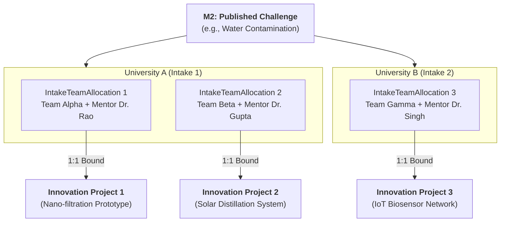
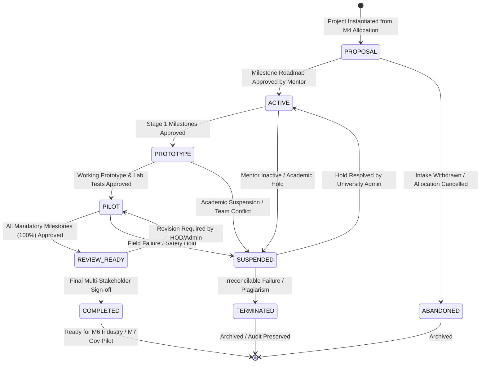
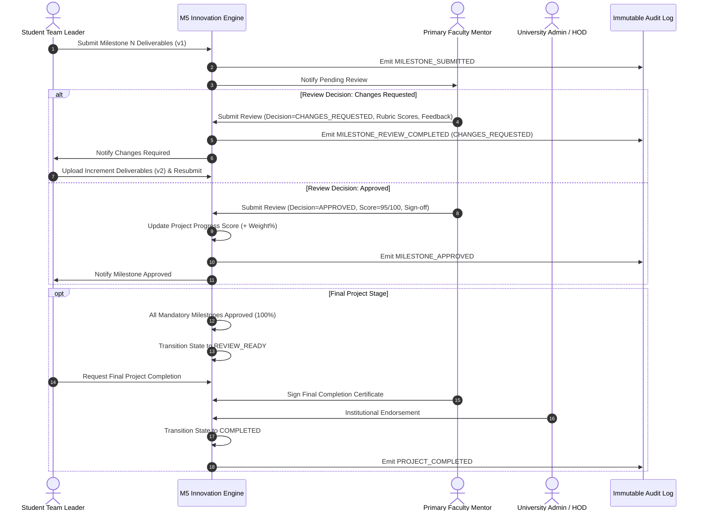

# Product Requirements Document (PRD) — Module 5: Innovation Project Lifecycle

**Document Version:** 1.0 (Specification Only)  
**Module ID:** M5  
**Module Name:** Innovation Project Lifecycle  
**Status:** 📋 **PROPOSED SPECIFICATION (PENDING APPROVAL)**  
**Author:** SICP Architecture & Engineering Core Team  
**Parent Project:** Societal Innovation Collaboration Platform (SICP)  
**Target Delivery:** Milestone 5  
**Dependencies:** 
- M1: Identity & Access Management (IAM) [LOCKED 🔒 `v1.0.0-m1-lock`]
- M2: Citizen Challenge Management [LOCKED 🔒 `v2.0.0-m2-lock`]
- M3: Team Formation & Collaboration [LOCKED 🔒 `v3.0.0-m3-lock`]
- M4: Academic Collaboration Hub [LOCKED 🔒 `v4.0.0-m4-lock`]

---

## 1. Mandatory Architecture Decision Lock

### 1.1 Decision Statement
**Can one Challenge create multiple Innovation Projects, or exactly one Innovation Project?**

### 1.2 Evaluation Against Existing SICP Architecture
1. **Module 2 (Citizen Challenge Management)**: A citizen or civic authority reports a verified societal problem (e.g., arsenic in drinking water, rural cold storage deficiency). The challenge represents the *problem space*.
2. **Module 3 (Team Formation & Collaboration)**: Multiple student teams can independently register and form around a single published challenge (`teams.challenge_id`).
3. **Module 4 (Academic Collaboration Hub)**: Multiple accredited universities can claim the same challenge (`academic_intakes`). Furthermore, within each university intake, the institution can allocate one or more student teams and faculty mentors via `intake_team_allocations`.
4. **Module 5 (Innovation Project Lifecycle)**: An **Innovation Project** represents the *solution execution vehicle*—the technical roadmap, sprints, repository, verifiable milestones, deliverables, and review workflow executed by a specific team under accredited mentorship.

### 1.3 Decision & Cardinality Mapping
* **Decision**: **One Challenge creates MULTIPLE Innovation Projects (1:N).**
* **Exact Binding Rule**: 
  $$\text{1 Challenge} \xrightarrow{1:N} \text{Academic Intakes} \xrightarrow{1:N} \text{Intake Team Allocations} \xrightarrow{1:1} \text{Innovation Project}$$
* **Uniqueness Invariant**: Exactly **one** `InnovationProject` is instantiated per active `IntakeTeamAllocation` (`intake_team_allocation_id` UNIQUE). A single student team working on an allocated challenge cannot spawn duplicate concurrent projects.

### 1.4 Architectural Rationale
1. **Competitive & Collaborative Innovation**: Societal challenges are multifaceted. Forcing a 1:1 mapping between a Challenge and a Project would artificially restrict solution discovery to a single university/team, destroying competitive research and cross-institutional comparison.
2. **Strict Integrity with M3 & M4**: M3 already permits multiple teams per challenge, and M4 permits multiple intakes and allocations. A 1:N project cardinality preserves architectural orthogonality without schema workarounds.
3. **Downstream M6 & M7 Enablement**: In Module 6 (Industry CSR) and Module 7 (Government Governance), stakeholders require a competitive showcase of distinct prototypes solving the same civic challenge to decide pilot deployment funding and policy adoption.
4. **Isolated Intellectual Property & Milestones**: Each team maintains an independent code repository, sprint backlog, milestone verification trail, and faculty evaluation ledger without data leakage across teams.

---

## 2. Executive Summary & Problem Statement

### 2.1 Problem Statement
In existing civic and hackathon platforms, once teams are formed and mentors are assigned, project execution collapses into untracked external communication (emails, messaging apps, unversioned drives). Key failure modes include:
* **Zero Milestone Traceability**: Mentors and institutions cannot track whether teams are progressing through structured validation phases (Proposal $\rightarrow$ Prototype $\rightarrow$ Field Pilot $\rightarrow$ Deployment).
* **Unverified Deliverables**: Code, CAD models, lab test reports, and datasets are uploaded without cryptographic hashing, versioning, or rubric-based faculty sign-offs.
* **Review Bottlenecks & Subjectivity**: Lack of formal review workflows prevents multi-stage evaluation across faculty mentors, departmental HODs, and civic/government observers.
* **No Audit-Grade Verification**: When industry partners (M6) or government departments (M7) allocate funding, they lack an immutable proof of work demonstrating that deliverables met rigorous technical criteria.

### 2.2 Solution: Module 5 (Innovation Project Lifecycle)
Module 5 provides the structured engineering and project execution engine for SICP. It operationalizes every allocated academic team into an active **Innovation Project** governed by:
1. **Deterministic State Machine**: Strict lifecycle state transitions with pre-condition validation.
2. **Weighted Milestone Roadmap**: Sequenced milestones with mandatory acceptance criteria and due dates.
3. **Immutable Versioned Deliverables**: Multi-format artifact repositories with SHA-256 integrity verification.
4. **Multi-Stage Review Engine**: Rubric-based evaluation workflows with formal mentor sign-offs and revision cycles.
5. **Real-Time Sprint & Progress Telemetry**: Automated weighted completion calculation and audit trails.

---

## 3. Target Stakeholders & Scope of Authority

| Stakeholder | Platform Role (`UserRole`) | Authority Scope in M5 | Primary Capabilities & Governance |
| :--- | :--- | :--- | :--- |
| **Student Team Leader** | `student` | Project Execution Lead | Initialize project repository links, create/submit milestone deliverables, request milestone reviews, submit project completion requests. |
| **Student Team Member** | `student` | Contributor | Upload draft deliverables, contribute code/test reports, post sprint updates, view review feedback. |
| **Primary Faculty Mentor** | `faculty` | Technical & Academic Lead | Set milestone roadmaps, review/approve/reject deliverables, grade milestone rubrics, certify stage transitions, sign off on completion. |
| **Co-Mentor / Technical Advisor** | `faculty` / `industry` | Advisory Reviewer | Provide advisory comments, review draft artifacts, score rubrics (non-blocking). |
| **University Admin / HOD** | `faculty` / `admin` | Institutional Tenant Oversight | Monitor departmental project velocity, intervene in deadlocked reviews, reassign mentors if inactive. |
| **Government Department** | `government` | Civic Challenge Sponsor | View project showcase, inspect verified field-test deliverables, evaluate pilot feasibility for M7 district deployment. |
| **Industry Partner (M6 Prep)** | `industry` | Future CSR Sponsor | Read-only discovery of high-impact prototypes, review verified technical test reports for sponsorship shortlisting. |
| **Platform Administrator** | `admin` | Global Governance | Platform-wide audit access, manual state transition overrides, policy enforcement, dispute resolution. |

---

## 4. Innovation Project Lifecycle

### 4.1 Lifecycle States Definition

1. **`PROPOSAL`**: Initial state upon instantiation from M4 `intake_team_allocations`. The team drafts problem scope, architecture, tech stack, repository URL, and initial milestone schedule.
2. **`ACTIVE`**: Faculty mentor approves the initial milestone roadmap. Active sprint development begins.
3. **`PROTOTYPE`**: Foundational research and architecture milestones are met; team is actively building and submitting Alpha/Beta prototypes.
4. **`PILOT`**: Working prototype is validated in lab environment; team deploys physical/digital solution in field testing (community site).
5. **`REVIEW_READY`**: All mandatory milestones (100% total weight) have been submitted, reviewed, and approved. Pending final holistic evaluation.
6. **`COMPLETED`**: Primary Faculty Mentor and University Administrator/Platform Admin execute final sign-off. Project qualifies for M6 CSR funding and M7 district deployment.
7. **`SUSPENDED`**: Project temporarily frozen due to institutional hold, team dispute, or ethics investigation. Deliverable submissions blocked.
8. **`TERMINATED`**: Terminal state resulting from plagiarism, academic misconduct, or permanent team abandonment.
9. **`ABANDONED`**: Terminal state triggered when parent M4 Academic Intake or Team is disbanded prior to milestone completion.

---

## 5. Milestone Management

### 5.1 Milestone Concepts & Structural Invariants
* **Weighted Progress**: Each milestone carries an integer weight ($1 \le \text{weight} \le 100$). The sum of weights across all milestones for a project MUST equal exactly **100** before the project can transition from `PROPOSAL` to `ACTIVE`.
* **Sequential Ordering**: Milestones have a strict sequence index ($1, 2, \dots, N$). Milestone $N$ cannot be submitted for review until Milestone $N-1$ is `APPROVED` or `COMPLETED`.
* **Classification**:
  - `MANDATORY`: Required for project completion.
  - `OPTIONAL`: Enrichment milestone (e.g., patent draft, extra paper publication) that contributes bonus score but does not block project completion.
* **Immutability Post-Approval**: Once a milestone is `APPROVED` / `COMPLETED`, its title, description, acceptance criteria, due date, and weight are **permanently locked**.

### 5.2 Milestone Lifecycle States
* **`DRAFT`**: Defined by team/mentor; editable.
* **`IN_PROGRESS`**: Active development period; deliverables being attached.
* **`SUBMITTED`**: Deliverables locked and submitted by Team Leader for faculty review.
* **`UNDER_REVIEW`**: Primary Mentor actively evaluating rubrics.
* **`CHANGES_REQUESTED`**: Mentor returned submission with actionable feedback; team must upload incremented deliverable versions.
* **`APPROVED`**: Formally accepted by mentor; weight credited to project progress.
* **`REJECTED`**: Milestone failed acceptance criteria; requires structural revision or escalation.

---

## 6. Deliverables Management

### 6.1 Deliverable Types
1. **`CODE_REPOSITORY`**: Git repository link (GitHub/GitLab) with specific commit SHA tag and branch name.
2. **`DOCUMENTATION`**: Architectural specifications, circuit schematics, CAD models (PDF, ZIP).
3. **`PROTOTYPE_DEMO`**: Video demonstration URL or interactive prototype hosting URL.
4. **`TEST_REPORT`**: Lab test measurements, water quality assay reports, stress-test logs.
5. **`DATASET`**: Raw or processed sensor data, survey results (CSV, JSON, Parquet).
6. **`DEPLOYMENT_PROOF`**: Geotagged photographs, civic authority sign-off letters, field telemetry logs.

### 6.2 Deliverable Invariants & Versioning Rules
* **Append-Only Versioning**: Deliverables are never updated in-place or overwritten. Re-submissions create a new version record (`version_number = N + 1`) with a foreign key pointer to `parent_deliverable_id`.
* **Cryptographic Integrity**: All file assets store file size, MIME type, and a client/server-verified `sha256_hash`.
* **Ownership**: Uploaded exclusively by active members of the assigned student team.
* **Locking During Review**: Once a milestone is `SUBMITTED`, all associated deliverables are frozen against deletion or replacement until the review cycle completes.

---

## 7. Review & Approval Workflow

---

## 8. Functional Requirements (FR)

### 8.1 Project Instantiation & Management
* **FR-M5-01 (Project Instantiation)**: The system shall allow the creation of an `InnovationProject` only when backed by an active `IntakeTeamAllocation` from M4.
* **FR-M5-02 (Unique Allocation Binding)**: The system shall enforce that exactly one `InnovationProject` exists per `intake_team_allocation_id` via a unique database index.
* **FR-M5-03 (Project Metadata)**: Each project must capture `title`, `abstract`, `repository_url`, `demo_url`, `tech_stack` (tags array), `target_completion_date`, and `current_stage`.
* **FR-M5-04 (Mentor Assignment)**: The system shall automatically designate the faculty mentor from M4 `intake_team_allocations` as the `primary_faculty_mentor_id`. A project may optionally designate one `secondary_mentor_id` (co-mentor/industry advisor).

### 8.2 Milestone Roadmap Engine
* **FR-M5-05 (Milestone Definition)**: A project must have between 3 and 10 milestones defined before moving to `ACTIVE`.
* **FR-M5-06 (Weight Invariant Enforcement)**: The sum of `weight` across all project milestones must equal exactly 100 before transition from `PROPOSAL` to `ACTIVE`.
* **FR-M5-07 (Sequential Dependency)**: Milestone $K$ cannot be submitted unless Milestone $K-1$ has status `APPROVED`.
* **FR-M5-08 (Milestone Immutability)**: Once a milestone reaches `APPROVED`, all attributes (`title`, `weight`, `acceptance_criteria`, `due_date`) become read-only.
* **FR-M5-09 (Progress Aggregation)**: Project `progress_percentage` shall be computed automatically as $\sum \text{weight}_i$ for all milestones where $\text{status} = \text{'APPROVED'}$.

### 8.3 Deliverable Repository & Versioning
* **FR-M5-10 (Multi-Format Deliverable Upload)**: Active team members can upload deliverables of types `CODE_REPOSITORY`, `DOCUMENTATION`, `PROTOTYPE_DEMO`, `TEST_REPORT`, `DATASET`, `DEPLOYMENT_PROOF`.
* **FR-M5-11 (SHA-256 Hash Verification)**: Uploaded files must store verified SHA-256 checksums, byte sizes, and MIME types.
* **FR-M5-12 (Immutable Version Chains)**: Replacing a deliverable creates a new row with incremented `version_number` and `parent_deliverable_id`. Historical records are never deleted.
* **FR-M5-13 (Submission Locking)**: When a milestone is `SUBMITTED` or `UNDER_REVIEW`, deliverables linked to that milestone cannot be modified, detached, or soft-deleted.

### 8.4 Multi-Stage Review Engine
* **FR-M5-14 (Review Rubric & Scoring)**: Mentors submit structured reviews containing numerical scores ($0-100$), criterion breakdown (JSONB: technical rigor, completeness, innovation, reproducibility), decision enum (`APPROVED`, `CHANGES_REQUESTED`, `REJECTED`), and feedback text.
* **FR-M5-15 (Review Immutability)**: A submitted `ProjectReview` record is append-only and immutable. It cannot be updated or deleted.
* **FR-M5-16 (Resubmission Cycle)**: If a review decision is `CHANGES_REQUESTED`, the milestone transitions back to `CHANGES_REQUESTED`. The team leader must submit a new revision, generating a separate, subsequent `ProjectReview` record upon re-evaluation.

### 8.5 Sprint Updates & Communication
* **FR-M5-17 (Sprint Progress Logs)**: Team members can publish timestamped `ProjectUpdate` entries (sprint summaries, blocker alerts, lab test logs, meeting notes) visible to mentors and institutional admins.
* **FR-M5-18 (Mentor Feedback Comments)**: Mentors and HODs can attach threaded feedback comments to specific updates or deliverables.

### 8.6 Project Completion & Closure Governance
* **FR-M5-19 (Completion Pre-requisites)**: A project can transition to `COMPLETED` only when:
  1. All mandatory milestones are `APPROVED` ($\text{progress\_percentage} = 100\%$).
  2. Primary Faculty Mentor submits final completion review and sign-off.
  3. University Administrator or Platform Admin provides institutional endorsement.
* **FR-M5-20 (M2 Challenge Decoupling)**: Completing an Innovation Project does NOT close the underlying M2 Challenge. It updates the university's M4 `AcademicIntake` to `COMPLETED`, while global challenge resolution remains reserved for Platform Admin / Government in M7.
* **FR-M5-21 (Project Suspension & Termination)**: Platform Admins and University Admins can suspend (`SUSPENDED`) or terminate (`TERMINATED`) a project with mandatory reason logging.

---

## 9. Acceptance Criteria

| ID | Feature | Acceptance Criteria |
| :--- | :--- | :--- |
| **AC-M5-01** | Project Creation | Given a valid, active M4 `intake_team_allocation_id`, an authenticated Team Leader can create an `InnovationProject` in `PROPOSAL` state. Returns HTTP 201. |
| **AC-M5-02** | Duplicate Prevention | Attempting to create a second project with the same `intake_team_allocation_id` returns HTTP 409 `DUPLICATE_PROJECT_ALLOCATION`. |
| **AC-M5-03** | Roadmap Activation | Transitioning a project from `PROPOSAL` to `ACTIVE` succeeds if and only if total milestone weights equal 100. If sum $\ne 100$, returns HTTP 422 `INVALID_MILESTONE_WEIGHT_SUM`. |
| **AC-M5-04** | Sequential Submission | Attempting to submit Milestone 2 when Milestone 1 is in `IN_PROGRESS` or `DRAFT` returns HTTP 400 `PREVIOUS_MILESTONES_INCOMPLETE`. |
| **AC-M5-05** | Deliverable Versioning | Uploading a replacement for an existing deliverable creates a new record with `version_number = parent.version_number + 1` and preserves original record intact. |
| **AC-M5-06** | Mentor Review Auth | Only the designated `primary_faculty_mentor_id` (or `admin`) can submit an authoritative `APPROVED` review decision. Other users receive HTTP 403 `FORBIDDEN`. |
| **AC-M5-07** | Concurrency Safety | Two concurrent review or status update requests with mismatched `version` triggers HTTP 409 `CONCURRENCY_CONFLICT`. |
| **AC-M5-08** | Inactive Intake Handling | If the parent M4 Academic Intake transitions to `DECLINED`, all associated projects automatically transition to `ABANDONED` / `SUSPENDED`. |
| **AC-M5-09** | Audit Completeness | Every state change, milestone submission, deliverable upload, and review decision emits an immutable entry in `audit_logs` matching `AuditAction`. |

---

## 10. Non-Functional Requirements (NFR)

### 10.1 Security & Access Control
* **Tenant & Role-Scoped RBAC**: Team members can only mutate their own team's project deliverables; faculty mentors can only review assigned projects.
* **Asset Storage Protection**: All uploaded media and document files must use signed, time-limited URLs (TTL $\le 15$ minutes) for read access.
* **Cryptographic Hashing**: Every deliverable payload requires a SHA-256 digest calculated and stored on record creation.

### 10.2 Reliability & Data Integrity
* **Optimistic Locking**: All `projects` and `project_milestones` records enforce `version` checks on update mutations.
* **Soft Deletes**: Deletions execute via `is_deleted = true`. Critical project entities (approved milestones, reviews, deliverables) forbid hard cascading deletes.
* **Relational Foreign Key Integrity**: All foreign keys strictly reference existing users, teams, challenges, and intakes (`ON DELETE RESTRICT`).

### 10.3 Auditability
* **Immutable Audit Trail**: 100% of project mutations generate persistent, un-updatable `AuditLog` records with actor UUID, IP address, user agent, old state, and new state.

### 10.4 Scalability & Performance
* **Query Latency**: `GET /api/v1/projects` and `GET /api/v1/projects/{id}` p95 response time $< 150\text{ms}$ under 500 concurrent connections.
* **Optimized Eager Loading**: Prevent N+1 queries by leveraging SQLAlchemy `selectin` relationships across project milestones, deliverables, and team allocations.
* **Index Coverage**: 100% of foreign keys and state filter combinations are covered by partial B-Tree indexes.
