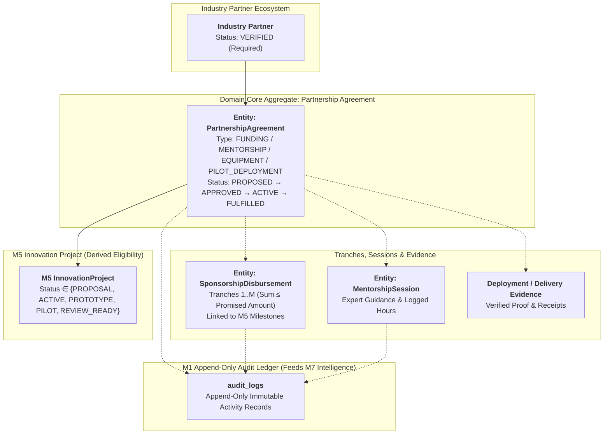

# Module 6 (M6) — Architecture Decisions & Domain Contracts Lock

**Document Version:** 1.5 (Domain Architecture Decisions, Refined Invariants & Coverage Metrics)  
**Module ID:** M6  
**Module Name:** Industry Partnership Network  
**Status:** 🔒 **LOCKED & IMMUTABLE DOMAIN ARCHITECTURE**  
**Author:** SICP Architecture & Engineering Core Team  
**Parent Project:** Societal Innovation Collaboration Platform (SICP)  
**Target Delivery:** Milestone 6 (CSR Sponsorship, Corporate Mentorship, Equipment & Pilot Support)  
**Dependencies:**
- M1: Identity & Access Management (IAM) [LOCKED 🔒 `v1.0.0-m1-lock`]
- M2: Citizen Challenge Management [LOCKED 🔒 `v2.0.0-m2-lock`]
- M3: Team Formation & Collaboration [LOCKED 🔒 `v3.0.0-m3-lock`]
- M4: Academic Collaboration Hub [LOCKED 🔒 `v4.0.0-m4-lock`]
- M5: Innovation Project Lifecycle [LOCKED 🔒 `v5.0.0-m5-lock`]

---

## 1. Executive Summary & Context

Module 6 connects validated innovation projects (`InnovationProject` from **M5**) and academic institutions (**M4**) with industry organizations, CSR foundations, incubators, and MSMEs. 

To ensure architectural alignment across SIH #26043 and prevent downstream data drift in **M7 Governance & Impact Intelligence**, the following core architectural decisions, domain entities, lifecycle contracts, derived M5 eligibility rules, tranche aggregation invariants, and append-only audit specifications are permanently locked.

---

## 2. Locked Architecture Decisions (ADR 1–9)



---

### Decision 1: Multi-Sponsor Project Model (Many-to-Many)
- **Decision**: A single `InnovationProject` can have **multiple industry partners** contributing simultaneously.
- **Cardinality**: Many-to-Many ($M:N$) mediated through the `PartnershipAgreement` domain aggregate.
- **Rationale**: Real-world societal innovation projects require diverse stakeholder support:
  - Corporate CSR grants monetary funding.
  - Hardware/Semiconductor firms supply testbeds and components.
  - Technology companies provide industry mentors and cloud credits.
  - Municipalities and local MSMEs provide test facilities for pilot deployments.
- **Domain Contract**: `InnovationProject (1) <---> (N) PartnershipAgreement (N) <---> (1) IndustryPartner`

---

### Decision 2: Multi-Project Industry Sponsor Model
- **Decision**: A single industry partner can sponsor, mentor, or provide resources to **multiple innovation projects** concurrently.
- **Rationale**: CSR foundations, incubators, enterprise programs, and venture mentors manage portfolios of 10–50+ student cohorts across districts and domains.
- **Domain Contract**: An industry partner can hold $N$ active `PartnershipAgreement` instances across different projects without artificial system-level barriers.

---

### Decision 3: Industry Partner Eligibility & Verification Lifecycle
- **Decision**: Industry organizations must be formally verified before they are eligible to sponsor projects, offer mentorship, or commit resources.
- **Verification States (`PartnerVerificationStatus`)**:
  - `PENDING_VERIFICATION`: Registered organization awaiting platform admin verification.
  - `VERIFIED`: Officially accredited; eligible to browse marketplace, submit proposals, and sign agreements.
  - `SUSPENDED`: Temporarily restricted by platform admin due to non-fulfillment, compliance violation, or policy breach.
  - `INACTIVE`: Organization deactivated or dormant.
- **Invariant**: Only `VERIFIED` industry partners can propose or execute partnership agreements.

---

### Decision 4: Sponsorship-Eligible Project Statuses (Derived Directly from M5)
- **Decision**: Sponsorship eligibility is **not invented in M6**; it is derived strictly from M5 `ProjectStatus` (`app.core.constants.ProjectStatus`).

```python
# Derived Directly from M5 Project Contracts
SPONSORSHIP_ELIGIBLE_PROJECT_STATUSES = {
    ProjectStatus.PROPOSAL,      # Open for early-stage grants & co-design
    ProjectStatus.ACTIVE,        # Open for active sprint funding & equipment
    ProjectStatus.PROTOTYPE,     # Open for hardware, cloud & prototype funding
    ProjectStatus.PILOT,         # Open for municipal/industrial field testbeds
    ProjectStatus.REVIEW_READY,  # Open for final evaluation & pilot adoption
}

INELIGIBLE_PROJECT_STATUSES = {
    ProjectStatus.COMPLETED,     # Terminal success — roadmap finalized
    ProjectStatus.TERMINATED,    # Terminal administrative abort
    ProjectStatus.ABANDONED,     # Terminal team/institutional exit
    ProjectStatus.SUSPENDED,     # Temporarily frozen by admin enforcement
}
```
- **Rule**: Creating a `PartnershipAgreement` against a project in any `INELIGIBLE_PROJECT_STATUSES` raises HTTP `400 Bad Request` (`PROJECT_NOT_ELIGIBLE_FOR_SPONSORSHIP`).

---

### Decision 5: Partnership Types (Closed Enum Contract)
- **Decision**: The platform models sponsorship through four distinct, first-class partnership types:

| Partnership Type (`PartnershipType`) | Category | Description & Resource Units |
| :--- | :--- | :--- |
| `FUNDING` | Direct Financial / CSR | Monetary sponsorship, grant funding, milestone-based tranches (INR ₹). |
| `MENTORSHIP` | Human Capital | Domain expert guidance, sprint reviews, architecture consulting (Hours). |
| `EQUIPMENT` | Physical / Cloud Assets | Hardware components, IoT sensors, cloud compute credits, lab licenses. |
| `PILOT_DEPLOYMENT` | Field / Testing Infrastructure | Real-world testing grounds, municipal testbeds, pilot site access. |

---

### Decision 6: Multi-Partner Contribution per Sponsorship Category
- **Decision**: A project can have **multiple partners contributing to the same category** without mutual exclusivity:
  - **Multi-Funding**: Partner A (₹2,00,000) + Partner B (₹1,50,000) + Partner C (₹50,000).
  - **Multi-Equipment**: Partner X (Sensors) + Partner Y (Cloud Credits) + Partner Z (PCBs).
  - **Multi-Mentorship**: Domain Expert 1 (AI/ML) + Domain Expert 2 (Embedded Firmware).
  - **Multi-Pilot**: Municipal Corporation (Urban testing) + Rural Panchayat (Field testing).
- **Rule**: No artificial single-sponsor constraints per category. Aggregate project resource coverage is computed dynamically from active agreements.

---

### Decision 7: Progressive Milestone-Based Funding Tranches
- **Decision**: `FUNDING` commitments support progressive, milestone-linked tranche scheduling.
- **Tranche Mechanics**:
  - Sponsors can define initial tranches upon agreement creation and schedule subsequent tranches as projects advance across M5 milestones.
  - **Tranche Upper Bound Invariant**:
    $$\sum_{j=1}^M \text{tranche\_amount}_j \le \text{promised\_amount}$$
  - **Released Amount Invariant**:
    $$\text{released\_amount} = \sum_{j \in \text{RELEASED}} \text{tranche\_amount}_j \le \text{promised\_amount}$$
  - **Remaining Amount Equation**:
    $$\text{remaining\_amount} = \text{promised\_amount} - \text{released\_amount}$$
  - Each released tranche is tracked as a `SponsorshipDisbursement` linked to an approved M5 `ProjectMilestone` (`MILESTONE_APPROVED`).

---

### Decision 8: Decoupling Mentorship Analytics from Lifecycle
- **Decision**: Student ratings ($1-5$) and written feedback are captured strictly as **analytical telemetry**.
- **Rule**: Session crediting and agreement fulfillment depend purely on meeting verification (time & attendance confirmed by student leader / faculty mentor) and are NOT blocked or conditioned on subjective rating scores.

---

### Decision 9: Sponsor Withdrawal Protocol & Audit Preservation
- **Zero Hard Deletions**: When a sponsor withdraws, the record is **NEVER deleted**.
- **State Transition**: `ACTIVE` $\rightarrow$ `WITHDRAWN`.
- **System Actions on Withdrawal**:
  1. **Preserve Historical Ledger**: Agreement record remains queryable with timestamp and withdrawal reason.
  2. **Recalculate Project Resource Coverage**: The project's active funding, equipment, and mentorship coverage totals immediately exclude unreleased/withdrawn amounts.
  3. **Gap Detection & Alerting**: System marks resource deficits (e.g., Budget Shortfall: ₹1,50,000) and emits notifications to Team Leader, Faculty Mentor, and University Admin.
  4. **Open Re-Sponsorship**: The project becomes eligible in the Industry Marketplace for new sponsor proposals to fill the vacated gap.
  5. **M7 Impact Analytics Ground Truth**: Historical reports in M7 continue to factor past contributions, pledged vs. realized CSR metrics, and sponsor reliability ratings.

---

## 3. Dynamic Sponsorship Coverage & Gap Metrics

The system dynamically computes the following business metrics at query time:
- **Funding Coverage Metric**:
  $$\text{Funding Coverage \%} = \min\left(100\%, \frac{\sum_{k \in \text{ACTIVE}} \text{promised\_amount}_k}{\text{Project Target Budget}} \times 100\right)$$
- **Funding Gap Metric**:
  $$\text{Funding Gap (INR)} = \max\left(0, \text{Project Target Budget} - \sum_{k \in \text{ACTIVE}} \text{promised\_amount}_k\right)$$
- **Mentorship Coverage Metric**:
  $$\text{Mentorship Coverage \%} = \min\left(100\%, \frac{\sum_{k \in \text{ACTIVE}} \text{promised\_hours}_k}{\text{Project Required Mentorship Hours}} \times 100\right)$$
- **Equipment Coverage Metric**:
  $$\text{Equipment Coverage \%} = \frac{\text{Count of Covered Equipment Requirements}}{\text{Total Required Equipment Categories}} \times 100$$

---

## 4. Locked Domain Invariants

1. **M5-Derived Active Project Pre-condition**: Project status must be in `SPONSORSHIP_ELIGIBLE_PROJECT_STATUSES` (`PROPOSAL`, `ACTIVE`, `PROTOTYPE`, `PILOT`, `REVIEW_READY`).
2. **Tranche Upper Bound Inequality**: $\sum_{j=1}^M \text{tranche\_amount}_j \le \text{promised\_amount}$.
3. **Financial Balance Equation**: $\text{released\_amount} \le \text{promised\_amount}$ and $\text{remaining\_amount} = \text{promised\_amount} - \text{released\_amount}$.
4. **Equipment Quantity Bounds**: $\text{delivered\_quantity} \le \text{promised\_quantity}$.
5. **Mentorship Hours Bounds**: $\text{completed\_hours} \le \text{promised\_hours}$.
6. **Pilot Deployment Evidence Gate**: $\text{Agreement Status} = \text{FULFILLED} \implies \text{Deployment Evidence Verified}$.

---

## 5. Append-Only Immutable Audit Contracts

All 14 M6 lifecycle actions across partners, agreements, disbursements, mentorship sessions, and evidence uploads emit append-only audit events via `AuditRepository.create_log(...)`, directly feeding downstream M7 Governance & Impact Intelligence pipelines. Audit records cannot be updated or deleted.

---

## 6. Architecture Lock Certification

| Architecture Dimension | Locked Rule / Specification | Status |
| :--- | :--- | :---: |
| **Sponsor Eligibility** | `PENDING_VERIFICATION`, `VERIFIED`, `SUSPENDED`, `INACTIVE` (`VERIFIED` required) | 🔒 LOCKED |
| **Project Pre-condition** | Derived from M5 `ProjectStatus`: `{PROPOSAL, ACTIVE, PROTOTYPE, PILOT, REVIEW_READY}` | 🔒 LOCKED |
| **Cardinality Model** | Multi-Sponsor ($M:N$ Many-to-Many via `PartnershipAgreement`) | 🔒 LOCKED |
| **Partnership Types** | `FUNDING`, `MENTORSHIP`, `EQUIPMENT`, `PILOT_DEPLOYMENT` | 🔒 LOCKED |
| **Category Capacity** | Unrestricted ($N$ partners per category) | 🔒 LOCKED |
| **Funding Tranches** | Progressive scheduling: $\sum \text{tranches} \le \text{promised}$, released on M5 `MILESTONE_APPROVED` | 🔒 LOCKED |
| **Financial Balance** | $\text{released\_amount} \le \text{promised\_amount}$ and $\text{remaining} = \text{promised} - \text{released}$ | 🔒 LOCKED |
| **Equipment Invariant** | $\text{delivered\_quantity} \le \text{promised\_quantity}$ | 🔒 LOCKED |
| **Mentorship Invariant** | $\text{completed\_hours} \le \text{promised\_hours}$ (Rating decoupled from fulfillment) | 🔒 LOCKED |
| **Pilot Invariant** | $\text{FULFILLED Pilot} \implies \text{Deployment Evidence Verified}$ | 🔒 LOCKED |
| **Coverage Metrics** | Dynamic query-time business metrics (Funding %, Gap, Mentorship %, Equipment %) | 🔒 LOCKED |
| **Commitment Lifecycle** | `PROPOSED` $\rightarrow$ `APPROVED` $\rightarrow$ `ACTIVE` $\rightarrow$ `FULFILLED` (Plus `REJECTED`, `WITHDRAWN`, `EXPIRED`) | 🔒 LOCKED |
| **Withdrawal Rule** | Soft status `WITHDRAWN`, zero hard deletion, gap calculation, preserved M7 analytics | 🔒 LOCKED |
| **Domain Entities** | `PartnershipAgreement`, `SponsorshipDisbursement`, `MentorshipSession` | 🔒 LOCKED |
| **Append-Only Audit** | 100% immutable append-only audit events logged to `audit_logs` | 🔒 LOCKED |

**Sign-off:** SICP Architecture Core Team — Module 6 specifications (`M6-PRD.md`, `M6-DESIGN.md`, `M6-TDD.md`) may proceed strictly against these locked domain decisions, invariants, and audit contracts.
