# Technical Architecture & Domain Design — Module 6: Industry Partnership Network

**Document Version:** 1.1 (Refined Conceptual & Domain Design Specification)  
**Module ID:** M6  
**Module Name:** Industry Partnership Network  
**Status:** 📋 **PROPOSED SPECIFICATION (PENDING APPROVAL)**  
**Author:** SICP Architecture & Engineering Core Team  
**Parent Project:** Societal Innovation Collaboration Platform (SICP)  
**Target Delivery:** Milestone 6 (CSR Sponsorship, Corporate Mentorship, Equipment & Pilot Support)  
**Dependencies:**
- M1: Identity & Access Management (IAM) [LOCKED 🔒 `v1.0.0-m1-lock`]
- M2: Citizen Challenge Management [LOCKED 🔒 `v2.0.0-m2-lock`]
- M3: Team Formation & Collaboration [LOCKED 🔒 `v3.0.0-m3-lock`]
- M4: Academic Collaboration Hub [LOCKED 🔒 `v4.0.0-m4-lock`]
- M5: Innovation Project Lifecycle [LOCKED 🔒 `v5.0.0-m5-lock`]

---

## 1. Domain Architecture & Aggregate Boundaries

The Module 6 domain model establishes an institutional collaboration and resource-allocation network between corporate industry entities and student-led innovation projects.

```mermaid
graph TD
    subgraph "Aggregate Root 1: IndustryPartner"
        IP["<b>IndustryPartner (Entity / Aggregate Root)</b><br/>• Verification Status<br/>• Corporate Identity & CIN<br/>• CSR Budget & Domain Focus"]
    end

    subgraph "Aggregate Root 2: PartnershipAgreement (Central Aggregate)"
        PA["<b>PartnershipAgreement (Aggregate Root)</b><br/>• Project Binding (M5)<br/>• Partner Binding (M6)<br/>• Partnership Type<br/>• Commitment Lifecycle<br/>• MoU Terms & Bounds<br/>• Optimistic Concurrency"]
        
        subgraph "Exclusive Child Entities & Manifests"
            SD["<b>SponsorshipDisbursement (Child Entity)</b><br/>• Exclusive to Agreement<br/>• Milestone Linkage (M5)<br/>• Tranche Index & Amount<br/>• Disbursement State"]
            
            MS["<b>MentorshipSession (Child Entity)</b><br/>• Exclusive to Agreement<br/>• Mentor Identity (M1)<br/>• Duration & Topics<br/>• Verification State"]
            
            EM["<b>EquipmentManifest (Value Object)</b><br/>• Itemized Promised Units<br/>• Verified Delivered Units"]
            
            PD["<b>PilotScope (Value Object)</b><br/>• Location & Facility Bounds<br/>• Deployment Evidence"]
        end
    end

    subgraph "M5 Innovation Project (External Aggregate Root)"
        Proj["<b>InnovationProject (M5 Aggregate Root)</b><br/>Status ∈ {PROPOSAL, ACTIVE, PROTOTYPE, PILOT, REVIEW_READY}"]
        Milestone["<b>ProjectMilestone (M5 Entity)</b><br/>Status: APPROVED (Tranche Gate)"]
    end

    IP -->|1:N| PA
    PA -->|N:1| Proj
    PA *-- SD
    PA *-- MS
    PA *-- EM
    PA *-- PD
    SD -.->|Gated by| Milestone
```

### 1.1 Cardinality & Many-to-Many ($M:N$) Architecture

To prevent single-sponsor misconceptions, the domain model explicitly defines:
1. **`IndustryPartner (1) <---> (N) PartnershipAgreement`**: An industry partner can sponsor multiple projects simultaneously.
2. **`InnovationProject (1) <---> (N) PartnershipAgreement`**: An innovation project can receive multiple sponsorships simultaneously across funding, equipment, mentorship, and pilot testbeds.
3. **Derived Association**:
   $$\text{IndustryPartner} \xleftrightarrow{M:N} \text{InnovationProject}$$
   *The many-to-many relationship between Industry Partners and Innovation Projects is mediated exclusively through the `PartnershipAgreement` aggregate.*

### 1.2 Aggregate Boundaries & Exclusive Child Ownership

#### A. Aggregate Root: `IndustryPartner`
* **Boundary**: Manages corporate profile identity, accreditation records, verification lifecycle, and corporate contact bindings.
* **Invariants Enforced by Root**:
  - Only organizations with `PartnerVerificationStatus.VERIFIED` can initiate partnership proposals, enter agreements, or assign corporate mentors.
  - Profile updates do not mutate historical agreements or completed disbursements.

#### B. Aggregate Root: `PartnershipAgreement` (Central Domain Aggregate)
* **Boundary**: Encapsulates the complete contractual relationship between an `IndustryPartner`, an `InnovationProject`, and a `PartnershipType`.
* **Strict Child Ownership Invariant**:
  - `SponsorshipDisbursement` and `MentorshipSession` are **strictly subordinate** to their parent `PartnershipAgreement`.
  - Child entities **cannot exist independently**, cannot be orphaned, and cannot be re-parented to another agreement or project.
  - All operations on tranches or sessions must be mediated through the `PartnershipAgreement` aggregate root.
* **Invariants Enforced by Root**:
  - **M5 Pre-condition**: An agreement can only be created against an active project in `SPONSORSHIP_ELIGIBLE_PROJECT_STATUSES` (`PROPOSAL`, `ACTIVE`, `PROTOTYPE`, `PILOT`, `REVIEW_READY`).
  - **Tranche Upper Bound**: The sum of scheduled/released tranches must never exceed `promised_amount` ($\sum \text{tranche\_amount}_j \le \text{promised\_amount}$).
  - **Financial Balance**: $\text{released\_amount} \le \text{promised\_amount}$ and $\text{remaining\_amount} = \text{promised\_amount} - \text{released\_amount}$.
  - **Equipment Bounds**: $\text{delivered\_quantity} \le \text{promised\_quantity}$.
  - **Mentorship Bounds**: $\text{completed\_hours} \le \text{promised\_hours}$.
  - **Pilot Evidence Gate**: Transition to `FULFILLED` requires verified deployment evidence.
  - **Concurrency Protection**: All mutations require version matching via optimistic concurrency control.

---

## 2. Domain State Machines & Withdrawal Propagation Rules

### 2.1 `PartnerVerificationStatus` State Machine

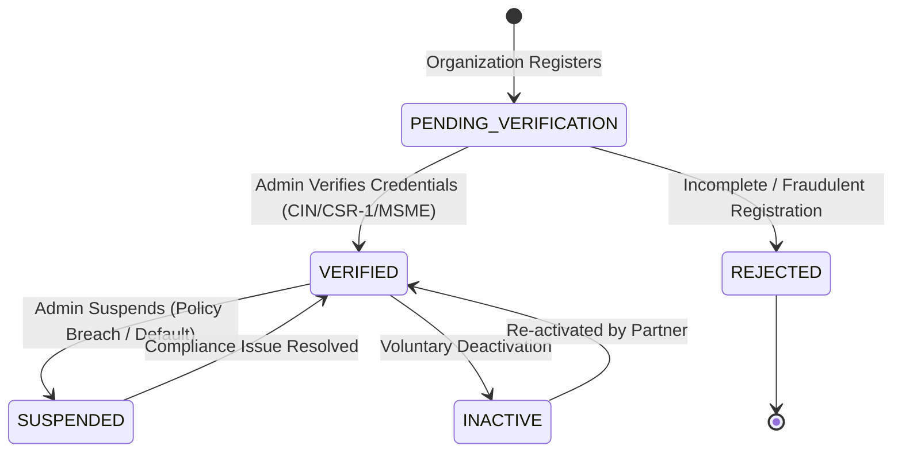

---

### 2.2 `CommitmentStatus` State Machine (Partnership Agreement)

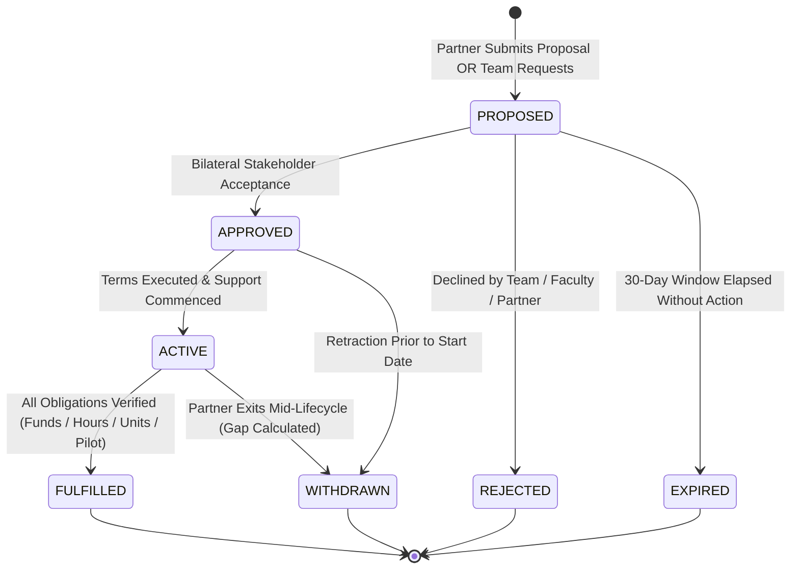

### 2.3 Withdrawal State Rules & Child Entity Propagation

When a `PartnershipAgreement` transitions to `WITHDRAWN`:
1. **Child Entity Propagation Rules**:
   - **Financial Tranches (`SponsorshipDisbursement`)**: All pending/scheduled tranches (`SCHEDULED`, `PENDING_VERIFICATION`) are immediately **cancelled and frozen**. No future disbursements can be released under this agreement.
   - **Mentorship Sessions (`MentorshipSession`)**: No new mentorship sessions can be logged or credited toward this agreement.
   - **Equipment Deliveries**: No new equipment delivery confirmations or receipts can be accepted.
   - **Pilot Deployment**: No new pilot evidence submissions can be accepted.
2. **Historical Preservation Invariant**:
   - All historical tranches previously marked `RELEASED`, sessions previously marked `VERIFIED`, and equipment previously marked delivered **remain permanently intact and immutable**.
3. **Resource Gap Calculation**:
   - Unreleased funds ($\text{promised} - \text{released}$) are marked as a project deficit, alerting team leaders and opening re-sponsorship opportunities in the marketplace.

---

### 2.4 `DisbursementStatus` State Machine (Financial Tranches)

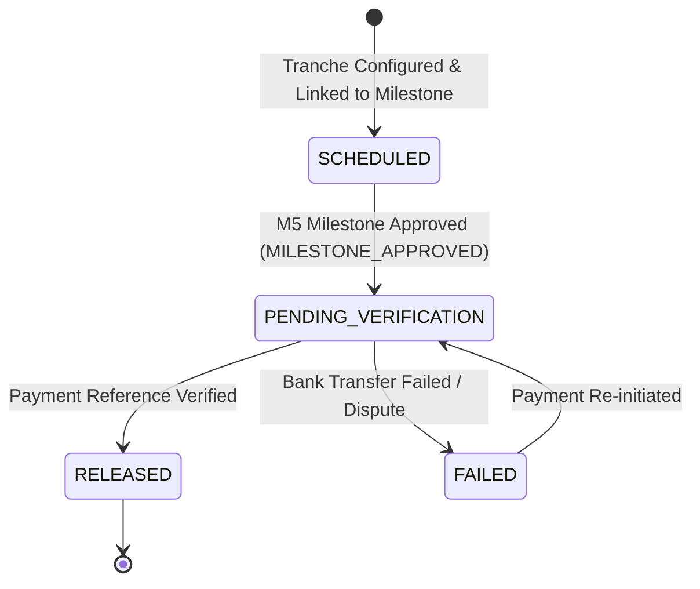

---

### 2.5 `MentorshipSessionStatus` State Machine

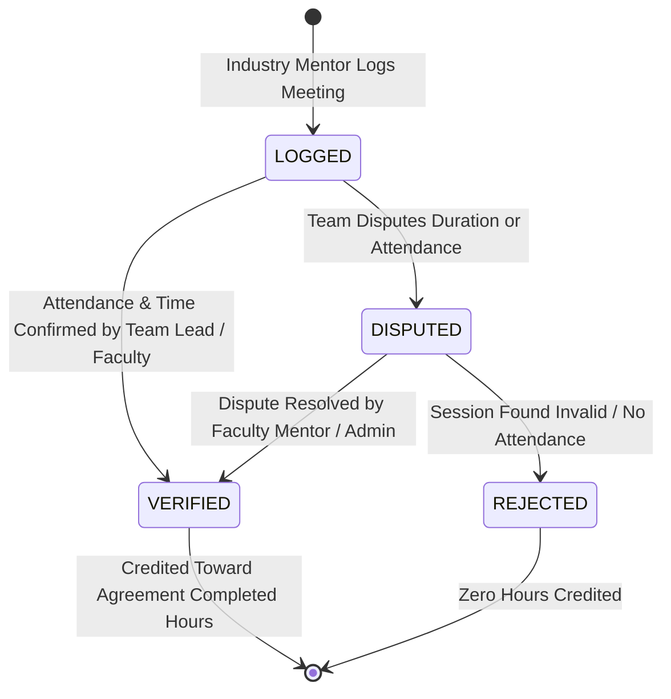

---

## 3. Concurrency Design & Protected Race Scenarios

Module 6 employs **Optimistic Concurrency Control** (`version` checking on aggregate roots) to prevent data corruption during simultaneous operations:

### 3.1 Protected Race Scenarios

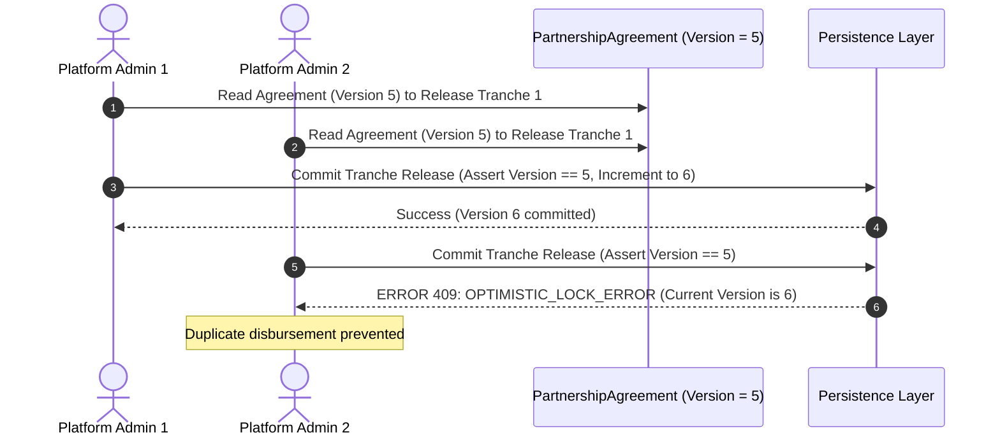

1. **Scenario A: Concurrent Tranche Releases**:
   - Two administrators or corporate officers attempting to mark the same tranche as `RELEASED` simultaneously. Version checking prevents duplicate balance increments.
2. **Scenario B: Simultaneous Approval and Partner Withdrawal**:
   - Student leader approves proposal while sponsor submits withdrawal concurrently. Version conflict forces re-evaluation against the updated state.
3. **Scenario C: Concurrent Manifest / Tranche Updates**:
   - Sponsor updates tranche amounts while student lead accepts previous terms. Conflict raises HTTP `409 Conflict` (`OPTIMISTIC_LOCK_ERROR`).

---

## 4. Event Flow Diagrams

### 4.1 Funding Sponsorship & Milestone Tranche Flow

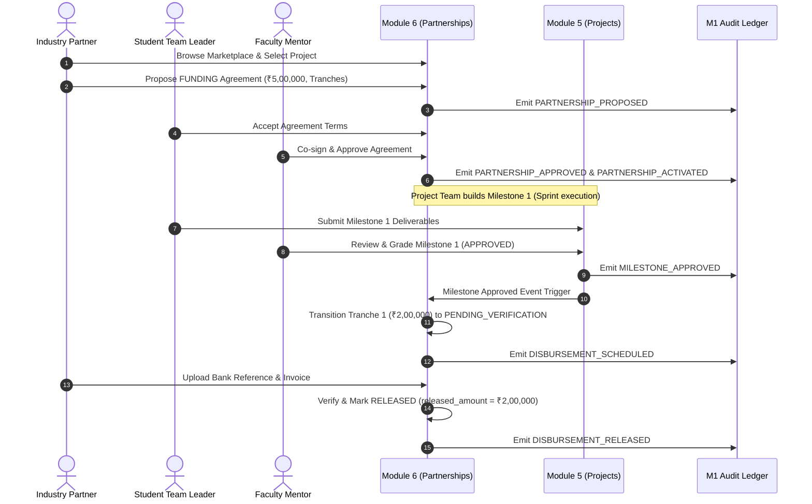

---

### 4.2 Corporate Mentorship Engagement Flow

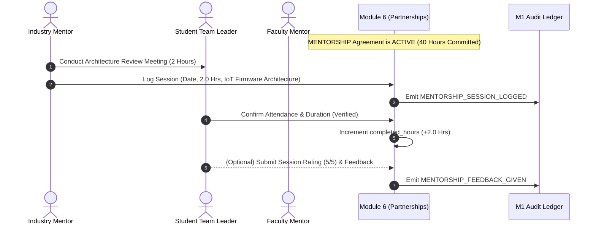

---

### 4.3 Equipment & Asset Contribution Flow

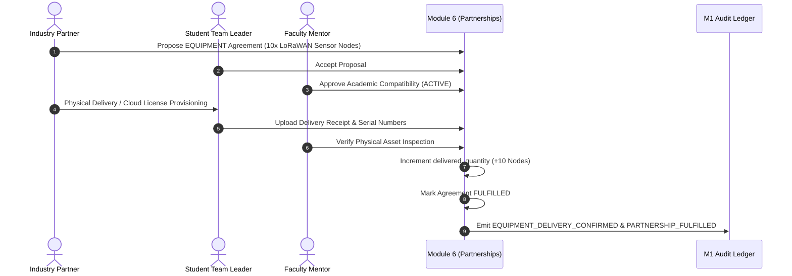

---

### 4.4 Pilot Deployment & Field Testing Flow

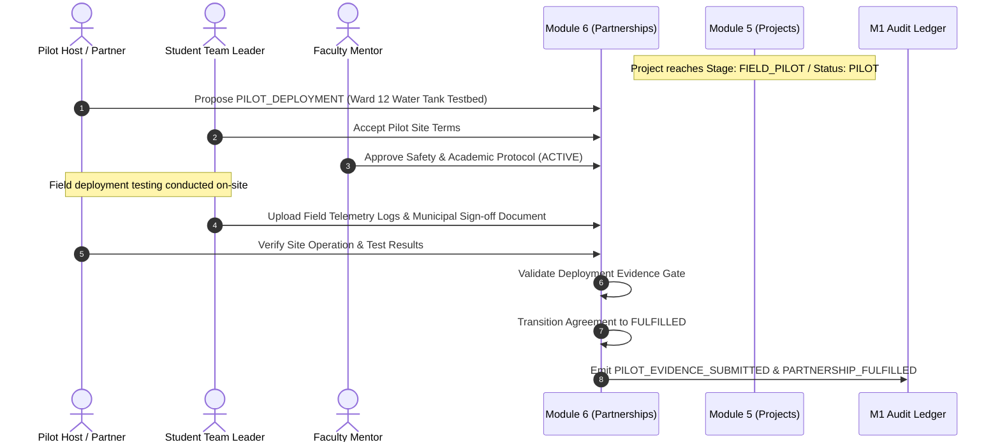

---

### 4.5 Sponsor Withdrawal & Resource Gap Recovery Flow

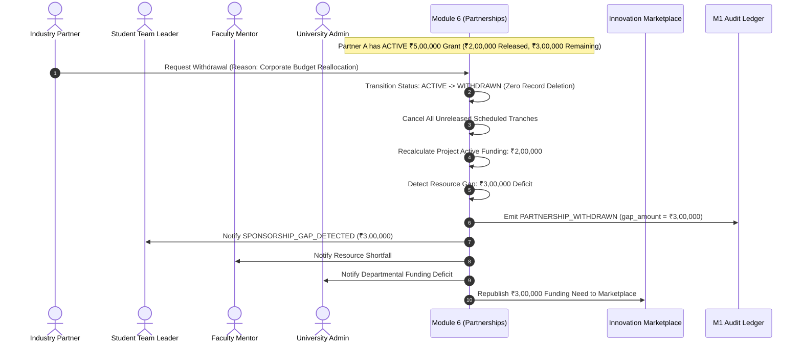

---

## 5. Audit Architecture & Append-Only Event Contracts

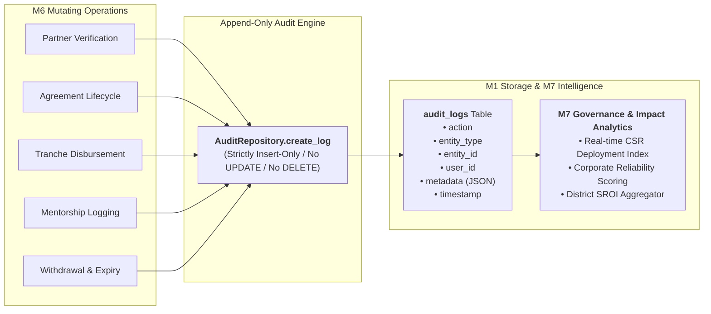

### 5.1 Audit Log Record Specification

Every M6 audit record adheres to the canonical M1–M5 schema:
* `action`: Standardized `AuditAction` enum member.
* `entity_type`: Canonical domain entity string (`"industry_partner"`, `"partnership_agreement"`, `"sponsorship_disbursement"`, `"mentorship_session"`).
* `entity_id`: UUID of the affected entity.
* `user_id`: UUID of the authenticated actor executing the action.
* `timestamp`: UTC timestamp with timezone.
* `metadata`: Structured context dictionary (JSON).

### 5.2 Complete M6 Audit Event Catalog (Including Expiry)

| Audit Action | Entity Type | Trigger Event | Metadata Key Payloads |
| :--- | :--- | :--- | :--- |
| `INDUSTRY_PARTNER_REGISTERED` | `industry_partner` | Enterprise profile created | `company_name`, `domain`, `website` |
| `INDUSTRY_PARTNER_VERIFIED` | `industry_partner` | Admin approves accreditation | `verified_by`, `cin_number`, `accreditation_type` |
| `INDUSTRY_PARTNER_SUSPENDED` | `industry_partner` | Admin suspends partner | `reason`, `suspended_by` |
| `PARTNERSHIP_PROPOSED` | `partnership_agreement` | Proposal submitted | `project_id`, `partner_id`, `type`, `pledged_metric` |
| `PARTNERSHIP_APPROVED` | `partnership_agreement` | Team & faculty accept | `approved_by_lead`, `approved_by_faculty` |
| `PARTNERSHIP_ACTIVATED` | `partnership_agreement` | Agreement executed | `start_date`, `end_date`, `terms_hash` |
| `PARTNERSHIP_FULFILLED` | `partnership_agreement` | All obligations verified | `fulfilled_at`, `total_delivered_metric` |
| `PARTNERSHIP_WITHDRAWN` | `partnership_agreement` | Partner exits agreement | `withdrawal_reason`, `gap_amount`, `unreleased_metric` |
| `PARTNERSHIP_REJECTED` | `partnership_agreement` | Proposal declined | `rejection_reason`, `rejected_by` |
| `PARTNERSHIP_EXPIRED` | `partnership_agreement` | 30-day window elapsed without action | `expired_at`, `original_proposal_date` |
| `DISBURSEMENT_SCHEDULED` | `sponsorship_disbursement` | Tranche configured & linked | `agreement_id`, `milestone_id`, `tranche_number`, `amount` |
| `DISBURSEMENT_RELEASED` | `sponsorship_disbursement` | Tranche funds released | `transaction_reference`, `invoice_no`, `amount` |
| `MENTORSHIP_SESSION_LOGGED` | `mentorship_session` | Mentor logs session | `agreement_id`, `duration_hours`, `topics` |
| `MENTORSHIP_FEEDBACK_GIVEN` | `mentorship_session` | Team submits feedback | `session_id`, `student_rating`, `feedback` |
| `EQUIPMENT_DELIVERY_CONFIRMED` | `partnership_agreement` | Hardware received | `item_name`, `quantity`, `receipt_ref` |
| `PILOT_EVIDENCE_SUBMITTED` | `partnership_agreement` | Field proof uploaded | `evidence_url`, `checksum`, `location` |

---

## 6. Coverage & Gap Metric Architecture (Derived Business Metrics)

Module 6 defines business analytics derived dynamically at query time to guide project discovery in the marketplace, detect funding shortfalls, and feed M7 governance dashboards.

> [!IMPORTANT]
> **Architectural Invariant on Coverage Metrics**:
> `FundingCoverage%`, `FundingGap`, `MentorshipCoverage%`, and `EquipmentCoverage%` are **strictly derived business metrics** computed dynamically at query time. They are **NOT source-of-truth fields** and must **NEVER be persisted as static/denormalized database columns**.

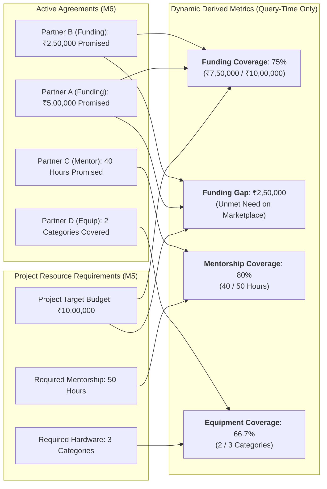

### 6.1 Derivation Logic (Conceptual)
1. **Funding Coverage Percentage**:
   - Ratio of total active promised funding across `ACTIVE` and `FULFILLED` agreements to the project's target budget, capped at $100\%$.
2. **Funding Gap (INR)**:
   - Remaining unmet capital needed to reach the project target budget. Returns zero if fully covered.
3. **Mentorship Coverage Percentage**:
   - Ratio of active committed corporate mentorship hours to the project's required advisory hours.
4. **Equipment Coverage Percentage**:
   - Ratio of itemized equipment specifications with active/fulfilled commitments to total required equipment categories.

---

## 7. Cross-Module Dependencies & Data Flow Map

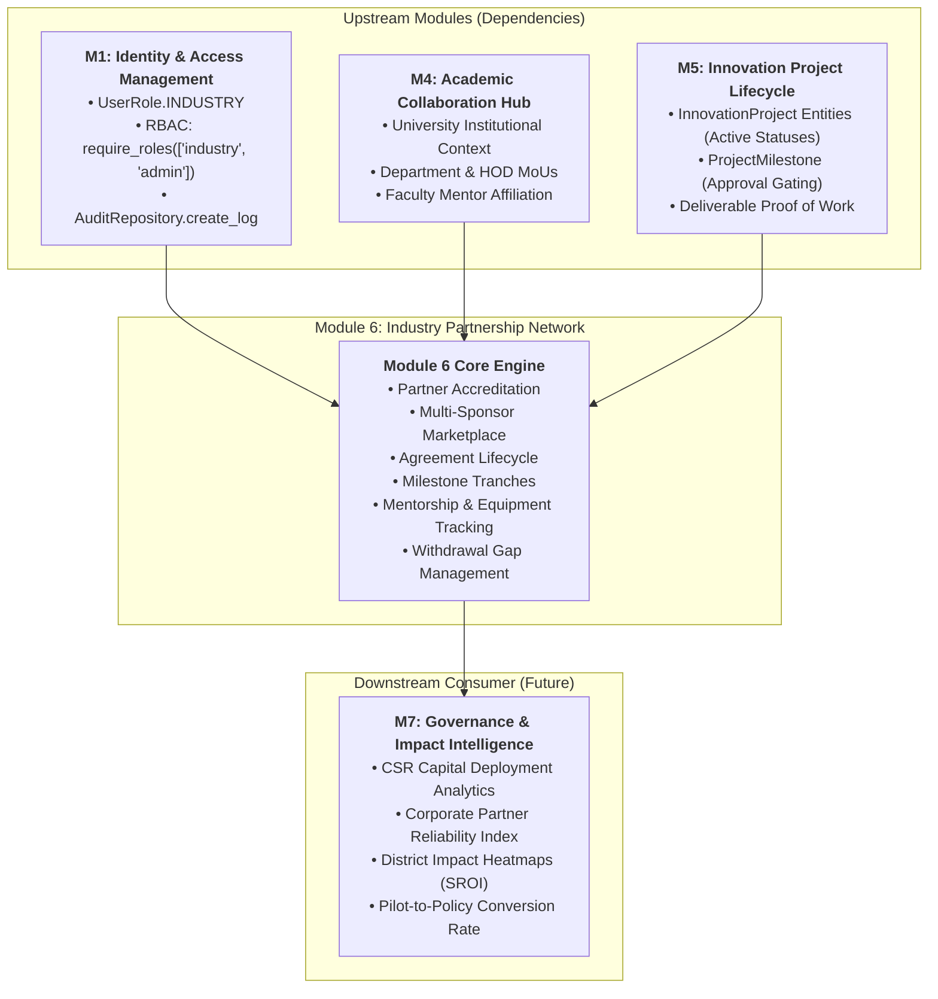

### 7.1 Upstream Consumed Contracts
* **M1 (IAM)**:
  - User authentication and role enforcement (`UserRole.INDUSTRY`, `UserRole.STUDENT`, `UserRole.FACULTY`, `UserRole.ADMIN`).
  - Base profile in `industries` table.
  - Append-only audit logger `AuditRepository.create_log`.
* **M4 (Academic Collaboration Hub)**:
  - Tri-partite agreement legal context linking student teams, university departments, and corporate sponsors.
  - Verification of primary faculty mentors authorized to co-sign agreements.
* **M5 (Innovation Project Lifecycle)**:
  - Target project state filtering (`SPONSORSHIP_ELIGIBLE_PROJECT_STATUSES`).
  - Milestone completion event triggers (`MILESTONE_APPROVED`) gating financial tranche releases.
  - Deliverables repository providing proof-of-work documentation for corporate CSR audit reports.

### 7.2 Downstream Emitted Contracts to M7 (Governance & Impact Intelligence)
* **Realized CSR Capital**: Exact monetary grants disbursed per district, university, and challenge domain.
* **Corporate Engagement Index**: Quantitative metrics tracking promised vs. fulfilled commitments, corporate mentor hours delivered, and partner reliability scores.
* **Pilot Conversion Velocity**: Number of prototypes transitioned from academic lab prototypes to validated municipal/industrial testbed pilots.
* **Social Return on Investment (SROI)**: Aggregated financial, technical, and equipment resources deployed per district.

---

## 8. Non-Functional Requirements (NFR)

* **Auditability & Traceability**: 100% of mutations across partner verification, agreement approvals, disbursements, sessions, and withdrawals emit append-only audit events. No historical record can be deleted.
* **Consistency & Financial Precision**: Monetary values must maintain exact decimal precision (`Numeric(15, 2)`) without floating-point artifacts. Tranche releases are strictly bounded by $\text{released} \le \text{promised}$.
* **Idempotency**: Disbursement executions and session hour verifications must be idempotent; duplicate release requests with the same transaction reference are safely rejected.
* **Concurrency Safety**: Optimistic concurrency control via version checking ensures zero lost updates during simultaneous multi-stakeholder approvals or modifications.
* **Historical Preservation**: Withdrawn partnerships and terminated proposals remain permanently queryable for historical analytics and compliance reporting.
* **Scalability**: Multi-sponsor marketplace filtering queries (across domain, district, stage, and coverage gap) must execute with sub-100ms response times at $10,000+$ concurrent projects.

---

## 9. Design Sign-Off & Review Status

- **Module ID**: M6 — Industry Partnership Network
- **Design Status**: 📋 **PROPOSED SPECIFICATION (REFINED)**
- **Next Step**: User review and approval before proceeding to **`M6-TDD.md`**.
