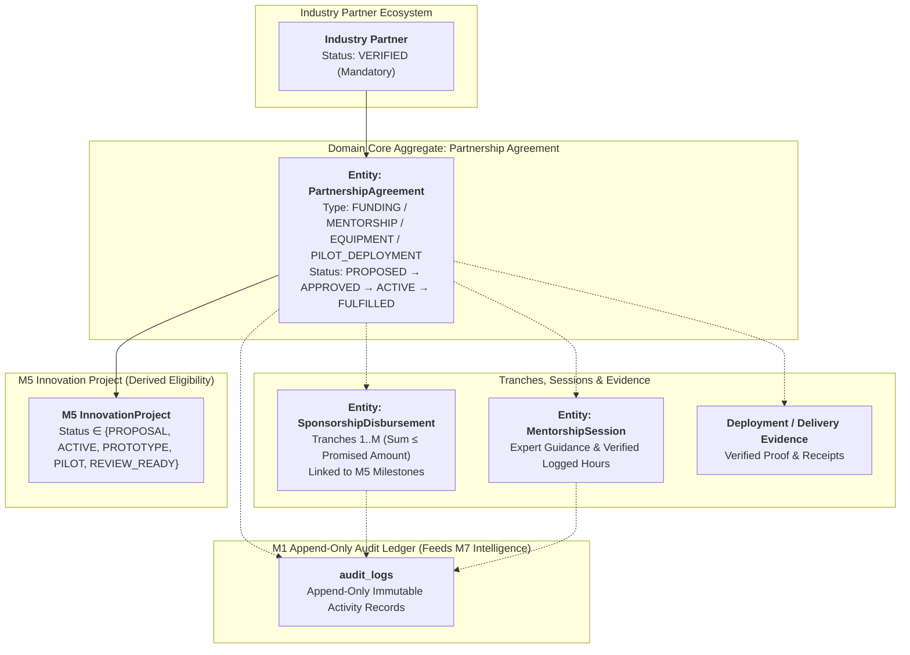
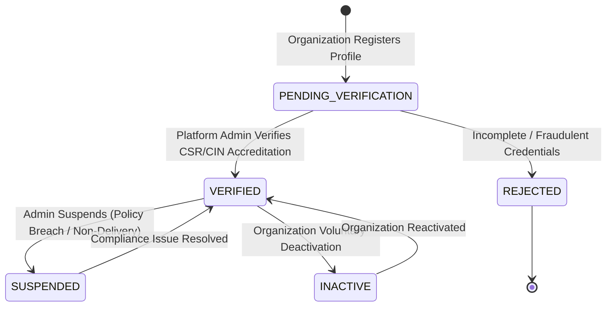
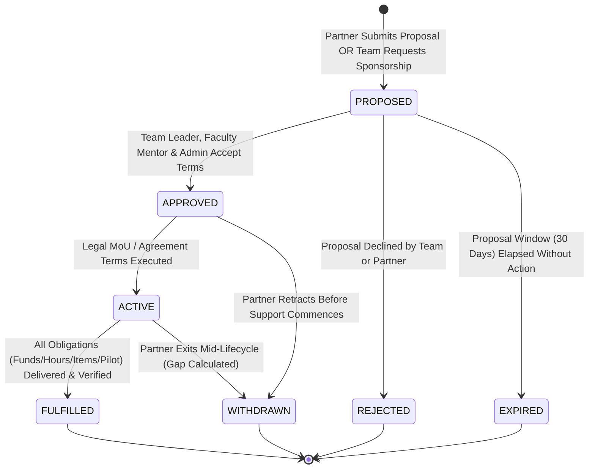
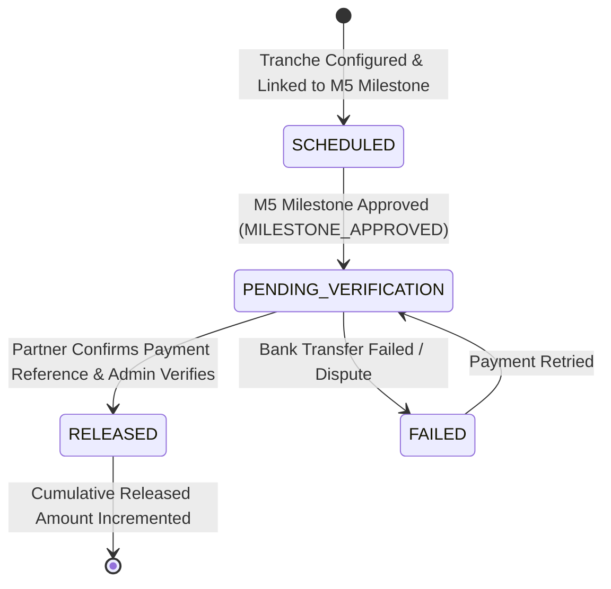
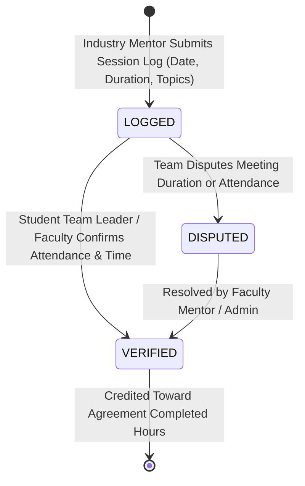
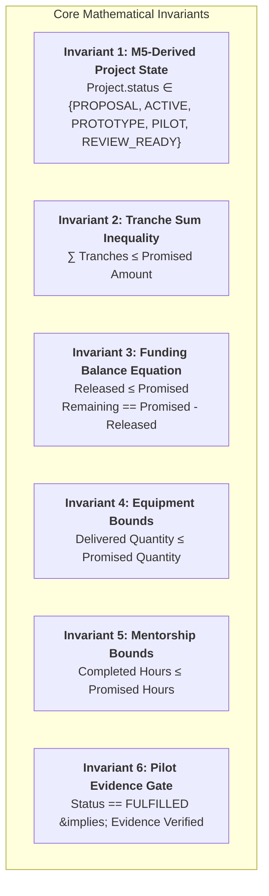

# Product Requirements Document (PRD) — Module 6: Industry Partnership Network

**Document Version:** 1.1 (Refined Specification)  
**Module ID:** M6  
**Module Name:** Industry Partnership Network  
**Status:** 📋 **PROPOSED SPECIFICATION (PENDING APPROVAL)**  
**Author:** SICP Architecture & Engineering Core Team  
**Parent Project:** Societal Innovation Collaboration Platform (SICP)  
**Target Delivery:** Milestone 6 (CSR Sponsorship, Corporate Mentorship, Equipment & Pilot Support)  
**Dependencies:** 
- M1: Identity & Access Management (IAM) [LOCKED 🔒 `v1.0.0-m1-lock`]
- M2: Citizen Challenge Management [LOCKED 🔒 `v2.0.0-m2-lock`]
- M3: Team Formation & Collaboration [LOCKED 🔒 `v3.0.0-m3-lock`]
- M4: Academic Collaboration Hub [LOCKED 🔒 `v4.0.0-m4-lock`]
- M5: Innovation Project Lifecycle [LOCKED 🔒 `v5.0.0-m5-lock`]

---

## 1. Executive Summary & Problem Definition

### 1.1 Context & Background
Across the SICP platform, citizens identify verified community challenges (Module 2), student teams assemble into collaborative cohorts (Module 3), accredited universities and departments adopt problems (Module 4), and student innovators execute rigorous, milestone-driven technical roadmaps under faculty mentorship (Module 5).

However, transforming viable academic prototypes into deployed societal solutions requires external capital, industrial hardware, domain-specific mentorship, and live field testbeds. In standard hackathon and university incubation systems, industry engagement suffers from structural bottlenecks:
* **Fragmented CSR & Grant Allocation**: Corporate Social Responsibility (CSR) departments struggle to discover verified, high-impact prototypes that match their corporate charter and geographical focus.
* **Lack of Milestone-Linked Funding Governance**: Grants are typically disbursed in lump sums without milestone verification, leading to capital misallocation and zero traceability.
* **Unstructured Corporate Mentorship**: Industry experts lack a formal mechanism to log hours, review project sprints, and provide structured technical advisement.
* **Equipment & Cloud Credit Bottlenecks**: Hardware innovators lack access to specialized IoT sensors, testing apparatus, compute credits, and manufacturing facilities.
* **Absence of Real-World Testbeds**: Prototypes fail at the transition from lab validation to field deployment because teams lack access to municipal wards, rural testbeds, or industrial facilities.

### 1.2 Solution: Module 6 (Industry Partnership Network)
Module 6 establishes a transparent, multi-stakeholder Industry Partnership Network connecting verified industry organizations (enterprises, MSMEs, CSR foundations, incubators) with active M5 innovation projects. 

Module 6 provides:
1. **Industry Partner Accreditation**: Verification workflows ensuring only legitimate, accredited corporate entities sponsor student initiatives.
2. **Multi-Sponsor Marketplace**: A discoverable showcase of active innovation projects enabling many-to-many ($M:N$) partnerships across funding, equipment, mentorship, and pilot testbeds.
3. **Flexible Milestone-Linked Financial Tranches**: CSR grant disbursements released conditionally upon M5 milestone approvals (`MILESTONE_APPROVED`), allowing tranches to be scheduled progressively ($\sum \text{tranches} \le \text{promised}$).
4. **Structured Mentorship & Hour Logging**: Dedicated corporate mentor assignment with verified session logging and non-blocking student feedback loops.
5. **Equipment & Asset Manifest Tracking**: Itemized hardware and software license delivery verification.
6. **Pilot Deployment Verification**: Municipal and field testbed access gated by verifiable deployment proof.
7. **Sponsor Withdrawal & Gap Mitigation**: Immutable withdrawal protocols that automatically calculate resource gaps and open projects for replacement sponsorship.
8. **Dynamic Sponsorship Coverage Metrics**: Real-time business metrics tracking project funding coverage percentages and resource gaps for marketplace discovery.
9. **Audit-Grade Compliance Telemetry**: 100% append-only audit event generation feeding downstream **M7 Governance & Impact Intelligence**.

---

## 2. Mandatory Architecture Decisions & Foundational Contracts

### 2.1 Multi-Sponsor Cardinality ($M:N$)
- **One Project $\leftrightarrow$ Many Industry Partners**: A single innovation project can receive financial grants from Company A, IoT sensors from Company B, corporate mentorship from Company C, and pilot deployment testing from Municipal Body D.
- **One Industry Partner $\leftrightarrow$ Many Projects**: A corporate partner or CSR foundation can sponsor and mentor $N$ innovation projects concurrently across domains and districts.

### 2.2 Partnership Types Enum (`PartnershipType`)
The platform supports four distinct, first-class partnership types:
1. `FUNDING`: Monetary grants and CSR sponsorships released in milestone-linked tranches (INR ₹).
2. `MENTORSHIP`: Technical and advisory guidance from industry experts (`UserRole.INDUSTRY`) measured in verified hours.
3. `EQUIPMENT`: Physical hardware components, lab access, IoT sensors, PCB fabrication, and cloud compute credits.
4. `PILOT_DEPLOYMENT`: Live operational testbeds, municipal wards, hospital wards, agricultural fields, or factory testing environments.

### 2.3 Unrestricted Multi-Partner Category Capacity
Projects can have multiple simultaneous partners within the *same* category:
- Multi-Funding: Partner A (₹2,00,000) + Partner B (₹1,50,000) + Partner C (₹50,000) $\le$ Project Budget.
- Multi-Equipment: Partner X (Sensors) + Partner Y (Cloud Credits) + Partner Z (Enclosures).
- Multi-Mentorship: Advisor 1 (Embedded Systems) + Advisor 2 (Cloud Architecture).
- Multi-Pilot: Partner 1 (Urban Field Site) + Partner 2 (Rural Field Site).

### 2.4 Sponsorship-Eligible Project Statuses (Derived from M5 Contract)
Sponsorship eligibility is derived directly from the M5 `ProjectStatus` enum (`app.core.constants.ProjectStatus`):
- **Eligible Statuses (`SPONSORSHIP_ELIGIBLE_PROJECT_STATUSES`)**:
  - `ProjectStatus.PROPOSAL`: Early-stage grant commitments & problem co-definition.
  - `ProjectStatus.ACTIVE`: Core sprint development, component sponsorships & mentorship.
  - `ProjectStatus.PROTOTYPE`: Hardware prototypes, lab validation equipment & cloud credits.
  - `ProjectStatus.PILOT`: Field testbed access, municipal trials & operational validation.
  - `ProjectStatus.REVIEW_READY`: Final evaluation review, transition to field adoption & commercialization.
- **Ineligible Statuses (`INELIGIBLE_PROJECT_STATUSES`)**:
  - `ProjectStatus.COMPLETED`: Terminal success — roadmap finalized.
  - `ProjectStatus.TERMINATED`: Terminal administrative abort.
  - `ProjectStatus.ABANDONED`: Terminal team/institutional exit.
  - `ProjectStatus.SUSPENDED`: Temporarily frozen by admin enforcement.
- Attempting to propose or create an agreement on an ineligible project is rejected with HTTP `400 Bad Request` (`PROJECT_NOT_ELIGIBLE_FOR_SPONSORSHIP`).

---

## 3. Target Stakeholders & Scope of Authority

| Stakeholder | Platform Role (`UserRole`) | Authority Scope in M6 | Primary Capabilities & Governance |
| :--- | :--- | :--- | :--- |
| **Industry Partner Admin / CSR Lead** | `industry` | Corporate Tenant / Portfolio | Register organization profile, complete accreditation verification, browse project marketplace, submit partnership proposals, configure funding tranches, allocate mentors, issue disbursements. |
| **Corporate Industry Mentor** | `industry` | Assigned Team / Project | Provide technical consulting, review sprint progress, log completed mentorship session hours, submit advisory notes. |
| **Student Team Leader** | `student` | Project Execution Lead | Discover industry sponsors, accept/reject partnership proposals, sign MoU/agreements, confirm equipment receipt, submit pilot deployment evidence, provide optional session feedback. |
| **Student Team Member** | `student` | Project Contributor | View active partnership resources, attend corporate mentorship sessions, utilize provided equipment/cloud credits. |
| **Primary Faculty Mentor** | `faculty` | Academic & Technical Lead | Review and co-sign partnership proposals, ensure academic integrity, verify equipment delivery, confirm readiness for milestone-linked tranche release. |
| **University Administrator / HOD** | `faculty` / `admin` | Institutional Tenant Oversight | Review tri-partite industry MoUs, monitor CSR capital inflow to departmental projects, facilitate institutional compliance. |
| **Pilot Host / Municipal Partner** | `industry` / `government` | Testing Facility Host | Authorize site access, monitor field testing safety, issue verified pilot completion sign-offs. |
| **Platform Administrator** | `admin` | Global Governance | Verify/reject/suspend industry organizations, arbitrate partnership disputes, override agreements, inspect global audit logs. |

---

## 4. Detailed Domain Lifecycles & State Machines

### 4.1 Industry Partner Verification Lifecycle

#### States (`PartnerVerificationStatus`):
- `PENDING_VERIFICATION`: Organization profile submitted; awaiting admin review of Corporate Identification Number (CIN), CSR-1 registration, or MSME certification.
- `VERIFIED`: Formally accredited; authorized to browse project marketplace, propose sponsorships, and sign agreements.
- `SUSPENDED`: Temporarily halted by platform admin due to unfulfilled commitments or policy violations.
- `INACTIVE`: Organization dormant or deactivated.

---

### 4.2 Partnership Agreement Lifecycle

#### Transition Pre-Conditions & Rules:
1. `[*] -> PROPOSED`:
   - Partner must be `VERIFIED`.
   - Target project must be in an eligible M5 status (`PROPOSAL`, `ACTIVE`, `PROTOTYPE`, `PILOT`, `REVIEW_READY`).
   - For `FUNDING`: `promised_amount > 0` and scheduled tranches sum $\le \text{promised\_amount}$.
   - For `MENTORSHIP`: `promised_hours > 0` and assigned mentor has `role = 'industry'`.
   - For `EQUIPMENT`: `promised_quantity > 0` and itemized manifest provided.
2. `PROPOSED -> APPROVED`:
   - Multi-stakeholder sign-off: Team Leader (`student`) and Primary Faculty Mentor (`faculty`) must approve.
3. `APPROVED -> ACTIVE`:
   - Agreement terms acknowledged; start date recorded. Resources become available for tracking.
4. `ACTIVE -> FULFILLED`:
   - Funding: $\text{released\_amount} == \text{promised\_amount}$.
   - Mentorship: $\text{completed\_hours} \ge \text{promised\_hours}$.
   - Equipment: $\text{delivered\_quantity} == \text{promised\_quantity}$ (Receipts confirmed).
   - Pilot: Verifiable deployment evidence uploaded and approved.
5. `ACTIVE -> WITHDRAWN`:
   - Partner submits withdrawal with mandatory narrative reason (`withdrawal_reason`).
   - Agreement record is preserved (never deleted).
   - Project coverage is recalculated, resource shortfall marked, and stakeholders alerted.

---

### 4.3 Sponsorship Disbursement Lifecycle (Financial Tranches)

#### Tranche Rules:
- A `FUNDING` agreement allows tranches to be scheduled incrementally, provided that $\sum \text{tranche\_amount}_j \le \text{promised\_amount}$.
- Tranche release requires that the linked M5 `ProjectMilestone` reaches `MilestoneStatus.APPROVED`.
- On `RELEASED`, the agreement's `released_amount` increments by `tranche.amount` and `remaining_amount` decrements.

---

### 4.4 Corporate Mentorship Session Lifecycle & Feedback Decoupling

#### Decoupling Feedback from Lifecycle:
- Student feedback and ratings ($1-5$) are stored as **optional telemetry/analytics** submitted post-session.
- Rating scores **do NOT block or govern state transitions** (`LOGGED` $\rightarrow$ `VERIFIED` or `ACTIVE` $\rightarrow$ `FULFILLED`).
- Verification is strictly based on attendance and time confirmation.

---

## 5. Functional Requirements (FR)

### 5.1 Industry Organization Onboarding & Accreditation
* **FR-M6-01 (Organization Registration)**: An authenticated user with `role = 'industry'` can register an enterprise profile with company name, domain industry sector, website, CIN/Registration number, CSR budget allocation, and official point-of-contact details. Status initialized to `PENDING_VERIFICATION`.
* **FR-M6-02 (Accreditation Verification)**: Only Platform Administrators (`admin`) can verify (`VERIFIED`), reject (`REJECTED`), or suspend (`SUSPENDED`) an industry organization.
* **FR-M6-03 (Accreditation Invariant Enforcement)**: System strictly blocks unverified organizations (`PENDING_VERIFICATION`, `REJECTED`, `SUSPENDED`, `INACTIVE`) from submitting proposals, creating agreements, or assigning mentors.

### 5.2 Industry Innovation Marketplace & Discovery
* **FR-M6-04 (Project Discovery Catalog)**: Verified industry partners can browse and filter active innovation projects by challenge domain category, geographic district/state, current lifecycle stage (`PROTOTYPE`, `PILOT`), university affiliation, and stated resource requirements (funding needed, equipment needed, pilot testbed needed).
* **FR-M6-05 (Sponsorship Request by Teams)**: Student Team Leaders can browse verified industry partners and submit an inbound sponsorship request linking their project roadmap and resource requirements.

### 5.3 Partnership Agreement Management
* **FR-M6-06 (Agreement Proposal Creation)**: A verified industry partner can initiate a partnership proposal for an eligible M5 project specifying `partnership_type` (`FUNDING`, `MENTORSHIP`, `EQUIPMENT`, `PILOT_DEPLOYMENT`), promised resource metrics, proposed MoU terms, and validity dates.
* **FR-M6-07 (Multi-Stakeholder Acceptance)**: A proposed agreement requires bilateral acceptance: Student Team Leader and Primary Faculty Mentor must accept before transition to `APPROVED` and `ACTIVE`.
* **FR-M6-08 (Optimistic Concurrency Control)**: All mutable agreement updates enforce optimistic concurrency control via a `version` integer column to prevent race conditions during concurrent approvals or edits.

### 5.4 Milestone-Linked Financial Tranches
* **FR-M6-09 (Progressive Tranche Scheduling)**: When creating or updating a `FUNDING` agreement, the partner configures 1 to $M$ tranches. Each tranche specifies `tranche_number`, `amount` ($> 0$), and target M5 `milestone_id`.
* **FR-M6-10 (Tranche Upper Bound Invariant)**: The system enforces that $\sum_{j=1}^M \text{tranche\_amount}_j \le \text{promised\_amount}$. Any tranche schedule violating this inequality is rejected with HTTP `422 Unprocessable Entity` (`INVALID_TRANCHE_AGGREGATION`).
* **FR-M6-11 (Tranche Release Gating)**: A scheduled disbursement cannot transition to `PENDING_VERIFICATION` or `RELEASED` until the target M5 milestone status is `APPROVED`.
* **FR-M6-12 (Disbursement Execution)**: When funds are transferred, the partner records transaction reference, invoice number, and timestamp. On release confirmation, the system updates `released_amount` and recalculates `remaining_amount`.

### 5.5 Equipment & Asset Contribution Tracking
* **FR-M6-13 (Equipment Manifest Definition)**: An `EQUIPMENT` agreement defines an itemized manifest (component name, model, quantity, estimated valuation, specifications).
* **FR-M6-14 (Delivery Confirmation)**: Upon receiving hardware or cloud credits, the Student Team Leader uploads delivery proof/receipt reference. System increments `delivered_quantity`.
* **FR-M6-15 (Equipment Bound Invariant)**: Enforces $\text{delivered\_quantity} \le \text{promised\_quantity}$.

### 5.6 Corporate Mentorship Engagement
* **FR-M6-16 (Mentor Assignment)**: A `MENTORSHIP` agreement assigns one or more verified industry professionals (`role = 'industry'`) to the project team.
* **FR-M6-17 (Mentorship Session Logging)**: The assigned corporate mentor logs completed mentoring sessions (session date, duration in hours, technical topics covered, action items).
* **FR-M6-18 (Session Verification & Feedback)**: Team leader validates session attendance and duration. Optional rating feedback ($1-5$) is logged for analytics. Verified hours increment the agreement's `completed_hours`.
* **FR-M6-19 (Mentorship Bound Invariant)**: Enforces $\text{completed\_hours} \le \text{promised\_hours}$.

### 5.7 Pilot Deployment Testbed Hosting
* **FR-M6-20 (Pilot Site Commitment)**: A `PILOT_DEPLOYMENT` agreement defines the field testing location, operational scope, facilities provided, and target duration.
* **FR-M6-21 (Deployment Evidence Gate)**: Transitioning a pilot agreement to `FULFILLED` strictly requires verified deployment evidence (municipal sign-off document, field telemetry log URL, or photographic proof with SHA-256 hash).

### 5.8 Sponsor Withdrawal & Resource Gap Recovery
* **FR-M6-22 (Withdrawal Execution)**: An active partner can withdraw from an agreement by providing a mandatory `withdrawal_reason`. Status transitions to `WITHDRAWN`.
* **FR-M6-23 (Zero Hard Deletion)**: Withdrawn agreement records and disbursement history are permanently preserved.
* **FR-M6-24 (Gap Recalculation & Notification)**: The system recalculates total project funding and resource coverage. If a deficit is created, system emits a `SPONSORSHIP_GAP_DETECTED` alert to the Team Leader, Faculty Mentor, and University Admin.
* **FR-M6-25 (Re-Sponsorship Opening)**: The project's unmet funding/resource deficit is automatically republished to the Industry Marketplace for new sponsor proposals.

### 5.9 Immutable Audit Logging
* **FR-M6-26 (Append-Only Audit Emission)**: 100% of mutations across partner verification, agreements, tranches, mentorship sessions, and evidence uploads emit append-only audit events via `AuditRepository.create_log(...)`.

---

## 6. Dynamic Sponsorship Coverage & Gap Metrics

To enable marketplace discovery, sponsor matching, and M7 executive reporting, the system calculates dynamic business metrics at query time without denormalized database fields:

### 6.1 Funding Coverage Metric
$$\text{Funding Coverage \%} = \min\left(100\%, \frac{\sum_{k \in \text{ACTIVE}} \text{promised\_amount}_k}{\text{Project Target Budget}} \times 100\right)$$

### 6.2 Funding Gap Metric
$$\text{Funding Gap (INR)} = \max\left(0, \text{Project Target Budget} - \sum_{k \in \text{ACTIVE}} \text{promised\_amount}_k\right)$$

### 6.3 Mentorship Coverage Metric
$$\text{Mentorship Coverage \%} = \min\left(100\%, \frac{\sum_{k \in \text{ACTIVE}} \text{promised\_hours}_k}{\text{Project Required Mentorship Hours}} \times 100\right)$$

### 6.4 Equipment Coverage Metric
$$\text{Equipment Coverage \%} = \frac{\text{Count of Covered Equipment Requirements}}{\text{Total Required Equipment Categories}} \times 100$$

---

## 7. Non-Functional Requirements (NFR)

* **NFR-M6-01 (Append-Only Audit Immutability)**: Audit logs are strictly append-only. Database rules and service layers prevent `UPDATE` or `DELETE` on `audit_logs`.
* **NFR-M6-02 (Financial Precision)**: All monetary figures use high-precision decimals (`Numeric(15, 2)`) to eliminate floating-point rounding errors.
* **NFR-M6-03 (Performance & Query Latency)**: Marketplace catalog queries with multi-dimensional filtering (domain, district, stage, funding need) must execute within $\le 100\text{ms}$ at 10,000 active projects.
* **NFR-M6-04 (Zero Contract Regression)**: Zero modifications permitted to locked M1, M2, M3, M4, or M5 database schemas, JWT payload structures, or route contracts.
* **NFR-M6-05 (Concurrency Protection)**: Optimistic concurrency control prevents lost updates during simultaneous agreement approvals or disbursement submissions.

---

## 8. Domain Invariants & Mathematical Constraints

The following 6 domain invariants are mandatory across validation, schemas, and test suites:

### Invariant 1: Active Project Pre-condition
$$\text{Project Status} \in \{\text{'PROPOSAL'}, \text{'ACTIVE'}, \text{'PROTOTYPE'}, \text{'PILOT'}, \text{'REVIEW\_READY'}\}$$
*Any project in `COMPLETED`, `SUSPENDED`, `TERMINATED`, or `ABANDONED` cannot accept new agreements.*

### Invariant 2: Tranche Upper Bound Inequality
$$\sum_{j=1}^M \text{tranche\_amount}_j \le \text{promised\_amount}$$
*The sum of scheduled/released tranches must never exceed the total promised agreement amount, while permitting progressive tranche definition.*

### Invariant 3: Financial Disbursement Bound & Balance
$$\text{released\_amount} \le \text{promised\_amount}$$
$$\text{remaining\_amount} = \text{promised\_amount} - \text{released\_amount}$$

### Invariant 4: Equipment Quantity Bounds
$$\text{delivered\_quantity} \le \text{promised\_quantity}$$

### Invariant 5: Mentorship Hours Bounds
$$\text{completed\_hours} \le \text{promised\_hours}$$

### Invariant 6: Pilot Deployment Fulfillment Evidence Gate
$$\text{Agreement Status} = \text{FULFILLED} \implies \text{Deployment Evidence Verified}$$

---

## 9. Role-Based Access Control (RBAC) Matrix

| Action / Operation | Industry Admin | Industry Mentor | Student Leader | Student Member | Faculty Mentor | Univ Admin | Super Admin |
| :--- | :---: | :---: | :---: | :---: | :---: | :---: | :---: |
| Register Industry Profile | ✅ | ❌ | ❌ | ❌ | ❌ | ❌ | ✅ |
| Verify / Suspend Industry Partner | ❌ | ❌ | ❌ | ❌ | ❌ | ❌ | ✅ |
| Browse Marketplace Projects | ✅ (Verified) | ✅ | ✅ | ✅ | ✅ | ✅ | ✅ |
| Create Partnership Proposal | ✅ (Verified) | ❌ | ❌ | ❌ | ❌ | ❌ | ✅ |
| Request Sponsorship from Partner | ❌ | ❌ | ✅ | ❌ | ❌ | ❌ | ✅ |
| Approve / Accept Agreement | ❌ | ❌ | ✅ | ❌ | ✅ (Assigned) | ❌ | ✅ |
| Reject / Decline Proposal | ✅ (Owner) | ❌ | ✅ | ❌ | ✅ (Assigned) | ❌ | ✅ |
| Withdraw from Agreement | ✅ (Owner) | ❌ | ✅ | ❌ | ❌ | ❌ | ✅ |
| Schedule Funding Tranches | ✅ (Owner) | ❌ | ❌ | ❌ | ❌ | ❌ | ✅ |
| Release Funding Tranche | ✅ (Owner) | ❌ | ❌ | ❌ | ❌ | ❌ | ✅ |
| Log Mentorship Session Hours | ❌ | ✅ (Assigned) | ❌ | ❌ | ❌ | ❌ | ✅ |
| Verify Mentorship Session & Feedback | ❌ | ❌ | ✅ | ❌ | ✅ (Assigned) | ❌ | ✅ |
| Confirm Equipment Delivery | ❌ | ❌ | ✅ | ❌ | ✅ (Assigned) | ❌ | ✅ |
| Upload Pilot Deployment Evidence | ✅ (Owner) | ❌ | ✅ | ❌ | ❌ | ❌ | ✅ |

---

## 10. Integration Interfaces & Contracts

### 10.1 Upstream Consumed Contracts
* **M1 (IAM)**: Authenticated corporate users (`UserRole.INDUSTRY`), `IndustryProfile` in `industries`, RBAC guard `require_roles(["industry", "admin"])`.
* **M4 (Academic Hub)**: University and Department context for tri-partite collaboration MoUs.
* **M5 (Innovation Projects)**: Active projects in `PROPOSAL`, `ACTIVE`, `PROTOTYPE`, `PILOT`, `REVIEW_READY` states eligible for marketplace listing. Milestone review completions (`MILESTONE_APPROVED`) trigger tranche releases.

### 10.2 Downstream Emitted Contracts to M7 (Governance & Impact Intelligence)
* **CSR Capital Deployed**: Pledged CSR vs. Realized CSR grants disbursed per district, university, and domain.
* **Corporate Engagement Index**: Industry contribution scoring based on fulfilled commitments and verified mentorship hours.
* **Pilot Conversion Rate**: Percentage of prototypes successfully deployed into municipal/industrial operations.
* **Social Return on Investment (SROI)**: Aggregated financial, technical, and equipment resources deployed per district.

---

## 11. PRD Review & Approval Sign-Off

- **Module ID**: M6 — Industry Partnership Network
- **PRD Status**: 📋 **PROPOSED SPECIFICATION (REFINED)**
- **Pending Action**: Final Acceptance before proceeding to `M6-DESIGN.md`.
