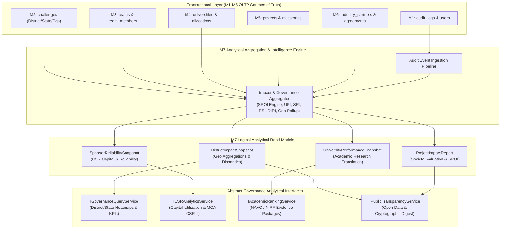
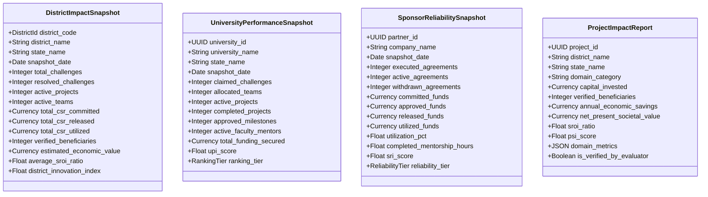

# Module 7 (M7) — Technical Design & Specification

**Document Version:** 2.0 (Lock-Ready Specification)  
**Module ID:** M7  
**Module Name:** Governance & Impact Intelligence  
**Status:** 🔒 **LOCKED SPECIFICATION** (`v7.0.0-m7-lock`)  
**Author:** SICP Architecture & Engineering Core Team  
**Parent Project:** Societal Innovation Collaboration Platform (SICP)  
**Dependencies:** 
- M1: Identity & Access Management (IAM) [LOCKED 🔒 `v1.0.0-m1-lock`]
- M2: Citizen Challenge Management [LOCKED 🔒 `v2.0.0-m2-lock`]
- M3: Team Formation & Collaboration [LOCKED 🔒 `v3.0.0-m3-lock`]
- M4: Academic Collaboration Hub [LOCKED 🔒 `v4.0.0-m4-lock`]
- M5: Innovation Project Lifecycle [LOCKED 🔒 `v5.0.0-m5-lock`]
- M6: Industry Partnership Network [LOCKED 🔒 `v6.0.0-m6-lock`]

---

## 1. Domain Architecture & CQRS Pattern

M7 implements a read-optimized **Command Query Responsibility Segregation (CQRS)** analytical layer. Operational transactions (M1–M6) emit immutable domain events and persist state in transactional tables. M7 consumes these records and generates indexed analytical snapshots for multi-dimensional querying.



---

## 2. Mathematical Algorithms & Computation Engine

### 2.1 SROI (Social Return on Investment) Computation Algorithm

Given an innovation project $P$:
1. **Gross Capital Invested ($I$)**:
   $$I = \text{Released CSR Grants} + \text{University Allocation Baseline} + \text{Equipment Valuation}$$
   If $I \le 0$, default baseline $I = 1.00$ to prevent division by zero.
2. **Gross Societal Value per Year ($V$)**:
   $$V = \text{Annual Civic Cost Savings} + (\text{Beneficiaries} \times \text{Per-Capita Value Proxy})$$
   - Default Water/Agro proxy: ₹500/beneficiary/year.
   - Default Health proxy: ₹1,200/beneficiary/year.
   - Default CleanTech/Energy proxy: ₹800/beneficiary/year.
3. **Net Present Value (NPV)** over 3-year horizon ($N=3$, discount rate $r=0.08$, deadweight $DW=0.20$, displacement $DP=0.05$, drop-off $DO=0.15$):
   $$\text{Net Value}_t = V \times (1 - DW) \times (1 - DP) \times (1 - DO)^{t-1}$$
   $$PV = \sum_{t=1}^{3} \frac{\text{Net Value}_t}{(1 + r)^t}$$
   $$\text{SROI Ratio} = \text{round}\left(\frac{PV}{I}, 2\right)$$

---

### 2.2 Sponsor Reliability Index (SRI) Algorithm

For each `IndustryPartner`:
1. **Fulfillment Score ($S_1$)**:
   $$S_1 = \min\left(100.0, \frac{\text{Total Released Funds}}{\text{Total Promised Funds}} \times 100\right) \quad (\text{if promised} = 0, S_1 = 100.0)$$
2. **Timeliness Score ($S_2$)**:
   $$S_2 = \frac{\text{Tranches released without dispute}}{\text{Total scheduled tranches}} \times 100 \quad (\text{default } 100.0)$$
3. **Retention Score ($S_3$)**:
   $$\text{Withdrawal Rate} = \frac{\text{Withdrawn Agreements}}{\text{Total Agreements}} \times 100$$
   $$S_3 = \max(0.0, 100.0 - \text{Withdrawal Rate})$$
4. **Mentorship Score ($S_4$)**:
   $$S_4 = \min\left(100.0, \frac{\text{Completed Mentorship Hours}}{\text{Promised Mentorship Hours}} \times 100\right) \quad (\text{if promised} = 0, S_4 = 100.0)$$
5. **Composite SRI**:
   $$\text{SRI} = \text{round}(0.40 \times S_1 + 0.30 \times S_2 + 0.20 \times S_3 + 0.10 \times S_4, 2)$$

---

### 2.3 University Participation Index (UPI) Algorithm

For each `University`:
1. **Claim Execution Rate ($U_1$)**:
   $$U_1 = \min\left(100.0, \frac{\text{Allocated Team Intakes}}{\text{Direct Claim Intakes}} \times 100\right)$$
2. **Milestone Velocity ($U_2$)**:
   $$U_2 = \min\left(100.0, \frac{\text{Approved Milestones}}{\text{Total Submitted Milestones}} \times 100\right)$$
3. **Faculty Mentorship Depth ($U_3$)**:
   $$U_3 = \min\left(100.0, \frac{\text{Active Faculty Mentors}}{\text{Total Affiliated Faculty}} \times 100\right)$$
4. **Industry Co-Sponsorship Rate ($U_4$)**:
   $$U_4 = \min\left(100.0, \frac{\text{Sponsored Projects}}{\text{Total Projects}} \times 100\right)$$
5. **Field Pilot Conversion Rate ($U_5$)**:
   $$U_5 = \min\left(100.0, \frac{\text{Projects Reaching Pilot / Completed}}{\text{Total Projects}} \times 100\right)$$
6. **Composite UPI**:
   $$\text{UPI} = \text{round}(0.25 \times U_1 + 0.25 \times U_2 + 0.20 \times U_3 + 0.15 \times U_4 + 0.15 \times U_5, 2)$$

---

### 2.4 Project Success Index (PSI) Algorithm

For each `InnovationProject`:
1. **Milestone Completion ($M_1$)**: $\frac{\text{Approved Milestones}}{\text{Total Planned Milestones}} \times 100$
2. **On-Time Delivery ($M_2$)**: $\frac{\text{Milestones Approved Without Extension}}{\text{Total Approved Milestones}} \times 100$
3. **Pilot Verification Score ($M_3$)**: $100.0$ if verified pilot evidence submitted; $50.0$ if pilot active; $0.0$ if prior stages.
4. **Adoption / Reach Ratio ($M_4$)**: $\min\left(100.0, \frac{\text{Verified Beneficiaries}}{\text{Target Population}} \times 100\right)$
5. **Faculty Evaluation ($M_5$)**: Average normalized faculty assessment score ($0-100$).
6. **Deployment Sustainability ($M_6$)**: Civic operational handover score ($0-100$).
7. **Composite PSI**:
   $$\text{PSI} = \text{round}(0.25 M_1 + 0.20 M_2 + 0.20 M_3 + 0.15 M_4 + 0.10 M_5 + 0.10 M_6, 2)$$

---

### 2.5 District Innovation & Resolution Index (DIRI)

For each `District`:
$$\text{DIRI} = \text{round}\left(0.40 \times \text{Resolution Rate} + 0.30 \times \text{Team Density Score} + 0.20 \times \text{Sponsorship Coverage} + 0.10 \times \text{Pilot Ratio}, 2\right)$$

---

## 3. Logical Analytical Read Models & Storage Specification

Rather than prescribing physical relational database DDL prematurely during specification phase, M7 establishes four **Logical Analytical Read Models** with strict data ownership, aggregation cadences, and retention rules:



### 3.1 Logical Read Model Specifications

| Analytical Read Model | Primary Dimensions | Aggregation Cadence | Source Ownership (OLTP) | Retention & Immutability Policy |
| :--- | :--- | :--- | :--- | :--- |
| **`DistrictImpactSnapshot`** | `district_code`, `state_name`, `snapshot_date` | Daily Rollup & On-Demand | M2 (`challenges`), M3 (`teams`), M5 (`projects`), M6 (`agreements`) | 5-Year Historical Retention; Daily Snapshots are Immutable once generated. |
| **`UniversityPerformanceSnapshot`** | `university_id`, `state_name`, `snapshot_date` | Daily Rollup & On-Demand | M4 (`universities`), M5 (`milestones`), M6 (`mentorship_sessions`) | 5-Year Historical Retention; Used for annual NAAC/NIRF accreditation ledgers. |
| **`SponsorReliabilitySnapshot`** | `partner_id`, `snapshot_date` | Daily Rollup & Event-Triggered (upon withdrawal or disbursement) | M6 (`industry_partners`, `partnership_agreements`, `sponsorship_disbursements`) | Permanent Retention; Generates official MCA CSR-1 audit certificates. |
| **`ProjectImpactReport`** | `project_id`, `district_name`, `domain_category` | Real-time on Milestone Completion & Daily Recalculation | M5 (`projects`, `milestones`), M6 (`disbursements`), M2 (`challenges`) | Permanent Project Ledger; Cryptographically referenced in Public Transparency Portal. |

---

## 4. Audit-Event Ingestion Contract

M7 subscribes to domain events emitted across Modules 1–6 through a standardized, strongly-typed **Audit-Event Ingestion Contract**.

### 4.1 Ingestion Event Schema

Every ingested governance event must conform to the following schema:

```json
{
  "event_id": "UUID (RFC 4122)",
  "event_type": "String (Standardized Governance Event Enum)",
  "actor_id": "UUID (User executing the action)",
  "actor_role": "String (UserRole: citizen | student | faculty | industry | government | admin)",
  "source_module": "String (M1 | M2 | M3 | M4 | M5 | M6 | M7)",
  "entity_type": "String (e.g., Challenge, Project, Milestone, Agreement, Disbursement)",
  "entity_id": "UUID (Identifier of the mutated entity)",
  "occurred_at": "String (ISO-8601 UTC Timestamp, e.g., '2026-09-19T14:30:00Z')",
  "payload": "Object (Arbitrary JSON structure detailing event delta / metadata)",
  "schema_version": "String (Strict version identifier: '1.0')"
}
```

### 4.2 Standardized Governance Event Types

| Event Type | Source Module | Trigger Condition | M7 Aggregation Action |
| :--- | :---: | :--- | :--- |
| `CHALLENGE_SUBMITTED` | M2 | Citizen logs challenge | Increment District Total Challenges |
| `CHALLENGE_RESOLVED` | M2/M5 | Project verified & closed | Increment District Resolved Count, Update Beneficiaries |
| `TEAM_ALLOCATED` | M4 | University allocates team | Update University Claim Rate & Intake Count |
| `MILESTONE_APPROVED` | M5 | Milestone verified | Recompute Project PSI, Update UPI Velocity |
| `AGREEMENT_EXECUTED` | M6 | Sponsor signs agreement | Update Committed Funds, Sponsorship Coverage |
| `DISBURSEMENT_RELEASED`| M6 | Funds released | Update Released Funds, SROI Capital Investment |
| `SPONSOR_WITHDRAWN` | M6 | Sponsor cancels agreement | Penalize SRI Score, Trigger Immediate Sponsor Recalculation |
| `PILOT_DEPLOYED` | M5/M6 | Deployment evidence verified | Trigger SROI Re-valuation, Update District Pilot Count |
| `SNAPSHOT_GENERATED` | M7 | Analytical batch completes | Persist snapshot, emit public ledger digest |
| `GOVERNANCE_RECALCULATED`| M7 | Admin triggers re-rollup | Invalidate cache, recalculate affected snapshots |

### 4.3 Ingestion Contract Invariants & Rules
1. **Strict Immutability**: Ingested audit records cannot be modified, deleted, or truncated under any circumstances.
2. **Idempotency by `event_id`**: Ingestion of a duplicate `event_id` must be safely ignored without corrupting snapshot aggregations.
3. **Out-of-Order Resiliency**: Aggregators use `occurred_at` timestamp rather than ingestion time to reconstruct deterministic historical state.
4. **Schema Version Compatibility**: M7 rejects payloads where `schema_version` is unsupported, logging an ingestion error without crashing.

---

## 5. Abstract Query & Analytical Read Interfaces

To maintain strict specification purity, M7 specifies abstract query service boundaries rather than physical REST endpoints. Physical transport routing and serialization will be defined during implementation planning.

```mermaid
classDiagram
    class IGovernanceQueryService {
        <<interface>>
        +get_national_overview() MacroOverviewDTO
        +get_district_scorecard(district_code) DistrictScorecardDTO
        +get_state_heatmap(state_name) StateHeatmapDTO
        +get_pipeline_funnel_velocity() FunnelVelocityDTO
    }

    class IImpactAnalyticsService {
        <<interface>>
        +compute_project_sroi(project_id) SROIReportDTO
        +compute_project_psi(project_id) PSIScorecardDTO
        +get_domain_impact_totals(category, geo_filter) DomainImpactDTO
    }

    class IStakeholderScorecardService {
        <<interface>>
        +get_sponsor_reliability_index(partner_id) SRIScorecardDTO
        +get_university_performance_index(university_id) UPIScorecardDTO
        +list_university_rankings(state_name, tier) List~UPIScorecardDTO~
    }

    class ICSRComplianceReportService {
        <<interface>>
        +get_csr_utilization_summary(partner_id) CSRUtilizationSummaryDTO
        +export_mca_csr1_package(partner_id, financial_year) CompliancePackageDTO
        +export_naac_nirf_evidence(university_id, academic_year) NAACReportDTO
    }

    class IPublicTransparencyService {
        <<interface>>
        +get_public_open_data_ledger() OpenDataLedgerDTO
        +verify_ledger_integrity(sha256_digest) Boolean
    }
```



---

## 6. Audit Logging Architecture

M7 emits append-only records across 10 distinct audit actions:

1. `IMPACT_SNAPSHOT_GENERATED`
2. `SROI_REPORT_GENERATED`
3. `DISTRICT_SCORECARD_VIEWED`
4. `STATE_HEATMAP_QUERIED`
5. `SPONSOR_RELIABILITY_EVALUATED`
6. `UNIVERSITY_PERFORMANCE_EVALUATED`
7. `CSR_COMPLIANCE_EXPORTED`
8. `NAAC_NIRF_REPORT_EXPORTED`
9. `PUBLIC_TRANSPARENCY_ACCESSED`
10. `GOVERNANCE_DATA_RECALCULATED`
