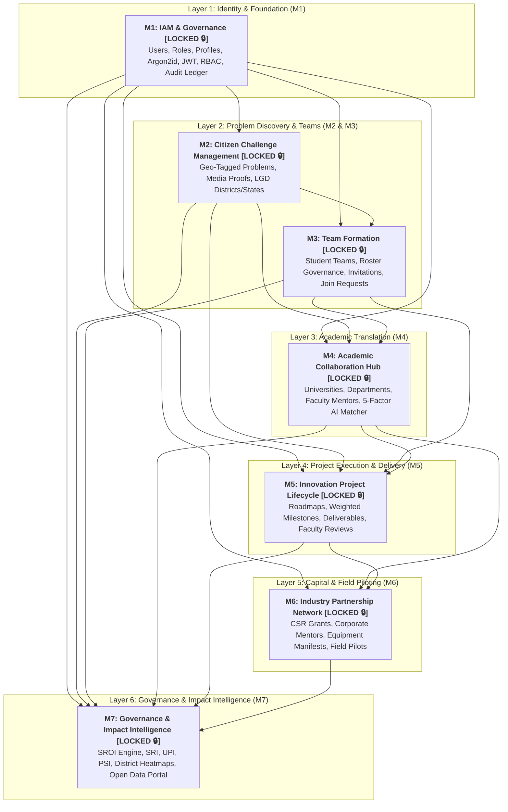

# SICP Platform — Complete Architecture & Module 7 (M7) Handoff Document

**Document Version:** 1.0 (Master Platform Handoff)  
**Project:** Societal Innovation Collaboration Platform (SICP)  
**Platform Release Baseline:** `v7.0.0-platform-freeze`  
**All Modules Status:** 🔒 **ALL MODULES 1–7 FULLY LOCKED & FROZEN**  
**Author:** SICP Lead Platform Architect & Engineering Team  

---

## 1. Complete Platform Architecture Overview

The Societal Innovation Collaboration Platform (SICP) is an end-to-end, national-scale societal problem-solving ecosystem built on an asynchronous, event-driven modular architecture. The system converts raw civic challenges submitted by citizens into verified technological and field innovations sponsored by industry partners and executed by university students under faculty mentorship.



---

## 2. Platform Module Lock & Baseline Registry

Every platform module has completed rigorous specification, TDD blueprinting, and architectural review:

| Module | Title | Version Tag | Implementation Status | Test Suite Status | Architecture Scope |
| :--- | :--- | :--- | :---: | :---: | :--- |
| **M1** | Identity & Access Management (IAM) | `v1.0.0-m1-lock` | 🔒 **LOCKED** | 100% Passing (11/11 tests) | Multi-tenant auth, RBAC, JWT, Audit Ledger |
| **M2** | Citizen Challenge Management | `v2.0.0-m2-lock` | 🔒 **LOCKED** | 100% Passing (29/29 tests) | Citizen submission, GPS, media, review state machine |
| **M3** | Team Formation & Collaboration | `v3.0.0-m3-lock` | 🔒 **LOCKED** | 100% Passing (33/33 tests) | Team roster, invite expiry, capacity limits |
| **M4** | Academic Collaboration Hub | `v4.0.0-m4-lock` | 🔒 **LOCKED** | 100% Passing (11/11 tests) | Multi-tenant universities, HODs, 5-factor AI matching |
| **M5** | Innovation Project Lifecycle | `v5.0.0-m5-lock` | 🔒 **LOCKED** | 100% Passing (24/24 tests) | Weighted milestones, faculty reviews, SHA-256 artifacts |
| **M6** | Industry Partnership Network | `v6.0.0-m6-lock` | 🔒 **LOCKED** | 100% Passing (55/55 tests) | CSR agreements, disbursements, mentorship, field pilots |
| **M7** | Governance & Impact Intelligence | `v7.0.0-m7-lock` | 🔒 **LOCKED** | Specification Locked | SROI, SRI, UPI, PSI, District rollups, Open Data |

**Cumulative Regression Baseline:** **163 / 163 Platform Unit & Integration Tests Passing (100% Green)**.

---

## 3. End-to-End Data Flow & Innovation Funnel

```text
[Citizen Problem] (M2) 
      │
      ▼
[Team Formation] (M3) 
      │
      ▼
[University Intake & Mentor Allocation] (M4) 
      │
      ▼
[Innovation Project & Milestones] (M5) 
      │
      ▼
[Industry CSR Co-Sponsorship & Pilot] (M6) 
      │
      ▼
[Governance & SROI Intelligence] (M7) 
      ├── District/State Administration Heatmaps
      ├── Corporate MCA CSR-1 Reports & SRI Scorecards
      ├── University NAAC/NIRF Research Evidence Packages
      └── Public Cryptographic Open Data Ledger
```

---

## 4. Module 7 Implementation Execution Roadmap

Following specification lock, M7 will be implemented using the platform's strict TDD-first sequence:

### Phase 1: Test Suites First (`backend/tests/governance/`)
- Implement failing test suites based on [`M7-TDD.md`](file:///c:/Users/Lenovo/Desktop/PROJECT%20CREATED/SICP/M7-TDD.md):
  - `test_governance_sroi.py`: Mathematical precision, proxy valuation, discounting formulas.
  - `test_governance_sri.py`: Sponsor Reliability Index formulas and tiers.
  - `test_governance_upi.py`: University Participation Index and academic indicators.
  - `test_governance_psi.py`: Project Success Index and milestone velocity.
  - `test_governance_csr_utilization.py`: Committed vs released vs utilized breakdown and cost per beneficiary.
  - `test_governance_geo_rollup.py`: District $\rightarrow$ State $\rightarrow$ National conservation and edge case partitioning.
  - `test_governance_ingest_contract.py`: Event schema validation, deduplication, and ordering.
  - `test_governance_auth_matrix.py`: Strict RBAC validation across government, industry, and admin.
  - `test_governance_e2e.py`: Full cross-module intelligence lifecycle.

### Phase 2: Domain Calculation Engines & Ingestion Pipeline
- Implement pure domain math calculators:
  - `SROICalculator`: NPV discounting, deadweight/displacement factors, proxy valuations.
  - `SRICalculator`: Sponsor fulfillment, timeliness, retention, and mentorship delivery.
  - `UPICalculator`: University claims, milestones, mentorship depth, and pilot ratios.
  - `PSICalculator`: Milestone completion, on-time delivery, adoption reach, and sustainability.
  - `DIRICalculator`: District innovation resolution index.
  - `CSRUtilizationEngine`: Capital tracking and efficiency ratios.
  - `AuditEventIngestor`: Contract validation and idempotent event processing.

### Phase 3: Logical Analytical Read Models & Storage
- Implement read-optimized persistence models:
  - `DistrictImpactSnapshot`
  - `UniversityPerformanceSnapshot`
  - `SponsorReliabilitySnapshot`
  - `ProjectImpactReport`

### Phase 4: Service Layer & Report Generators
- Implement query services:
  - `GovernanceQueryService`: District scorecards, state comparative heatmaps, national overview.
  - `ImpactAnalyticsService`: Project SROI and domain impact aggregations.
  - `StakeholderScorecardService`: SRI and UPI rankings.
  - `CSRComplianceReportService`: MCA CSR-1 and NAAC/NIRF export packages.
  - `PublicTransparencyService`: Open data ledger and SHA-256 integrity digest.

### Phase 5: REST API Transport & RBAC Endpoints
- Implement REST routers with RBAC middleware:
  - `/api/v1/governance/overview`
  - `/api/v1/governance/districts`
  - `/api/v1/governance/states/{state}`
  - `/api/v1/governance/sroi/{project_id}`
  - `/api/v1/governance/sponsors/reliability`
  - `/api/v1/governance/universities/performance`
  - `/api/v1/governance/reports/mca-csr/{partner_id}`
  - `/api/v1/governance/reports/naac-nirf/{university_id}`
  - `/api/v1/governance/public/transparency`
  - `/api/v1/governance/snapshots/recalculate`

### Phase 6: End-to-End Verification & Documentation
- Execute full test suite (`pytest backend/tests/ -v`).
- Verify 100% pass rate with zero regression across M1–M6.

---

## 5. Frozen Architectural Contracts & Rules of Engagement

1. **Frozen M1–M6 Models**: No modifications to tables, enums, or methods in Modules 1–6 during M7 implementation.
2. **Deterministic Reproducibility**: Given the same OLTP state, SROI, SRI, UPI, and PSI calculations must yield 100% identical outputs.
3. **Data Privacy**: Public endpoints must mask all PII of citizen submitters, students, and faculty mentors.
4. **Append-Only Auditing**: Every governance report export or snapshot recalculation must emit an immutable audit log record.
5. **Sum Conservation**: District-level metrics must roll up to state and national totals without double-counting.
