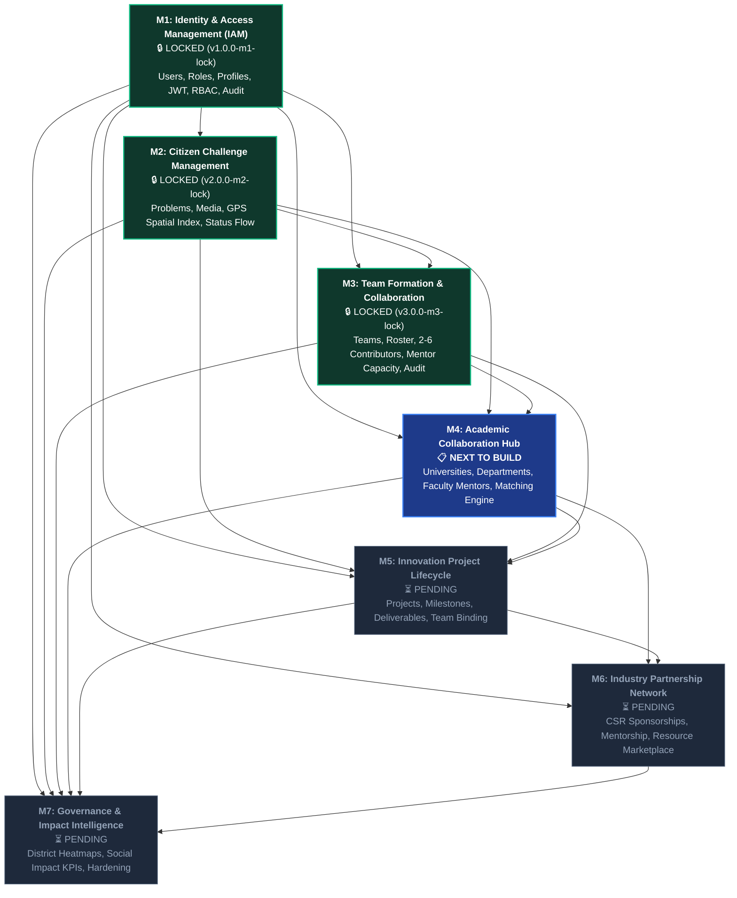

# Module 4 Roadmap & Architectural Verification Report

**Document ID:** `DOC-ROADMAP-M4-VERIFY-v1.0`  
**Date:** 2026-09-15  
**Status:** ✅ **VERIFIED & ALIGNED**  
**Lead Architect:** SICP Core Architecture Team  

---

## 1. Executive Summary

This verification report formally reconciles the SICP module sequence, addresses the naming inconsistency, analyzes the root cause of architectural drift, and reaffirms the canonical **M1–M7 Platform Roadmap**.

### Core Determination:
> **Module 4 is unequivocally the ACADEMIC COLLABORATION HUB.**  
> The AI Classification, Duplicate Detection, and Multi-Factor Matching algorithms defined in `Docs/ai-design.md` and `Docs/backend-architecture.md` are **service-layer intelligence capabilities embedded within and supporting M4 (Academic Hub), M2 (Challenges), and M6 (Industry)**, rather than a displaced standalone product module.

---

## 2. Official SICP Module Mapping (M1–M7)

| Module ID | Official Module Name | Canonical Scope & Responsibilities | Status |
| :--- | :--- | :--- | :--- |
| **M1** | **Identity & Access Management (IAM)** | Users, Roles (`citizen`, `student`, `faculty`, `industry`, `government`, `admin`), JWT auth, RBAC, Profiles, Audit Logs. | 🔒 **LOCKED (`v1.0.0-m1-lock`)** |
| **M2** | **Citizen Challenge Management** | Problem submission, media upload, GPS spatial indexing, verification workflows, state machine. | 🔒 **LOCKED (`v2.0.0-m2-lock`)** |
| **M3** | **Team Formation & Collaboration** | Team lifecycle (`OPEN`, `FULL`, `LOCKED`, `DISBANDED`), 2–6 student contributors, max 2 mentors, join requests, 14-day invitation expiry, audit trail. | 🔒 **LOCKED (`v3.0.0-m3-lock`)** |
| **M4** | **Academic Collaboration Hub** | University registration, Department management, Faculty mentor onboarding, Institution Verification, Multi-factor University & Faculty Matching Engine. | 📋 **READY FOR SPECIFICATION** |
| **M5** | **Innovation Project Lifecycle** | Project creation from accepted challenges, Milestones, Deliverable submission, Review workflows, Prototype documentation. | ⏳ Pending M4 |
| **M6** | **Industry Partnership Network** | CSR project sponsorship, Resource/Equipment/Cloud Credit contributions, Industry mentor allocation, Corporate marketplace. | ⏳ Pending M5 |
| **M7** | **Governance & Impact Intelligence** | District analytics, Government KPIs, Social impact metrics, Redis token blacklisting, Telemetry, and Production hardening. | ⏳ Pending M6 |

---

## 3. Evidence from Source Documents

### 3.1 `MODULE-DEPENDENCY.md`
- **Lines 105–122:** Defines **Module 4: Academic Collaboration Hub**.
- Dependencies: M1 (IAM) + M2 (Challenges) + M3 (Teams/AI inputs).
- Core entities: `universities`, `departments`, `university_expertise_profiles`.
- Services: **University Matching Engine**, **Faculty Mentor Recommender**, Academic Problem Intake.

### 3.2 `Docs/PRD.md` (Product Requirements Document)
- **Section 3 & 4:** Establishes the primary stakeholders: Citizens, Students, Faculty Members, Industry Partners, and Government Officials.
- **Section 5:** Specifies that verified societal problems must be routed to academic institutions and faculty mentors for structured research and prototype development.

### 3.3 `Docs/backend-architecture.md`
- **Section 2 & 3:** Architectural service boundaries delineate:
  - `Problem Service` (M2)
  - `Project Service` / `Team Service` (M3 / M5)
  - `AI Service` & `Recommendation Service` (cross-cutting computational services powering university/faculty matching and problem deduplication)
  - `Industry Service` (M6)
  - `Analytics Service` (M7)

### 3.4 `Docs/Database.md`
- **Section 2:** Entity Relationship Overview specifies:
  - `UNIVERSITIES` $\rightarrow$ `DEPARTMENTS`, `FACULTY`, `STUDENTS`
  - `PROJECTS` $\rightarrow$ `PROJECT_TEAMS`, `PROJECT_MEMBERS`, `PROJECT_MILESTONES`
  - `INDUSTRIES` $\rightarrow$ `INDUSTRY_PARTNERSHIPS`

---

## 4. Architectural Drift Analysis

### Root Cause of Confusion:
1. In the earliest draft of `MODULE-DEPENDENCY.md` (Day 1), Day 3 was provisionally labeled "AI Intelligence Engine" and Day 4 was "Academic Collaboration Hub".
2. During Milestone 3 implementation, team collaboration was pulled into M3 as **Team Formation & Collaboration** (`M3-PRD.md`, `M3-DESIGN.md`, `M3-TDD.md`) to provide the prerequisite student/team structures.
3. The previous agent response improperly assumed that the AI Engine shifted to M4, which conflicted with the master roadmap where **M4 is the Academic Collaboration Hub**.

### Resolution:
- **No roadmap shift occurred.** The canonical 7-module structure is preserved.
- The AI / Recommendation capabilities defined in `Docs/ai-design.md` serve as the **computational backend engine** inside the **Academic Collaboration Hub (M4)** for matching challenges to Universities and Faculty Mentors.

---

## 5. Impact on Completed Modules (M1–M3)

- **M1 (IAM):** 🔒 **Zero Impact / Preserved.** `FacultyProfile`, `StudentProfile`, and `UserRole` enums are fully intact and ready to link to `universities` and `departments`.
- **M2 (Challenges):** 🔒 **Zero Impact / Preserved.** Verified challenges (`challenges` table) will be consumed by M4 for university intake and matching.
- **M3 (Teams):** 🔒 **Zero Impact / Preserved.** Pre-formed student teams (`teams` and `team_members`) will attach to academic projects under participating universities in M4/M5.

---

## 6. Current Module Dependency Diagram

---

## 7. Recommended Next Module to Build

👉 **Module 4: Academic Collaboration Hub**

### Proposed Phased Execution for M4:
1. **Phase 1: Specification & Design Approval**
   - Generate `M4-PRD.md` (Product Requirements: University onboarding, Department hierarchy, Faculty affiliation, Challenge routing).
   - Generate `M4-DESIGN.md` (Data schemas: `universities`, `departments`, `faculty_affiliations`, Matching algorithm formulas).
   - Generate `M4-TDD.md` (Red test suites for schema validation, access control, repository, and API endpoints).
2. **Phase 2: Database Migration (Alembic)**
   - Schema: `universities`, `departments`, foreign keys to `users` (`faculty` / `student`).
3. **Phase 3: Repository, Service & API Implementation (TDD)**
   - Red $\rightarrow$ Green $\rightarrow$ Refactor lifecycle with $\ge 90\%$ test coverage.
