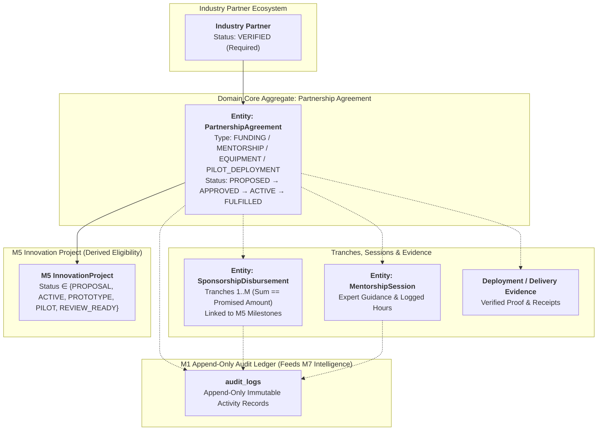
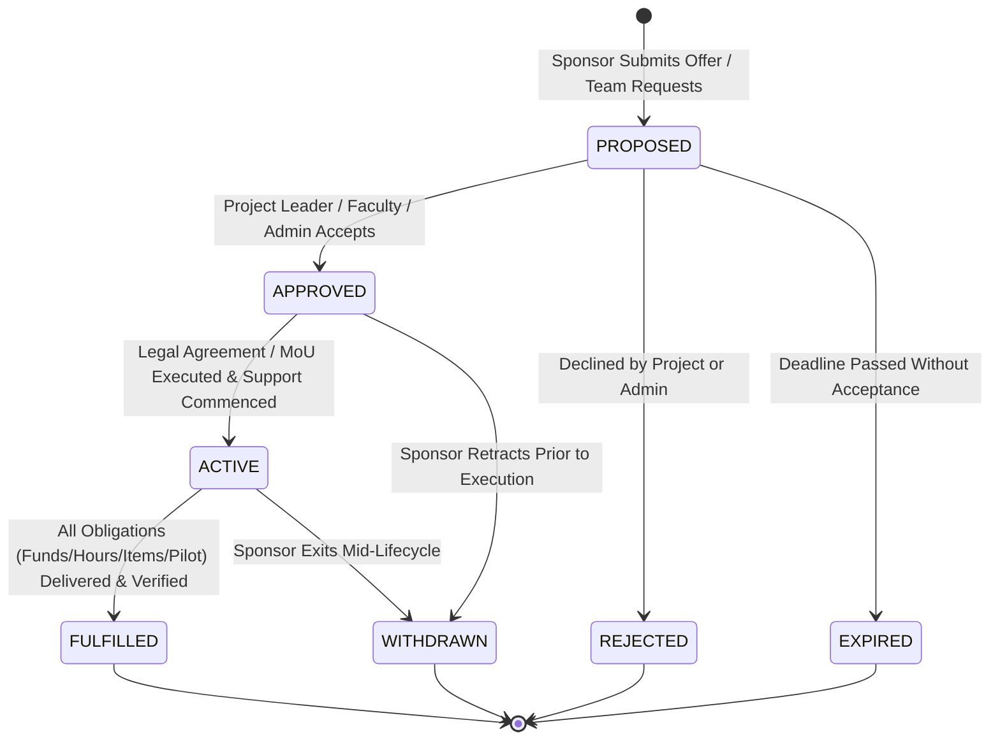

# Module 6 (M6) — Architecture Decisions & Domain Contracts Lock

**Document Version:** 1.4 (Domain Architecture Decisions, M5-Derived Eligibility, Invariants & Append-Only Audit Lock)  
**Module ID:** M6  
**Module Name:** Industry Partnership Network  
**Status:** 🔒 **LOCKED & IMMUTABLE DOMAIN ARCHITECTURE**  
**Author:** SICP Architecture & Engineering Core Team  
**Parent Project:** Societal Innovation Collaboration Platform (SICP)  
**Target Delivery:** Milestone 6 (CSR Sponsorship, Corporate Mentorship, Equipment & Pilot Support)  
**Dependencies:**
- M1: Identity & Access Management (IAM) [LOCKED 🔒 `v1.0.0-m1-lock`]
- M2: Citizen Challenge Management [LOCKED 🔒 `v2.0.0-m2-lock`]
- M3: Team Formation & Collaboration [LOCKED 🔒 `v3.0.0-m3-lock`]
- M4: Academic Collaboration Hub [LOCKED 🔒 `v4.0.0-m4-lock`]
- M5: Innovation Project Lifecycle [LOCKED 🔒 `v5.0.0-m5-lock`]

---

## 1. Executive Summary & Context

Module 6 connects validated innovation projects (`InnovationProject` from **M5**) and academic institutions (**M4**) with industry organizations, CSR foundations, incubators, and MSMEs. 

To ensure architectural alignment across SIH #26043 and prevent downstream data drift in **M7 Governance & Impact Intelligence**, the following core architectural decisions, domain entities, lifecycle contracts, derived M5 eligibility rules, tranche aggregation invariants, and append-only audit specifications are permanently locked.

---

## 2. Locked Architecture Decisions (ADR 1–8)



---

### Decision 1: Multi-Sponsor Project Model (Many-to-Many)
- **Decision**: A single `InnovationProject` can have **multiple industry partners** contributing simultaneously.
- **Cardinality**: Many-to-Many ($M:N$) mediated through the `PartnershipAgreement` domain aggregate.
- **Rationale**: Real-world societal innovation projects require diverse stakeholder support:
  - Corporate CSR grants monetary funding.
  - Hardware/Semiconductor firms supply testbeds and components.
  - Technology companies provide industry mentors and cloud credits.
  - Municipalities and local MSMEs provide test facilities for pilot deployments.
- **Domain Contract**: `InnovationProject (1) <---> (N) PartnershipAgreement (N) <---> (1) IndustryPartner`

---

### Decision 2: Multi-Project Industry Sponsor Model
- **Decision**: A single industry partner can sponsor, mentor, or provide resources to **multiple innovation projects** concurrently.
- **Rationale**: CSR foundations, incubators, enterprise programs, and venture mentors manage portfolios of 10–50+ student cohorts across districts and domains.
- **Domain Contract**: An industry partner can hold $N$ active `PartnershipAgreement` instances across different projects without artificial system-level barriers.

---

### Decision 3: Industry Partner Eligibility & Verification Lifecycle
- **Decision**: Industry organizations must be formally verified before they are eligible to sponsor projects, offer mentorship, or commit resources.
- **Verification States (`PartnerVerificationStatus`)**:
  - `PENDING_VERIFICATION`: Registered organization awaiting platform admin verification.
  - `VERIFIED`: Officially accredited; eligible to browse marketplace, submit proposals, and sign agreements.
  - `SUSPENDED`: Temporarily restricted by platform admin due to non-fulfillment, compliance violation, or policy breach.
  - `INACTIVE`: Organization deactivated or dormant.
- **Invariant**: Only `VERIFIED` industry partners can propose or execute partnership agreements.

---

### Decision 4: Sponsorship-Eligible Project Statuses (Derived Directly from M5)
- **Decision**: Sponsorship eligibility is **not invented in M6**; it is derived strictly from M5 `ProjectStatus` (`app.core.constants.ProjectStatus`).

```python
# Derived Directly from M5 Project Contracts
SPONSORSHIP_ELIGIBLE_PROJECT_STATUSES = {
    ProjectStatus.PROPOSAL,      # Open for early-stage grants & co-design
    ProjectStatus.ACTIVE,        # Open for active sprint funding & equipment
    ProjectStatus.PROTOTYPE,     # Open for hardware, cloud & prototype funding
    ProjectStatus.PILOT,         # Open for municipal/industrial field testbeds
    ProjectStatus.REVIEW_READY,  # Open for final evaluation & pilot adoption
}

INELIGIBLE_PROJECT_STATUSES = {
    ProjectStatus.COMPLETED,     # Terminal success — roadmap finalized
    ProjectStatus.TERMINATED,    # Terminal administrative abort
    ProjectStatus.ABANDONED,     # Terminal team/institutional exit
    ProjectStatus.SUSPENDED,     # Temporarily frozen by admin enforcement
}
```
- **Rule**: Creating a `PartnershipAgreement` against a project in any `INELIGIBLE_PROJECT_STATUSES` raises HTTP `400 Bad Request` (`PROJECT_NOT_ELIGIBLE_FOR_SPONSORSHIP`).

---

### Decision 5: Partnership Types (Closed Enum Contract)
- **Decision**: The platform models sponsorship through four distinct, first-class partnership types:

| Partnership Type (`PartnershipType`) | Category | Description & Resource Units |
| :--- | :--- | :--- |
| `FUNDING` | Direct Financial / CSR | Monetary sponsorship, grant funding, milestone-based tranches (INR ₹). |
| `MENTORSHIP` | Human Capital | Domain expert guidance, sprint reviews, architecture consulting (Hours). |
| `EQUIPMENT` | Physical / Cloud Assets | Hardware components, IoT sensors, cloud compute credits, lab licenses. |
| `PILOT_DEPLOYMENT` | Field / Testing Infrastructure | Real-world testing grounds, municipal testbeds, pilot site access. |

---

### Decision 6: Multi-Partner Contribution per Sponsorship Category
- **Decision**: A project can have **multiple partners contributing to the same category** without mutual exclusivity:
  - **Multi-Funding**: Partner A (₹2,00,000) + Partner B (₹1,50,000) + Partner C (₹50,000).
  - **Multi-Equipment**: Partner X (Sensors) + Partner Y (Cloud Credits) + Partner Z (PCBs).
  - **Multi-Mentorship**: Domain Expert 1 (AI/ML) + Domain Expert 2 (Embedded Firmware).
  - **Multi-Pilot**: Municipal Corporation (Urban testing) + Rural Panchayat (Field testing).
- **Rule**: No artificial single-sponsor constraints per category. Aggregate project resource coverage is computed dynamically from active agreements.

---

### Decision 7: Milestone-Based Funding Tranches & Tranche Aggregation
- **Decision**: `FUNDING` commitments must support **milestone-linked tranche releases**.
- **Tranche Aggregation Mechanics**:
  - A total funding commitment `promised_amount` is partitioned into $M$ scheduled tranches ($M \ge 1$).
  - Each tranche release is tracked as a `SponsorshipDisbursement` linked to an approved M5 `ProjectMilestone` (`MILESTONE_APPROVED`).
  - **Tranche Sum Invariant**:
    $$\sum_{j=1}^M \text{tranche\_amount}_j == \text{promised\_amount}$$
  - **Released Amount Invariant**:
    $$\text{released\_amount} = \sum_{j \in \text{RELEASED}} \text{tranche\_amount}_j \le \text{promised\_amount}$$
  - **Remaining Amount Invariant**:
    $$\text{remaining\_amount} = \sum_{j \in \text{SCHEDULED}} \text{tranche\_amount}_j = \text{promised\_amount} - \text{released\_amount}$$
  - **Milestone Unique Binding**: Each tranche must bind to a distinct `milestone_id` within the target project.

---

### Decision 8: Sponsorship Commitment Lifecycle & Metric Tracking

#### 8.1 Agreement State Machine


#### 8.2 Agreement Lifecycle States (`CommitmentStatus`)
- `PROPOSED`: Partnership offer submitted by sponsor or requested by team.
- `APPROVED`: Mutual agreement accepted by project stakeholders / platform admin.
- `ACTIVE`: Partnership currently active; resources, hours, or funds being disbursed.
- `FULFILLED`: All promised financial, mentorship, equipment, or deployment obligations completed.
- `REJECTED`: Partnership proposal declined.
- `WITHDRAWN`: Sponsor or project withdrew from the agreement.
- `EXPIRED`: Proposal window elapsed without execution.

---

### Decision 9: Sponsor Withdrawal Protocol & Audit Preservation
- **Zero Hard Deletions**: When a sponsor withdraws, the record is **NEVER deleted**.
- **State Transition**: `ACTIVE` $\rightarrow$ `WITHDRAWN`.
- **System Actions on Withdrawal**:
  1. **Preserve Historical Ledger**: Agreement record remains queryable with timestamp and withdrawal reason.
  2. **Recalculate Project Resource Coverage**: The project's active funding, equipment, and mentorship coverage totals immediately exclude unreleased/withdrawn amounts.
  3. **Gap Detection & Alerting**: System marks resource deficits (e.g., Budget Shortfall: ₹1,50,000) and emits notifications to Team Leader, Faculty Mentor, and University Admin.
  4. **Open Re-Sponsorship**: The project becomes eligible in the Industry Marketplace for new sponsor proposals to fill the vacated gap.
  5. **M7 Impact Analytics Ground Truth**: Historical reports in M7 continue to factor past contributions, pledged vs. realized CSR metrics, and sponsor reliability ratings.

---

## 3. Domain Entity Model (Logical Level)

### 3.1 Entity: `PartnershipAgreement` (Aggregate Root)
- **Role**: Mediates the $M:N$ relationship between `IndustryPartner`, `InnovationProject`, and `PartnershipType`.
- **Core Attributes**:
  - `agreement_id`: Unique domain identifier.
  - `project_id`: Target M5 Innovation Project identifier (must be in `SPONSORSHIP_ELIGIBLE_PROJECT_STATUSES`).
  - `partner_id`: Verified Industry Partner identifier (must be `VERIFIED`).
  - `partnership_type`: `FUNDING`, `MENTORSHIP`, `EQUIPMENT`, `PILOT_DEPLOYMENT`.
  - `commitment_status`: `PROPOSED`, `APPROVED`, `ACTIVE`, `FULFILLED`, `REJECTED`, `WITHDRAWN`, `EXPIRED`.
  - `terms_and_conditions`: Agreement narrative, MoU references, and scope.
  - `start_date` / `end_date`: Agreement validity period.
  - Dimension-specific commitments (Funding amounts, Equipment manifests, Mentorship hours, Pilot parameters).

### 3.2 Entity: `SponsorshipDisbursement`
- **Role**: Tracks individual financial or asset tranches released against an active `PartnershipAgreement`.
- **Core Attributes**:
  - `disbursement_id`: Unique identifier.
  - `agreement_id`: Parent agreement reference.
  - `milestone_id`: Associated M5 Project Milestone triggering the tranche.
  - `tranche_number`: Sequential tranche index (e.g., 1, 2, 3).
  - `amount`: Disbursed currency amount.
  - `disbursement_status`: `SCHEDULED`, `PENDING_VERIFICATION`, `RELEASED`, `FAILED`.
  - `transaction_reference`: Invoice/bank transaction reference.
  - `disbursed_at`: Verification timestamp.

### 3.3 Entity: `MentorshipSession`
- **Role**: Logs dedicated mentorship hours and expert feedback between industry advisors and student teams.
- **Core Attributes**:
  - `session_id`: Unique identifier.
  - `agreement_id`: Parent agreement reference.
  - `mentor_user_id`: Authenticated industry mentor (`role = 'industry'`).
  - `team_id`: M3 Student Team.
  - `session_date`: Date and time of meeting.
  - `duration_hours`: Duration in hours credited toward `completed_hours`.
  - `topics_covered`: Technical and advisory sprint notes.
  - `student_rating`: Optional feedback rating from team leader.

---

## 4. Locked Domain Invariants

The following invariants are mandatory across PRD, Design, TDD, and runtime validation:

### Invariant 1: M5-Derived Active Project Pre-condition
- **Rule**: A `PartnershipAgreement` can **ONLY** be created against an **active** `InnovationProject`.
- **Constraint**: Project status must be in `SPONSORSHIP_ELIGIBLE_PROJECT_STATUSES` (`PROPOSAL`, `ACTIVE`, `PROTOTYPE`, `PILOT`, `REVIEW_READY`).
- **Guard**: Projects in `COMPLETED`, `SUSPENDED`, `TERMINATED`, or `ABANDONED` cannot accept new agreements.

### Invariant 2: Financial Tranche Aggregation & Bounds
- **Tranche Sum Equality**: 
  $$\sum_{j=1}^M \text{tranche\_amount}_j == \text{promised\_amount}$$
- **Disbursement Bound**: 
  $$\text{released\_amount} \le \text{promised\_amount}$$
- **Exact Balance Equation**:
  $$\text{remaining\_amount} = \text{promised\_amount} - \text{released\_amount}$$

### Invariant 3: Equipment Quantity Bounds
- **Bounds Rule**:
  $$\text{delivered\_quantity} \le \text{promised\_quantity}$$
- **Guard**: The verified delivered resource quantity must never exceed the committed quantity specified in the agreement manifest.

### Invariant 4: Mentorship Hours Bounds
- **Bounds Rule**:
  $$\text{completed\_hours} \le \text{promised\_hours}$$
- **Guard**: Cumulative logged mentoring session hours credited toward agreement fulfillment cannot exceed the committed hours.

### Invariant 5: Pilot Deployment Fulfillment Evidence Gate
- **Evidence Rule**:
  $$\text{Agreement Status} = \text{FULFILLED} \implies \text{Deployment Evidence Verified}$$
- **Guard**: A pilot deployment agreement cannot transition to `FULFILLED` without verifiable deployment evidence (e.g., municipal sign-off, pilot telemetry logs, site photos, or validation reports).

---

## 5. Append-Only Immutable Audit Contracts (M7 Telemetry Contract)

- **Append-Only Contract**: Audit logs in `audit_logs` are strictly **append-only** and **immutable**. Under no circumstances can an audit log entry be updated, modified, or deleted by any user, role, service, or administrator.
- **Contract Enforcement**: Handled via `AuditRepository.create_log(session, action, entity_type, user_id, entity_id, metadata)` with database-level insert-only integrity.

### 5.1 Required M6 Audit Actions (`AuditAction`)

| Category | Audit Action Enum | Trigger Event / Lifecycle Mutation | Metadata Logged |
| :--- | :--- | :--- | :--- |
| **Partner Lifecycle** | `INDUSTRY_PARTNER_REGISTERED` | Organization registers profile on SICP | `partner_id`, `company_name`, `domain` |
| | `INDUSTRY_PARTNER_VERIFIED` | Admin approves partner verification | `partner_id`, `verified_by`, `accreditation` |
| | `INDUSTRY_PARTNER_SUSPENDED` | Admin suspends partner | `partner_id`, `reason`, `suspended_by` |
| **Agreement Lifecycle** | `PARTNERSHIP_PROPOSED` | Sponsor submits offer or team requests partnership | `agreement_id`, `project_id`, `partner_id`, `type`, `pledge` |
| | `PARTNERSHIP_APPROVED` | Stakeholders accept agreement | `agreement_id`, `approved_by` |
| | `PARTNERSHIP_ACTIVATED` | MoU/agreement executed; partnership becomes active | `agreement_id`, `start_date`, `end_date` |
| | `PARTNERSHIP_FULFILLED` | All obligations verified & completed | `agreement_id`, `fulfilled_at`, `total_delivered` |
| | `PARTNERSHIP_WITHDRAWN` | Sponsor or project exits agreement | `agreement_id`, `withdrawal_reason`, `gap_amount` |
| | `PARTNERSHIP_REJECTED` | Proposal declined | `agreement_id`, `rejection_reason` |
| **Disbursement Lifecycle**| `DISBURSEMENT_SCHEDULED` | Tranche linked to M5 milestone | `disbursement_id`, `agreement_id`, `milestone_id`, `amount` |
| | `DISBURSEMENT_RELEASED` | Tranche funds/resources released & verified | `disbursement_id`, `transaction_ref`, `amount` |
| **Mentorship Lifecycle** | `MENTORSHIP_SESSION_LOGGED`| Industry mentor logs session hours & notes | `session_id`, `agreement_id`, `duration_hours`, `mentor_id` |
| | `MENTORSHIP_FEEDBACK_GIVEN`| Team submits rating & feedback for session | `session_id`, `student_rating`, `feedback` |
| **Evidence & Delivery** | `EQUIPMENT_DELIVERY_CONFIRMED` | Team confirms receipt of hardware/cloud credits | `agreement_id`, `item_name`, `quantity`, `receipt_ref` |
| | `PILOT_EVIDENCE_SUBMITTED` | Pilot deployment telemetry/sign-off uploaded | `agreement_id`, `evidence_url`, `checksum` |

### 5.2 M7 Governance & Intelligence Downstream Analytics
These immutable audit records directly power the following M7 reporting pipelines:
- **Sponsor Activity & Reliability Rating**: Percentage of proposed vs. fulfilled vs. withdrawn commitments per partner.
- **CSR Fund Utilization Velocity**: Real-time ratio of committed CSR grants vs. disbursed milestone tranches.
- **Corporate Mentorship Index**: Cumulative hours delivered by industry mentors across academic domains.
- **Social Return on Investment (SROI)**: Combined financial, technical, and equipment contributions deployed per district.

---

## 6. Architecture Lock Certification

| Architecture Dimension | Locked Rule / Specification | Status |
| :--- | :--- | :---: |
| **Sponsor Eligibility** | `PENDING_VERIFICATION`, `VERIFIED`, `SUSPENDED`, `INACTIVE` (`VERIFIED` required) | 🔒 LOCKED |
| **Project Pre-condition** | Derived from M5 `ProjectStatus`: `{PROPOSAL, ACTIVE, PROTOTYPE, PILOT, REVIEW_READY}` | 🔒 LOCKED |
| **Cardinality Model** | Multi-Sponsor ($M:N$ Many-to-Many via `PartnershipAgreement`) | 🔒 LOCKED |
| **Partnership Types** | `FUNDING`, `MENTORSHIP`, `EQUIPMENT`, `PILOT_DEPLOYMENT` | 🔒 LOCKED |
| **Category Capacity** | Unrestricted ($N$ partners per category) | 🔒 LOCKED |
| **Funding Tranches** | Milestone-linked tranche releases on M5 `MILESTONE_APPROVED` | 🔒 LOCKED |
| **Tranche Aggregation** | $\sum \text{tranche\_amount} == \text{promised\_amount}$ and $\text{remaining} = \text{promised} - \text{released}$ | 🔒 LOCKED |
| **Equipment Invariant** | $\text{delivered\_quantity} \le \text{promised\_quantity}$ | 🔒 LOCKED |
| **Mentorship Invariant** | $\text{completed\_hours} \le \text{promised\_hours}$ | 🔒 LOCKED |
| **Pilot Invariant** | $\text{FULFILLED Pilot} \implies \text{Deployment Evidence Verified}$ | 🔒 LOCKED |
| **Commitment Lifecycle** | `PROPOSED` $\rightarrow$ `APPROVED` $\rightarrow$ `ACTIVE` $\rightarrow$ `FULFILLED` (Plus `REJECTED`, `WITHDRAWN`, `EXPIRED`) | 🔒 LOCKED |
| **Withdrawal Rule** | Soft status `WITHDRAWN`, zero hard deletion, gap calculation, preserved M7 analytics | 🔒 LOCKED |
| **Domain Entities** | `PartnershipAgreement`, `SponsorshipDisbursement`, `MentorshipSession` | 🔒 LOCKED |
| **Append-Only Audit** | 100% immutable append-only audit events logged to `audit_logs` | 🔒 LOCKED |

**Sign-off:** SICP Architecture Core Team — Module 6 specifications (`M6-PRD.md`, `M6-DESIGN.md`, `M6-TDD.md`) may proceed strictly against these locked domain decisions, invariants, and audit contracts.
