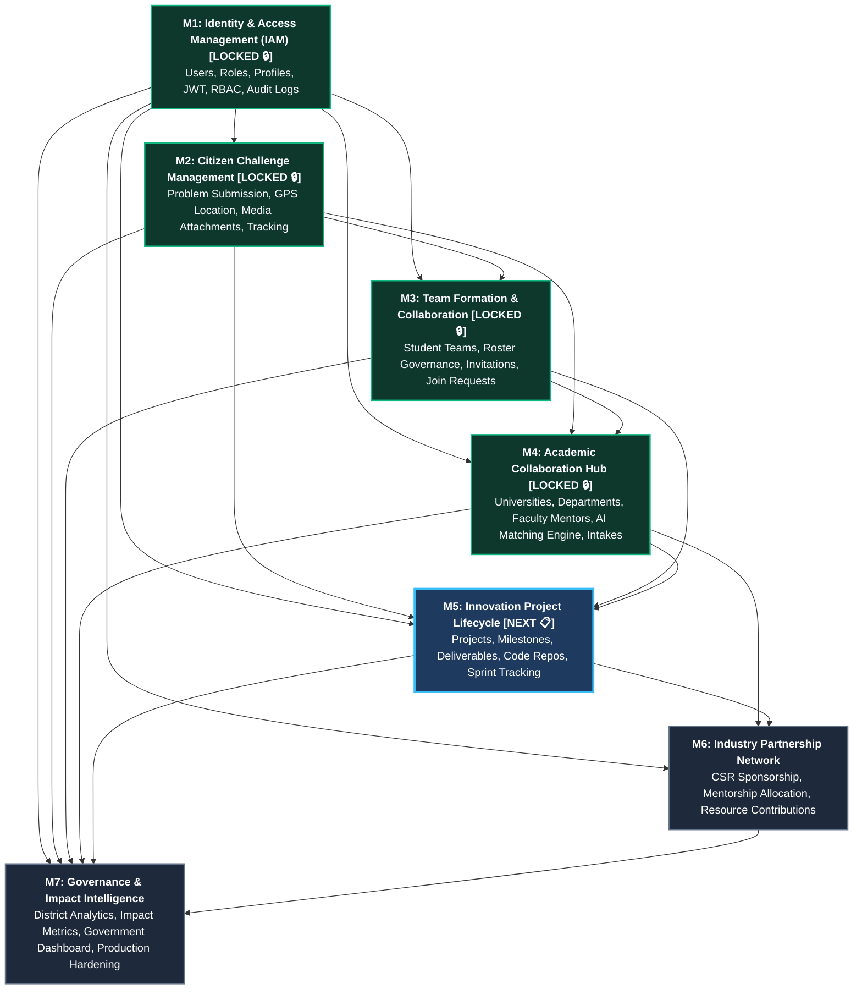

# SICP Module Dependency & Data Flow Map

**Document Version:** 4.0  
**Project:** Societal Innovation Collaboration Platform (SICP)  
**Architecture Style:** Modular Monolith $\rightarrow$ Event-Driven Microservices Ready  

---

## 1. High-Level Dependency Graph

---

## 2. Module Specifications & Input/Output Matrix

### Module 1: Identity & Access Management (IAM)
- **Status:** 🔒 **LOCKED & COMPLETE** (`v1.0.0-m1-lock`)
- **Dependencies:** None (Foundational Layer).
- **Core Entities Provided:**
  - `users`: Core identity, Argon2id credentials, role enums (`citizen`, `student`, `faculty`, `industry`, `government`, `admin`), account status (`ACTIVE`, `PENDING`, `SUSPENDED`, `BANNED`), trust score.
  - `audit_logs`: Immutable activity tracking for all platform mutations.
  - `notifications`: System notification queue.
  - `citizens`, `faculty`, `students`, `industries`: Role profile extensions.
- **Contracts Exported:**
  - JWT Tokens: 15-minute access token (`sub`, `role`, `email`, `name`) & 7-day refresh token.
  - RBAC Guard: `require_roles(["role1", ...])` with super admin bypass.
  - Standard Response Envelopes: `{ success: true, data: {} }` and `{ success: false, error: {} }`.
  - Shared Constants: `UserRole`, `UserStatus`, `AuditAction`, `NotificationType`.

---

### Module 2: Citizen Challenge Management
- **Status:** 🔒 **LOCKED & COMPLETE** (`v2.0.0-m2-lock`)
- **Dependencies:** **M1 (IAM)**
- **Inputs Consumed from M1:**
  - Authenticated citizen UUID (`current_user.id`).
  - `citizens` table foreign key target (`challenges.citizen_id -> citizens.user_id`).
  - RBAC guard: `require_roles(["citizen", "admin"])`.
  - `AuditRepository.log` for audit event generation (`CHALLENGE_CREATED`, etc.).
- **Core Entities Created:**
  - `challenges`: Title, description, category, affected population, latitude/longitude, district, state, workflow status (`draft`, `submitted`, `under_review`, `approved`, `published`, `in_progress`, `resolved`, `closed`), optimistic locking version.
  - `challenge_assets`: Storage URLs, media types (`image`, `video`, `document`), upload timestamps.
- **Events Published:**
  - `CHALLENGE_CREATED`, `CHALLENGE_SUBMITTED`, `CHALLENGE_APPROVED`, `CHALLENGE_PUBLISHED`, `CHALLENGE_ARCHIVED`.

---

### Module 3: Team Formation & Collaboration
- **Status:** 🔒 **LOCKED & COMPLETE** (`v3.0.0-m3-lock`)
- **Dependencies:** **M1 (IAM) + M2 (Challenge Management)**
- **Inputs Consumed:**
  - `challenges.id` (strictly anchors teams to published challenges).
  - Authenticated students, faculty, and industry mentors from M1.
- **Core Entities Created:**
  - `teams`: Name, description, challenge linkage, capacity limits ($2 \le \text{max\_members} \le 6$), status (`OPEN`, `FULL`, `LOCKED`, `DISBANDED`), visibility (`PUBLIC`, `PRIVATE`, `INVITE_ONLY`), skills needed.
  - `team_members`: Team membership roster, roles (`LEADER`, `CO_LEADER`, `MEMBER`, `MENTOR`), statuses (`ACTIVE`, `INVITED`, `REQUESTED`, `WITHDRAWN`, `EXPIRED`, `REJECTED`, `LEFT`, `REMOVED`), 14-day invitation expiry.
- **Governance Rules Enforced:**
  - Single active team ownership per challenge (FR-M3-15).
  - Single active challenge participation per contributor (FR-M3-14).
  - Mentor capacity limit (maximum 2 active mentors per team).
- **Events Published:**
  - 17 team lifecycle and membership audit actions.

---

### Module 4: Academic Collaboration Hub
- **Status:** 🔒 **LOCKED & COMPLETE** (`v4.0.0-m4-lock`)
- **Dependencies:** **M1 (IAM) + M2 (Challenge Management) + M3 (Teams)**
- **Inputs Consumed:**
  - Published societal challenges from **M2**.
  - Student teams from **M3**.
  - Faculty and student user profiles from **M1**.
- **Core Entities Created:**
  - `universities`: Legal name, code, district, state, domain expertise tags, verification status (`PENDING_VERIFICATION`, `VERIFIED`, `REJECTED`, `SUSPENDED`).
  - `university_administrators`: Tenant-scoped institutional administration without modifying global user roles.
  - `departments`: University department units, specializations, Head of Department assignment.
  - `faculty_affiliations`: Faculty primary institutional bindings with single active primary affiliation constraint.
  - `academic_intakes`: University challenge claims and routing statuses (`PENDING_REVIEW`, `ACCEPTED`, `ASSIGNED`, `IN_PROGRESS`, `COMPLETED`).
  - `intake_team_allocations`: Binding of M3 student teams and faculty mentors to an academic intake.
- **Engines & Governance Rules:**
  - Multi-factor deterministic matching formula ($40\%$ domain expertise, $25\%$ faculty availability, $15\%$ proximity, $10\%$ track record, $10\%$ cohort capacity).
  - Explainable recommendation output per `AGENTS.md` Rule 6.
  - Faculty mentoring capacity limits (maximum 3 platform-wide, maximum 1 per specific challenge).
  - Strict Head of Department validation (must be active faculty in the same department and university).
- **Events Published:**
  - 20 academic audit actions (`UNIVERSITY_REGISTERED`, `FACULTY_AFFILIATION_APPROVED`, `CHALLENGE_CLAIMED_BY_UNIVERSITY`, `TEAM_ALLOCATED_TO_CHALLENGE`, `FACULTY_MENTOR_ASSIGNED_TO_TEAM`, etc.).

---

### Module 5: Innovation Project Lifecycle
- **Status:** 📋 **NEXT IN QUEUE**
- **Dependencies:** **M1 (IAM) + M2 (Challenge Management) + M3 (Teams) + M4 (Academic Hub)**
- **Inputs Consumed:**
  - Bound `intake_team_allocations` from **M4** linking challenge, student team, university department, and faculty mentor.
  - Team roster and leader from **M3**.
  - Verified challenge context and population metrics from **M2**.
- **Core Entities to Create:**
  - `projects`: Title, description, status (`proposal`, `prototype`, `pilot`, `deployment`, `completed`), impact score, repository links.
  - `project_milestones`: Title, description, due date, deliverables, review status, faculty mentor sign-off.
  - `project_deliverables`: Artifacts, code repositories, test reports, verification proofs.
  - `project_updates`: Sprint progress logs and team discussions.
- **Events Published:**
  - `PROJECT_CREATED`, `MILESTONE_SUBMITTED`, `MILESTONE_APPROVED`, `PROJECT_COMPLETED`.
- **Next Module Dependency:** Validated innovation projects and prototype funding requirements feed into **M6** (Industry Sponsorship).

---

### Module 6: Industry Partnership Network
- **Status:** 📋 **Upcoming**
- **Dependencies:** **M1 (IAM) + M4 (Academic Hub) + M5 (Project Lifecycle)**
- **Inputs Consumed:**
  - `industries` profile table from **M1**.
  - Active innovation projects needing funding/mentorship from **M5**.
- **Core Entities to Create:**
  - `industry_partnerships`: Project ID, Industry ID, contribution type (`CSR Funding`, `Mentorship`, `Equipment`, `Cloud Credits`), funding amount.
  - `industry_capability_profiles`: Domain interest, CSR focus areas, budget allocations.
- **Services to Build:**
  - Project Marketplace for industry CSR discovery.
  - Sponsorship & equipment contribution workflow.
  - Industrial mentor assignment.
- **Events Published:**
  - `INDUSTRY_PARTNERSHIP_CREATED`.

---

### Module 7: Governance & Impact Intelligence & Hardening
- **Status:** 📋 **Upcoming (Final Milestone)**
- **Dependencies:** **All Previous Modules (M1 $\rightarrow$ M6)**
- **Inputs Consumed:**
  - Challenges and district metrics from **M2**.
  - Student and team collaboration metrics from **M3**.
  - University intake and faculty mentorship analytics from **M4**.
  - Project completion and pilot milestones from **M5**.
  - Industry CSR funding figures from **M6**.
- **Core Entities to Create:**
  - `impact_metrics`: People benefited, cost saved, water saved (liters), energy saved (kWh), jobs created, patents generated, pollution reduction.
- **Services to Build:**
  - Government Analytics Dashboard with district heatmaps.
  - Impact KPI Aggregator & Downloadable Social Impact Reports.
  - Production Hardening: Redis cluster token revocation, rate limiting, and Prometheus/Grafana telemetry.

---

## 3. Module Lock Registry

| Module | Title | Release Tag | Status | Test Suite |
| :--- | :--- | :--- | :---: | :---: |
| **M1** | Identity & Access Management (IAM) | `v1.0.0-m1-lock` | 🔒 **LOCKED** | Passing (100%) |
| **M2** | Citizen Challenge Management | `v2.0.0-m2-lock` | 🔒 **LOCKED** | Passing (100%) |
| **M3** | Team Formation & Collaboration | `v3.0.0-m3-lock` | 🔒 **LOCKED** | Passing (100%) |
| **M4** | Academic Collaboration Hub | `v4.0.0-m4-lock` | 🔒 **LOCKED** | 24/24 Passing (100%) |
| **M5** | Innovation Project Lifecycle | `v5.0.0-m5-candidate` | 📋 **NEXT** | Pending Implementation |
| **M6** | Industry Partnership Network | `v6.0.0-m6-candidate` | 📋 Queued | Pending M5 |
| **M7** | Governance & Impact Intelligence | `v7.0.0-m7-candidate` | 📋 Queued | Pending M6 |
