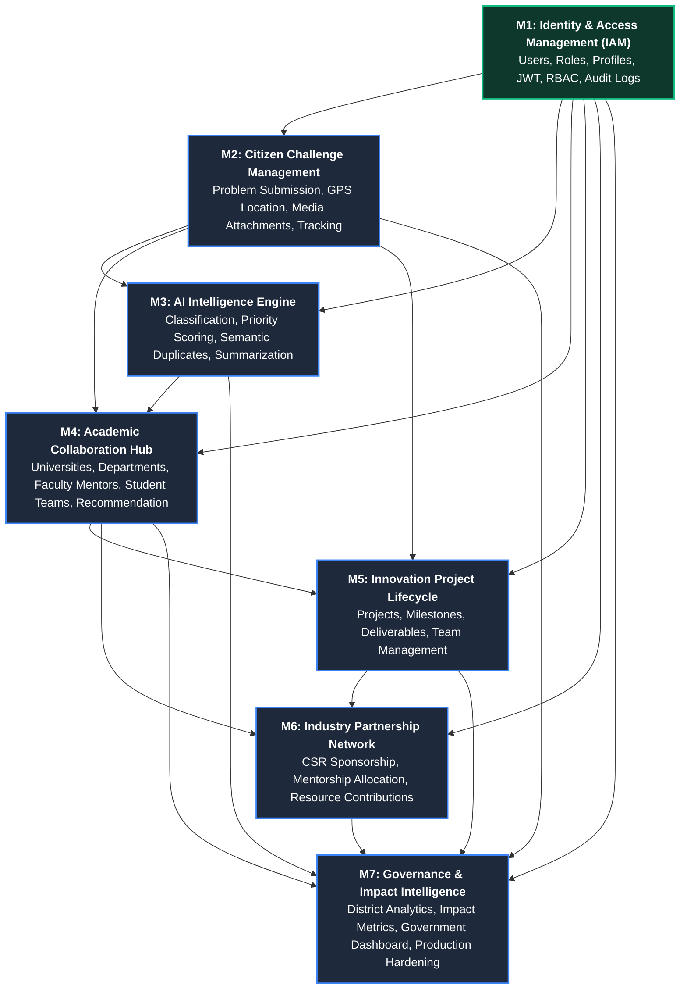

# SICP Module Dependency & Data Flow Map

**Document Version:** 1.0  
**Project:** Societal Innovation Collaboration Platform (SICP)  
**Architecture Style:** Modular Monolith $\rightarrow$ Event-Driven Microservices Ready  

---

## 1. High-Level Dependency Graph

---

## 2. Module Specifications & Input/Output Matrix

### Module 1: Identity & Access Management (IAM)
- **Status:** 🔒 **LOCKED & COMPLETE**
- **Dependencies:** None (Foundational Layer).
- **Core Entities Provided:**
  - `users`: Core identity, Argon2id credentials, role enums (`citizen`, `student`, `faculty`, `industry`, `government`, `admin`), account status (`ACTIVE`, `PENDING`, `SUSPENDED`, `BANNED`), trust score.
  - `audit_logs`: Immutable activity tracking for all platform mutations.
  - `notifications`: System notification queue.
  - `citizens`, `faculty`, `students`, `industries`: Role profile extensions.
- **Contracts Exported:**
  - JWT Tokens: 15-minute access token (`sub`, `role`, `email`, `name`) & 7-day refresh token.
  - RBAC Guard: `require_roles(["role1", ...])` with super admin bypass.
  - Standard Response Envelopes: `{ success: true, data: {} }` and `{ success: false, error: {} }`.
  - Shared Constants: `UserRole`, `UserStatus`, `AuditAction`, `NotificationType`.

---

### Module 2: Citizen Challenge Management
- **Status:** 📋 **NEXT IN QUEUE (Day 2)**
- **Dependencies:** **M1 (IAM)**
- **Inputs Consumed from M1:**
  - Authenticated citizen UUID (`current_user.id`).
  - `citizens` table foreign key target (`problems.citizen_id -> citizens.user_id`).
  - RBAC guard: `require_roles(["citizen"])`.
  - `AuditRepository.log` for audit event generation (`PROBLEM_CREATED`).
- **Core Entities Created:**
  - `problems`: Title, description, category, affected population, latitude/longitude, PostGIS Point geometry, workflow status (`submitted`, `verified`, `assigned`, etc.), priority score placeholder.
  - `problem_media`: Storage URLs, media types (`image`, `video`, `document`), upload timestamps.
- **Events Published:**
  - `ProblemCreated(problem_id, citizen_id, category, timestamp)`
  - `ProblemUpdated(problem_id, changes)`
- **Next Module Dependency:** Provides the problem entity and media required by **M3** (AI Processing) and **M4** (Academic Matching).

---

### Module 3: AI Intelligence Engine
- **Status:** 📋 **Day 3**
- **Dependencies:** **M1 (IAM) + M2 (Challenge Management)**
- **Inputs Consumed from M2:**
  - `problems` text (Title, Description), location coordinates, and media.
  - Event trigger: `ProblemCreated`.
- **Core Entities Created:**
  - `problem_embeddings`: Vector embeddings (pgvector / SentenceTransformers `all-MiniLM-L6-v2`) for semantic duplicate matching.
  - `problem_clusters` & `problem_cluster_mapping`: Grouping semantically identical citizen reports.
  - `ai_analysis_results`: Predicted category, confidence score, priority urgency score (0–100), and concise summary.
- **Events Published:**
  - `ProblemAnalyzed(problem_id, category, confidence, priority_score, is_duplicate, cluster_id)`
- **Next Module Dependency:** Outputs priority scores and classified domain categories to drive **M4** (University & Faculty Recommendation).

---

### Module 4: Academic Collaboration Hub
- **Status:** 📋 **Day 4**
- **Dependencies:** **M1 (IAM) + M2 (Challenge Management) + M3 (AI Engine)**
- **Inputs Consumed:**
  - Verified problems & AI priority scores from **M2 & M3**.
  - `faculty` and `students` profiles from **M1**.
- **Core Entities Created:**
  - `universities`: Name, district, state, accreditation, website, expertise tags.
  - `departments`: University ID, department name, specialization tags.
  - `university_expertise_profiles`: Research focus and historical capacity.
- **Services Built:**
  - **University Matching Engine**: Multi-factor scoring ($40\%$ expertise, $25\%$ faculty availability, $15\%$ proximity, $10\%$ past success, $10\%$ capacity).
  - **Faculty Mentor Recommender**: Matching specialization and research experience.
  - **Student Team Formation Recommender**: Skill-based cohort builder.
- **Events Published:**
  - `RecommendationGenerated(problem_id, university_id, faculty_id, score)`
- **Next Module Dependency:** Sets up academic acceptance and student/faculty teams for **M5** (Project Lifecycle).

---

### Module 5: Innovation Project Lifecycle
- **Status:** 📋 **Day 5**
- **Dependencies:** **M1 (IAM) + M2 (Challenge Management) + M4 (Academic Hub)**
- **Inputs Consumed:**
  - Accepted challenge (`problem_id`) from **M2**.
  - Assigned university, faculty mentor, and student cohort from **M4**.
- **Core Entities Created:**
  - `projects`: Title, description, status (`proposal`, `prototype`, `pilot`, `deployment`, `completed`), impact score.
  - `project_teams` & `project_members`: Student roles (`ML Engineer`, `IoT Developer`, `Team Lead`, etc.).
  - `project_milestones`: Title, description, due date, status (`pending`, `in_progress`, `completed`).
  - `project_documents`: Prototype blueprints, lab reports, code repositories.
- **Events Published:**
  - `ProjectCreated(project_id, problem_id, university_id)`
  - `MilestoneCompleted(project_id, milestone_id)`
- **Next Module Dependency:** Project records and funding requests feed into **M6** (Industry Sponsorship).

---

### Module 6: Industry Partnership Network
- **Status:** 📋 **Day 6**
- **Dependencies:** **M1 (IAM) + M4 (Academic Hub) + M5 (Project Lifecycle)**
- **Inputs Consumed:**
  - `industries` profile table from **M1**.
  - Active innovation projects needing funding/mentorship from **M5**.
- **Core Entities Created:**
  - `industry_partnerships`: Project ID, Industry ID, contribution type (`CSR Funding`, `Mentorship`, `Equipment`, `Cloud Credits`), funding amount.
  - `industry_capability_profiles`: Domain interest, CSR focus areas, budget allocations.
- **Services Built:**
  - Project Marketplace for industry CSR discovery.
  - Sponsorship & equipment contribution workflow.
  - Industrial mentor assignment.
- **Events Published:**
  - `IndustryPartnershipCreated(project_id, industry_id, funding_amount)`
- **Next Module Dependency:** Investment and deployment metrics feed into **M7** (Governance Analytics).

---

### Module 7: Governance & Impact Intelligence & Hardening
- **Status:** 📋 **Day 7 (Final Milestone)**
- **Dependencies:** **All Previous Modules (M1 $\rightarrow$ M6)**
- **Inputs Consumed:**
  - Total problems & district metrics from **M2**.
  - AI classification trends from **M3**.
  - University participation metrics from **M4**.
  - Project completion and pilot milestones from **M5**.
  - Industry funding & CSR figures from **M6**.
- **Core Entities Created:**
  - `impact_metrics`: People benefited, cost saved, water saved (liters), energy saved (kWh), jobs created, patents generated, pollution reduction.
- **Services Built:**
  - Government Analytics Dashboard with district heatmaps.
  - Impact KPI Aggregator & Downloadable Social Impact Reports.
  - Production Hardening: Redis cluster token revocation, rate limiting, and Prometheus/Grafana telemetry.
- **Deliverable:** `FINAL-HANDOFF.md`.

---

## 3. End-of-Day Memory Handoff Protocol

At the close of each day/module, the agent generates an updated **`M<N>-HANDOFF.md`** file that serves as the isolated context for the next module:

$$\text{M1-HANDOFF.md} \longrightarrow \text{M2-HANDOFF.md} \longrightarrow \text{M3-HANDOFF.md} \longrightarrow \text{M4-HANDOFF.md} \longrightarrow \text{M5-HANDOFF.md} \longrightarrow \text{M6-HANDOFF.md} \longrightarrow \text{FINAL-HANDOFF.md}$$

### Standard Handoff Structure
1. **Status**: `LOCKED` / `IN PROGRESS`.
2. **Completed**: Implemented endpoints, UI views, services, and background workers.
3. **Database Changes**: Tables created, columns, indexes, foreign keys.
4. **Routes Added**: HTTP method, URL path, access control level.
5. **Frontend Pages**: Route path, components, user actions.
6. **Tests Passed**: Number of passing unit/integration tests and code coverage percentage.
7. **Known Issues / Limitations**: Technical debt, stubs, and mocks.
8. **Next Module Dependencies**: Exact schema and contract prerequisites needed for the next day.
