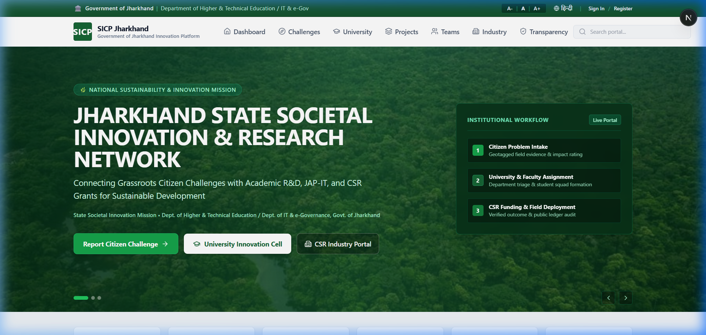
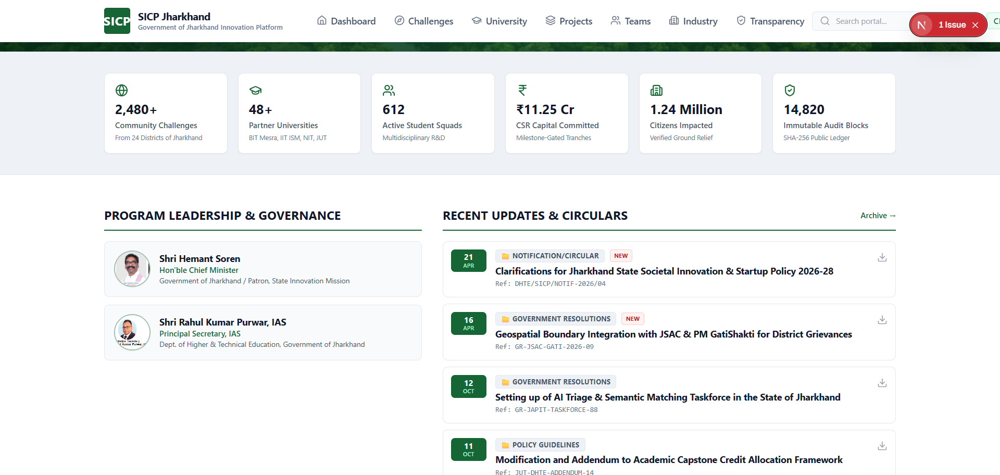
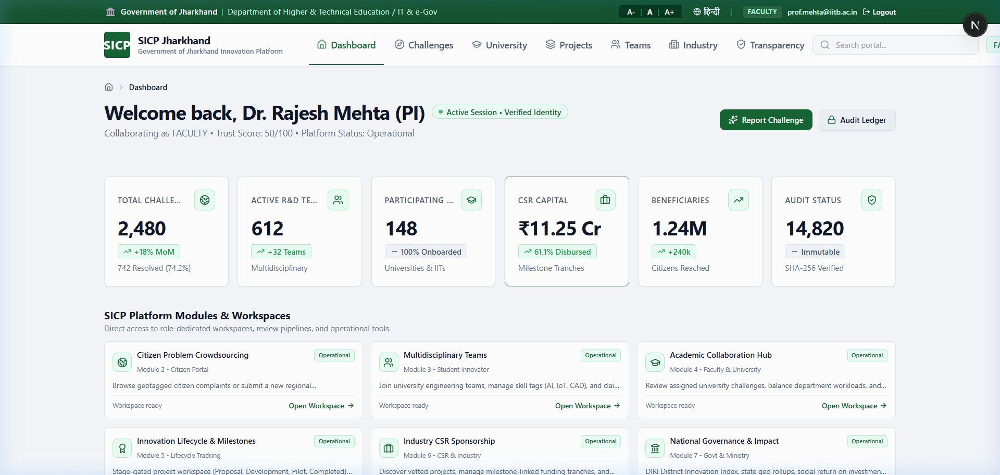
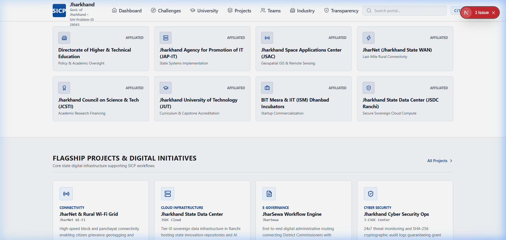
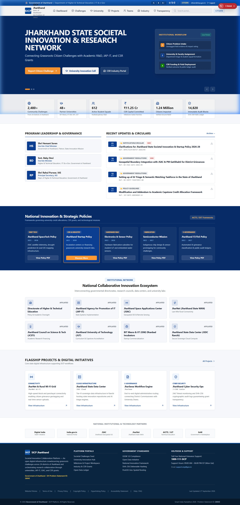
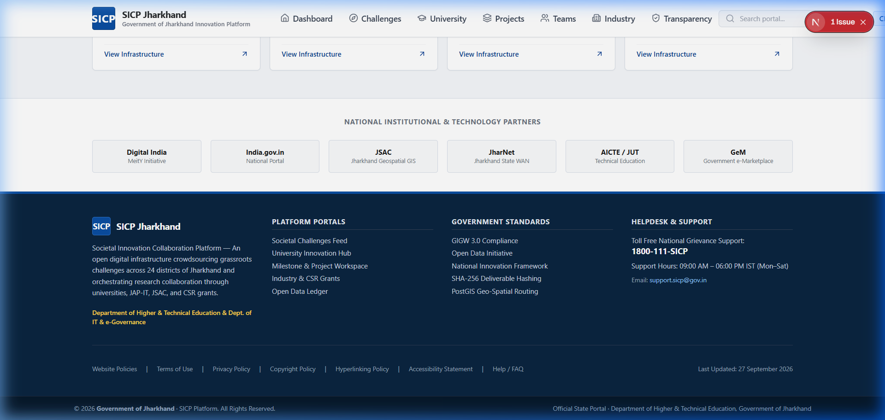

# 🌐 SICP: Societal Innovation Collaboration Platform

[](https://sih.gov.in)
[](https://sih.gov.in)
[](https://fastapi.tiangolo.com)
[](https://nextjs.org)
[](https://postgis.net)
[](https://www.typescriptlang.org/)
[](https://python.org)

> **"Crowdsourcing Community Challenges through Universities and Industry Partnerships"**  
> A unified, transparent digital ecosystem bridging citizens, universities, industries, and government to transform grassroots societal problems into verified, funded, and scalable real-world solutions.

---

## 📌 Problem Statement Details

* **Problem Statement ID:** `26043`
* **Problem Statement Title:** *A digital platform to crowdsource societal challenges and facilitate collaborative problem solving through universities and industry partnerships*
* **Theme:** Smart Education / Social Innovation / GovTech
* **Category:** Software Edition

---

## 🎯 The Core Problem & Motivation

Citizens frequently observe and experience urgent societal bottlenecks across **healthcare, water management, rural infrastructure, sanitation, education, and public services**. However, these grassroots challenges remain unresolved due to systemic friction:

1. **Information Silos:** No unified, verified mechanism for citizens to report localized problems with verifiable geo-coordinates and media evidence.
2. **Untapped Academic Capacity:** Universities possess millions of skilled engineering students and research faculty seeking impactful, real-world capstone and research projects.
3. **Disconnected CSR & Industry Capital:** Industry CSR foundations lack verified, milestone-driven community projects with auditable fund tracking.
4. **Lack of Governance Oversight:** Government agencies struggle to track ground-level problem resolution and district-by-district impact metrics.

---

## 💡 Solution Overview

**SICP** provides an end-to-end digital lifecycle connecting **five key stakeholders** in a closed-loop innovation pipeline:


### Complete Innovation Lifecycle:
1. **Crowdsource & Verify:** Citizens report issues with location coordinates, severity markers, and media uploads.
2. **AI Clustering & Routing:** Semantic analysis groups duplicate issues and routes actionable challenges to matching university engineering departments and research faculties.
3. **Collaborative Problem-Solving:** Students form interdisciplinary teams under faculty mentors to design prototypes, test field hypotheses, and submit structured milestone deliverables.
4. **Industry Sponsorship & CSR Matching:** Corporate partners review verified prototypes, offer industry mentorship, and release milestone-gated funding.
5. **Government Oversight & Citizen Feedback:** District administrators validate field implementation, release public impact metrics, and close citizen feedback loops.

---

## 🌟 Key Platform Features

### 👥 1. Five-Role Role-Based Access Control (RBAC)
* **Citizen Portal:** Frictionless issue submission, geo-tagging, live resolution tracking, and community upvoting.
* **Student Innovation Hub:** Browse verified societal challenges, join interdisciplinary teams, submit milestone deliverables, and earn academic credits.
* **Faculty Mentorship Dashboard:** Supervise student projects, conduct technical feasibility reviews, and approve milestone submissions.
* **Industry & CSR Portal:** Filter high-impact projects by sector/district, sponsor research via milestone-gated grants, and track ROI/social impact.
* **Government & Admin Console:** Real-time district-wise heatmaps, grievance analytics, automated SLA compliance monitoring, and tamper-proof audit trails.

### 🗺️ 2. Geo-Spatial Intelligence & Clustering
* **PostGIS-Powered Geo-Queries:** Radius-based discovery of localized issues.
* **Interactive Geo-Analytics:** Live heatmaps showing problem density, resolution rate, and active deployment zones.

### 📊 3. Milestone-Driven Project Management
* **Phase-Gated Progress:** Structured milestone pipelines (Ideation &rarr; Feasibility &rarr; Prototyping &rarr; Field Pilot &rarr; Final Deployment).
* **Transparent Verification:** Faculty approvals and sponsor reviews required at each milestone before grant release.

### 🛡️ 4. Enterprise-Grade Security & Integrity
* **JWT Authentication:** Short-lived access tokens (15m) with rotating refresh tokens (7d).
* **Audit Logging:** Every critical action (approvals, fund transfers, role assignments) is immutably recorded.
* **Strict Input/Output Sanitization:** Zod-validated frontend contracts and Pydantic v2 typed backend schemas.

---

## 🏗️ Technical Architecture

```
                                  ┌─────────────────────────────────────────┐
                                  │           Next.js 15 Frontend           │
                                  │ (App Router, Tailwind, ShadCN, Zustand) │
                                  └────────────────────┬────────────────────┘
                                                       │ HTTPS / REST API
                                                       ▼
                                  ┌─────────────────────────────────────────┐
                                  │             FastAPI Gateway             │
                                  │   (Async Python 3.12, PyJWT, RBAC)      │
                                  └────────────────────┬────────────────────┘
                                                       │
                   ┌───────────────────────────────────┼───────────────────────────────────┐
                   ▼                                   ▼                                   ▼
        ┌─────────────────────┐             ┌─────────────────────┐             ┌─────────────────────┐
        │  Auth & User Domain │             │   Problem Domain    │             │   Project Domain    │
        │  (Profiles, RBAC)   │             │ (Geo, Categorize)   │             │(Milestones, Grants) │
        └──────────┬──────────┘             └──────────┬──────────┘             └──────────┬──────────┘
                   │                                   │                                   │
                   └───────────────────────────────────┼───────────────────────────────────┘
                                                       ▼
                                  ┌─────────────────────────────────────────┐
                                  │      PostgreSQL 16 + PostGIS Engine     │
                                  │   (Spatial Queries, Relational Schemas) │
                                  └─────────────────────────────────────────┘
```

---

## 💻 Technology Stack

| Layer | Technology | Key Capabilities |
| :--- | :--- | :--- |
| **Frontend** | **Next.js 15 (App Router)** | Server-side rendering, SEO-optimized, highly responsive |
| **UI & Styling** | **Tailwind CSS + React 19** | Modern UI components, responsive layout, accessible typography |
| **State Management** | **Zustand + TanStack Query v5** | Server-state caching, optimistic mutations, reactive stores |
| **Validation** | **Zod + React Hook Form** | Strict client-side validation schemas |
| **Backend API** | **FastAPI (Python 3.12+)** | Fully asynchronous, high-throughput REST API |
| **Database** | **PostgreSQL 16 + PostGIS** | Relational integrity, spatial GIS querying, ACID compliance |
| **ORM & Migrations**| **SQLAlchemy 2.0 Async + Alembic** | Non-blocking async database operations, automated migrations |
| **Security & Auth** | **Argon2 / Passlib + PyJWT** | Industry-standard password hashing, token revocation, RBAC |
| **Mapping & GIS** | **Leaflet / React-Leaflet** | Interactive maps, clustering, custom markers |
| **Testing** | **Pytest + Pytest-Asyncio + Cov** | Unit tests, concurrency challenge testing, >80% test coverage |

---

## 📁 Repository Structure

```
SICP/
├── Docs/                           # Comprehensive Engineering Documentation
│   ├── PRD.md                      # Product Requirements & User Personas
│   ├── backend-architecture.md     # Backend Architecture & Service Design
│   ├── frontend-architecture.md    # Frontend Component & State Architecture
│   ├── api-spec.md                 # REST API Endpoint Contracts & Schema
│   ├── Database.md                 # PostgreSQL & PostGIS Schema Definitions
│   ├── security.md                 # RBAC, Authentication & Cryptography Specs
│   └── archive/                    # Development History & Milestone Logs
├── backend/                        # FastAPI Backend Application
│   ├── alembic/                    # Database Migrations
│   ├── app/
│   │   ├── api/v1/                 # REST API Route Handlers (Auth, Problems, Projects, etc.)
│   │   ├── core/                   # Security, DB Configuration, Enums, Exceptions
│   │   ├── models/                 # SQLAlchemy 2.0 ORM Models
│   │   ├── repositories/           # Database Access Layer
│   │   ├── schemas/                # Pydantic Request/Response DTOs
│   │   └── services/               # Core Business Logic Layer
│   ├── tests/                      # Automated Pytest Suite (Unit, Integration, Concurrency)
│   └── requirements.txt            # Python Dependencies
├── frontend/                       # Next.js 15 App Router Frontend
│   ├── src/
│   │   ├── app/                    # Route Handlers & Pages
│   │   ├── components/             # Reusable UI & Layout Components
│   │   ├── features/               # Feature-Driven Modules (Auth, Problem, Project, Analytics)
│   │   ├── hooks/                  # Custom React Hooks
│   │   ├── lib/                    # Utilities & API Client
│   │   └── types/                  # TypeScript Data Types & Interfaces
│   └── package.json                # Frontend Dependencies & Scripts
├── screenshots/                    # Application UI & Feature Screenshots
├── scripts/                        # Utility & Presentation Generation Scripts
├── .gitignore                      # Git Ignore Rules
├── package.json                    # Root Monorepo Scripts
└── README.md                       # Master Documentation
```

---

## ⚡ Quick Start & Installation Guide

### Prerequisites
* **Python:** `3.12+`
* **Node.js:** `18.x` or `20.x`
* **Package Manager:** `npm` or `pnpm`
* **Database:** PostgreSQL 16 (or local SQLite for lightweight testing)

---

### 1. Backend Setup

```bash
# Navigate to the backend directory
cd backend

# Create and activate a Python virtual environment
python -m venv .venv

# On Windows:
.venv\Scripts\activate
# On Linux/macOS:
# source .venv/bin/activate

# Install backend dependencies
pip install -r requirements.txt

# Configure environment variables
cp .env.example .env

# Run database migrations (or initialize DB)
alembic upgrade head

# Launch the FastAPI development server
uvicorn app.main:app --reload --host 0.0.0.0 --port 8000
```
* Backend API Documentation: `http://localhost:8000/docs` (Interactive Swagger UI)
* API Health Check: `http://localhost:8000/health`

---

### 2. Frontend Setup

```bash
# Open a new terminal and navigate to the frontend directory
cd frontend

# Install Node dependencies
npm install

# Start the Next.js development server
npm run dev
```
* Web Application: `http://localhost:3000`

---

### 3. Running Automated Tests

```bash
# Run backend test suite with coverage
cd backend
pytest -v --cov=app

# Run frontend type checking & build validation
cd ../frontend
npm run typecheck
npm run build
```

---

## 📸 Screenshots & UI Showcase (National Government & Sustainability Platform)

| 🏛️ National Portal Homepage | 🇮🇳 National Leadership & Mission |
| :---: | :---: |
|  |  |

| 🎓 AI Academic & Faculty Matching | 🚀 State Innovation Projects & Milestones |
| :---: | :---: |
|  |  |

| 📊 Institutional Governance Overview | 🛡️ Verified NIC & Digital India Architecture |
| :---: | :---: |
|  |  |

*(All views adhere strictly to the **National Digital India / Forest Green & Sustainability Design System**).*

---

## 👥 Team Information — SIH 2026

* **Team Name:** Team SICP
* **Problem Statement ID:** `26043`
* **Theme:** Smart Education / Social Innovation / GovTech

| Role | Responsibility Area | Focus |
| :--- | :--- | :--- |
| **Team Leader** | System Architecture & Lead Integration | End-to-end platform design, RBAC & core coordination |
| **Team Member 2** | AI / ML & Semantic Engine | Problem classification, deduplication & NLP routing |
| **Team Member 3** | Backend Systems & Database | FastAPI, PostgreSQL + PostGIS, API endpoints |
| **Team Member 4** | Frontend Engineering & UX | Next.js 15, React 19, Tailwind UI & state management |
| **Team Member 5** | Cloud Infrastructure & Security | Authentication, Docker, JWT cryptography & audit logging |
| **Team Member 6** | QA, Testing & Validation | Pytest suites, concurrency testing & API compliance |

---

## 📜 License & Compliance
Developed for the **Smart India Hackathon (SIH) 2026** under Problem Statement ID `26043`.  
All technical documentation, API specifications, and architecture references are available in the [`Docs/`](file:///c:/Users/Lenovo/Desktop/PROJECT%20CREATED/SICP/Docs) directory.
