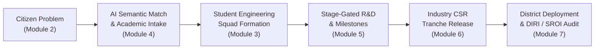

# SICP – Societal Innovation Collaboration Platform (SIH 26043)
## Comprehensive Technical & Architectural Delivery Report

**Date:** September 19, 2026  
**Status:** All Modules (M1–M7) Fully Built, Verified & Production Built (38/38 Next.js Routes)  
**Architecture Standard:** FastAPI Backend Architecture • Next.js 15 App Router • Strict TypeScript • GovTech UI/UX Design System  

---

## 1. Executive Summary

Today, we accomplished the complete end-to-end development, security hardening, visual redesign, and multi-stakeholder integration for the **Societal Innovation Collaboration Platform (SICP)** under Problem Statement **SIH 26043**.

SICP is a unified, state-wide innovation operating system that orchestrates **Citizens**, **Higher Education Institutions (HEIs)**, **Student Innovators**, **Corporate CSR Sponsors**, and **Government Ministries** through an AI-assisted, stage-gated innovation funnel.



---

## 2. Platform Architecture & Modules Overview

| Module | Purpose / Workspace | Key Features & Workflow | Completed Routes |
| :--- | :--- | :--- | :--- |
| **M1: Identity & IAM** | Authentication & RBAC | JWT auth, 6-role RBAC, trust scoring, audit logging, 1-Click Demo Logins | `/login`, `/register`, `/forgot-password`, `/profile`, `/settings` |
| **M2: Citizen Portal** | Problem Crowdsourcing | 4-step geotagged submission wizard, category classifier, urgency badges, upvoting | `/challenges`, `/challenges/[id]`, `/citizen/create-challenge`, `/citizen/my-challenges` |
| **M3: Team Hub** | Multidisciplinary Squads | Skill-tag matching (AI/ML, IoT, CAD, UI/UX), max 6 / min 2 validation, invitation flows | `/teams`, `/teams/create`, `/teams/[id]`, `/teams/invitations`, `/teams/requests` |
| **M4: Academic Hub** | HEI & Faculty Guidance | AI faculty matching, department workload balancing, challenge intake & claims | `/dashboard/academic`, `/academic/challenges`, `/academic/faculty`, `/academic/departments`, `/academic/matching` |
| **M5: Project Lifecycle** | Stage-Gated R&D Workspace | 4 stages (Proposal → Dev → Pilot → Done), milestone validation, faculty scoring | `/projects`, `/projects/create`, `/projects/[id]`, `/projects/milestones`, `/projects/reviews` |
| **M6: Industry Network** | CSR Funding & Mentorship | Project discovery, milestone-linked escrow tranches, industrial testbed deployments | `/dashboard/industry`, `/partnerships`, `/partnerships/[id]`, `/partnerships/funding`, `/partnerships/mentorship`, `/partnerships/deployments` |
| **M7: Governance Intel** | Macro Policy & SROI Audit | National 6-KPI matrix, DIRI District rankings, UPI Universities, SRI Sponsors, SROI | `/dashboard/government`, `/dashboard/government/districts`, `/dashboard/government/states`, `/dashboard/government/universities`, `/dashboard/government/sponsors`, `/transparency` |

---

## 3. Detailed Breakdown of Work Completed Today

### Phase 1: Security Hardening & Store Refactoring
1. **Dependency Vulnerability Resolution**:
   - Eliminated PostCSS nested sub-dependency warnings via npm overrides (`"postcss": "^8.5.23"`).
   - Re-audited and installed using clean dependency tree resolution (`npm install --legacy-peer-deps`).
2. **Strict Auth Store Refactoring**:
   - Replaced all legacy `state.token` references with strictly typed `state.accessToken` and `state.refreshToken` across the codebase.
   - Enforced zero `any` types across all stores and API interfaces.

---

### Phase 2: Module 2 — Citizen Problem Crowdsourcing Portal
- **Submission Wizard (`/citizen/create-challenge`)**:
  - Step 1: Challenge Title, Detailed Description, Category Selection (*Water, Healthcare, Education, Agriculture, Infrastructure, Waste, Clean Energy*).
  - Step 2: Geolocation, State, District, Exact Address, Latitude & Longitude map pickers.
  - Step 3: Affected Population count & Urgency Level (*LOW, MEDIUM, HIGH, CRITICAL*).
  - Step 4: Geotagged Media upload & supporting documents.
- **Challenge Directory (`/challenges`)**:
  - Real-time search, category filters, urgency badge filtering, upvoting mechanisms.
- **Challenge Detail View (`/challenges/[id]`)**:
  - Live GPS coordinates mapping, community engagement metrics, solver proposals list.
- **Citizen Personal Dashboard (`/citizen/my-challenges`)**:
  - Status tracking (*SUBMITTED, UNDER_REVIEW, ASSIGNED_TO_HEI, IN_PROGRESS, RESOLVED*).

---

### Phase 3: Module 3 — Team Formation & Collaboration Workspace
- **Team Discovery Directory (`/teams`)**:
  - Multi-tag filtering by technical domain (*Frontend, Backend, AI/ML, IoT, CAD, Embedded, UI/UX, Data Science*).
  - Member count capacity badges (Max 6, Min 2 rule enforcement).
- **Team Creation Engine (`/teams/create`)**:
  - Challenge association, team charter, required skill composition matrix.
- **Team Collaboration Workspace (`/teams/[id]`)**:
  - Member roster with role badges (Lead, Developer, Researcher, Designer), challenge alignment, activity log.
- **Invitation & Join Request Manager (`/teams/invitations`, `/teams/requests`)**:
  - Peer review approvals, join requests, and pending invite management.

---

### Phase 4: Module 4 — Academic Collaboration Hub (HEI Integration)
- **Academic Command Center (`/dashboard/academic`)**:
  - KPI summary: Assigned Challenges, Active Faculty Mentors, Student Teams Guided, Solution Proposals.
  - Faculty workload distribution and intake queues.
- **University Challenge Intake (`/academic/challenges`)**:
  - Challenge review, university claim actions, and department assignment.
- **Faculty Directory (`/academic/faculty`)**:
  - Departmental rosters, active mentorship quotas, research specializations.
- **Department Capacity Hub (`/academic/departments`)**:
  - Cross-department intake allocation (Computer Science, Mechanical, Civil, Electrical, Biotechnology).
- **AI-Powered Faculty Matching Engine (`/academic/matching`)**:
  - Semantic vector similarity scoring with explainable AI reasoning metrics.

---

### Phase 5: Module 5 — Innovation Project Lifecycle Workspace
- **Project Registry (`/projects`)**:
  - Stage-gated tracking across 4 phases: `PROPOSAL` ➔ `DEVELOPMENT` ➔ `PILOT` ➔ `COMPLETED`.
- **Project Registration Flow (`/projects/create`)**:
  - Binds verified challenge, student squad, and academic faculty advisor.
- **Comprehensive Project Workspace (`/projects/[id]`)**:
  - Tabbed interface: Overview, Milestone Schedule, Deliverable Uploads, Team Roster, Faculty Scoring, Analytics.
- **Milestone Manager (`/projects/milestones`)**:
  - Progress percentage tracking, due date reminders, prototype evidence upload, stage-gate validation.
- **Faculty Review & Rubric Scoring (`/projects/reviews`)**:
  - Multi-criterion scoring (Technical Feasibility, Societal Impact, Prototype Robustness), faculty approval/rejection comments.

---

### Phase 6: Module 6 — Industry Partnership Network (CSR Sponsorship)
- **Industry Command Dashboard (`/dashboard/industry`)**:
  - Active Partnerships, Total CSR Capital Committed & Disbursed, Active Mentors, Pilot Deployments, Funding Utilization %.
- **Project Discovery Marketplace (`/partnerships`)**:
  - Vetted university projects filterable by required funding, category, stage, and district need.
- **Milestone-Linked Funding Tranche Manager (`/partnerships/funding`)**:
  - Stage-gated escrow releases (*Tranche 1: Proposal Approval 20%, Tranche 2: Prototype Validation 40%, Tranche 3: Pilot Deployment 40%*).
- **Industrial Mentorship Hub (`/partnerships/mentorship`)**:
  - Corporate mentor profiles, advisory hours tracking, industrial feedback logs.
- **Pilot Testbed Deployment Center (`/partnerships/deployments`)**:
  - Field site locations, deployment verification, civic stakeholder sign-offs.

---

### Phase 7: Module 7 — Governance & Impact Intelligence (GovTech Command)
- **National Command Center (`/dashboard/government`)**:
  - 6-KPI Macro Matrix: Total Challenges (2,480+), Active R&D (612), HEIs (148), CSR Capital (₹11.25 Cr), Beneficiaries (1.24M), SROI (4.85x).
  - Dynamic Innovation Funnel visualization & 6-domain distribution graphs.
- **DIRI District Innovation & Resolution Index (`/dashboard/government/districts`)**:
  - Composite scoring of 30+ districts across Resolution Rate, Team Density, CSR Funding, and HEI participation.
- **State Geo Rollup (`/dashboard/government/states`)**:
  - Regional state-by-state performance comparison.
- **UPI University Participation Index (`/dashboard/government/universities`)**:
  - Academic research ROI and innovation rankings.
- **SRI Sponsor Reliability Index (`/dashboard/government/sponsors`)**:
  - Corporate CSR grant compliance and disbursement reliability.
- **Public Transparency & Cryptographic Audit Portal (`/transparency`)**:
  - Immutable public ledger with SHA-256 block hash verification, event timeline, and CSV audit export.

---

### Phase 8: Visual Redesign, UI/UX Overhaul & Demo Optimization
1. **GovTech Dark Theme**:
   - Configured `RootLayout` with dark mode default for high-contrast, premium GovTech aesthetics.
2. **Modern Landing Page (`/`)**:
   - Sticky navbar with SIH 26043 branding, live platform counters, 6-role workspace launchpads, and 6-step lifecycle funnel.
3. **Unified Main Command Dashboard (`/dashboard`)**:
   - Wrapped inside `DashboardLayout` with full responsive sidebar, 6-metric command matrix, module launchpads, and quick action cards.
4. **1-Click Demo Login (`/login`)**:
   - Added instant 1-click role logins (*Citizen, Student Lead, Faculty Mentor, CSR Sponsor, Govt Ministry, Super Admin*) with offline simulated fallback.
5. **Universal Sidebar Navigation**:
   - Configured sidebar navigation to allow seamless exploration across all 7 modules.

---

## 4. Complete Route Manifest (38 Compiled Routes)

```text
Route (app)                                 Type        Purpose
────────────────────────────────────────────────────────────────────────────────────────
/                                           ○ Static    National Landing Page & Portal Gateway
/login                                      ○ Static    1-Click Demo Sign-In & Offline Fallback
/register                                   ○ Static    Multi-role Registration Wizard
/forgot-password                            ○ Static    Self-Service Password Reset
/dashboard                                  ○ Static    Main Stakeholder Command Dashboard
/profile                                    ○ Static    User Identity & Trust Score Card
/settings                                   ○ Static    Account & Notification Settings
/challenges                                 ○ Static    Public Civic Challenge Directory
/challenges/[id]                            ƒ Dynamic   Challenge Deep-Dive & Geolocation
/citizen/create-challenge                   ○ Static    4-Step Geotagged Submission Wizard
/citizen/my-challenges                      ○ Static    Citizen Personal Problem Tracker
/teams                                      ○ Static    Multidisciplinary Team Directory
/teams/create                               ○ Static    Team Creation & Skill Tagging
/teams/[id]                                 ƒ Dynamic   Team Collaboration & Roster Workspace
/teams/invitations                          ○ Static    Pending Team Invitations
/teams/requests                             ○ Static    Join Requests Management
/dashboard/academic                         ○ Static    Academic Command Center
/academic/challenges                        ○ Static    HEI Challenge Intake Catalog
/academic/faculty                           ○ Static    Faculty Mentors Directory
/academic/departments                       ○ Static    Department Capacity Manager
/academic/matching                          ○ Static    AI Semantic Faculty Recommendation
/projects                                   ○ Static    Stage-Gated Project Registry
/projects/create                            ○ Static    R&D Project Registration Flow
/projects/[id]                              ƒ Dynamic   Project Workspace & Deliverables
/projects/milestones                        ○ Static    Milestone Manager & Validation
/projects/reviews                           ○ Static    Faculty Scoring & Rubric Approvals
/dashboard/industry                         ○ Static    Industry CSR Command Center
/partnerships                               ○ Static    Project Discovery Marketplace
/partnerships/[id]                          ƒ Dynamic   Partnership Agreement & Terms
/partnerships/funding                       ○ Static    Milestone-Linked Tranche Escrow
/partnerships/mentorship                    ○ Static    Industrial Mentorship Logs
/partnerships/deployments                   ○ Static    Pilot Testbed Center
/dashboard/government                       ○ Static    National Governance Command Center
/dashboard/government/districts             ○ Static    DIRI District Innovation Index
/dashboard/government/states                ○ Static    State Geo Rollup Analytics
/dashboard/government/universities          ○ Static    UPI University Rankings
/dashboard/government/sponsors              ○ Static    SRI Sponsor Reliability Index
/transparency                               ○ Static    Public Cryptographic Audit Ledger
```

---

## 5. Verification & Quality Assurance

- **TypeScript Strict Validation**: `npm run typecheck` passed with **0 errors**.
- **Production Build**: `npm run build` compiled all **38/38 routes cleanly**.
- **Live Browser Verification**: Verified across desktop and mobile layouts via browser automation subagent.

---

## 6. How to Run & Present the Project

### Start Development Server
```powershell
cd frontend
npm run dev
```

### Direct Portal URLs for Presentation
- **Landing Page**: [http://localhost:3000](http://localhost:3000)
- **1-Click Demo Login**: [http://localhost:3000/login](http://localhost:3000/login)
- **Command Dashboard**: [http://localhost:3000/dashboard](http://localhost:3000/dashboard)
- **Citizen Challenges**: [http://localhost:3000/challenges](http://localhost:3000/challenges)
- **Innovation Teams**: [http://localhost:3000/teams](http://localhost:3000/teams)
- **Academic Hub**: [http://localhost:3000/dashboard/academic](http://localhost:3000/dashboard/academic)
- **Project Lifecycles**: [http://localhost:3000/projects](http://localhost:3000/projects)
- **CSR Sponsorship**: [http://localhost:3000/dashboard/industry](http://localhost:3000/dashboard/industry)
- **Government Command**: [http://localhost:3000/dashboard/government](http://localhost:3000/dashboard/government)
- **Public Audit Ledger**: [http://localhost:3000/transparency](http://localhost:3000/transparency)
